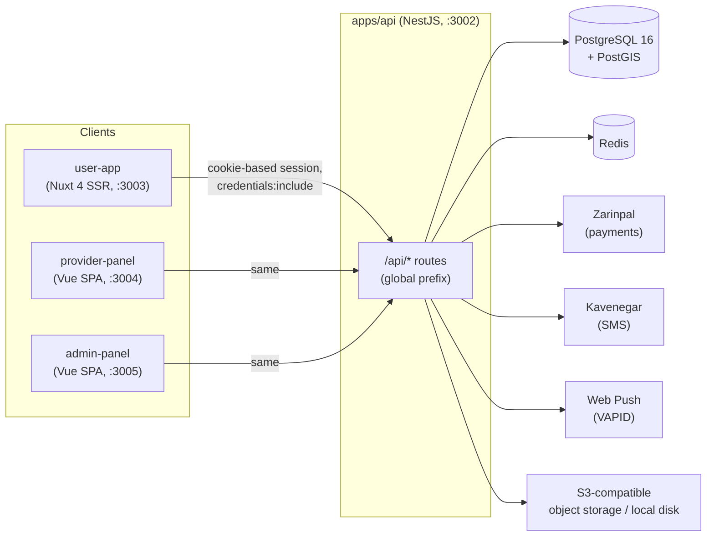
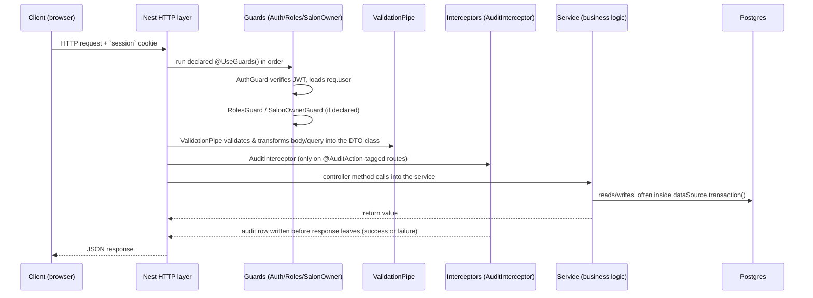
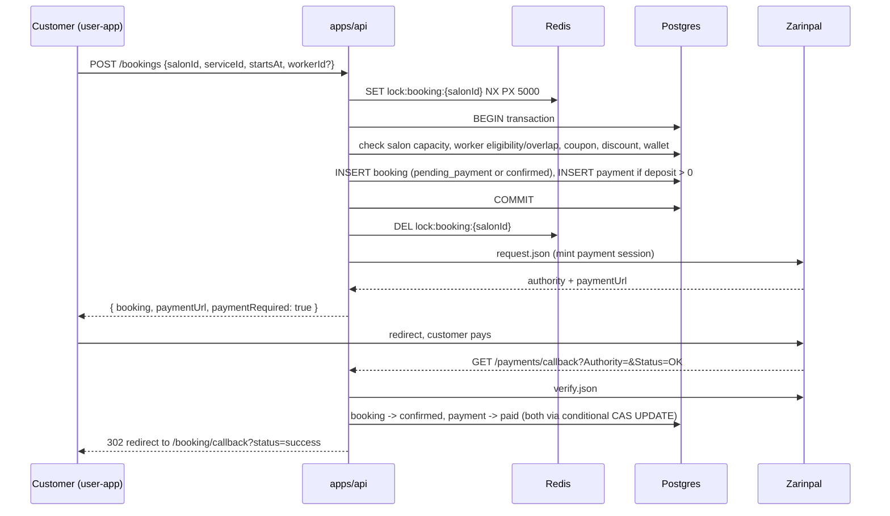

# 02 — System Architecture

## High-level shape



All three frontends are **pure HTTP clients** of the single API. There is no server-to-server traffic between frontends, and no frontend has its own database or persistent state beyond a Pinia store and (in `user-app`'s case) a service worker cache. Every business rule and every database write lives in `apps/api`.

## `apps/api` — NestJS modular monolith

### Module structure

Each domain is a self-contained NestJS module under `src/<domain>/`. A representative module:

```
src/booking/
├── booking.module.ts
├── bookings.controller.ts        bookings.service.ts
├── availability.controller.ts    availability.service.ts
├── salon-bookings.controller.ts  # provider-scoped, separate controller from the customer-facing one
├── payments.controller.ts        payments.service.ts
├── booking.entity.ts             payment.entity.ts
├── booking-expiry.job.ts  booking-reminder.job.ts  payment-reconciliation.job.ts  refund-retry.job.ts  referral-grant.job.ts
├── payment-gateway.ts (interface)  mock-payment.gateway.ts  zarinpal-payment.gateway.ts
├── deposit.util.ts  availability.util.ts  (+ colocated .spec.ts)
└── dto/booking.dto.ts
```

Conventions, consistent across every module:
- **One entity file per table**, one service per domain, but **multiple controllers per module** when a resource is exposed differently to different actors — e.g. `bookings.controller.ts` (customer, `/bookings/*`) vs `salon-bookings.controller.ts` (provider, `/salons/mine/bookings/*`) vs an admin controller where applicable.
- **DTOs** live in `dto/`, named `{Action}{Entity}Dto` (e.g. `CreateBookingDto`, `UpdateSalonDto`), validated with `class-validator` decorators. The global `ValidationPipe({ whitelist: true, transform: true })` strips unknown fields and coerces query-string primitives via `@Type(() => Number)`.
- **Unit tests (`.spec.ts`) are colocated** next to the file they test. Only e2e tests live in a separate top-level `test/` tree.
- **Background jobs** live inside their owning module as `@Injectable()` classes: a thin `@Cron()`-decorated `handleCron()` delegates to a plain `async run()` method, kept independently unit-testable. Registered as providers in the module. Full inventory: [18-background-jobs.md](./18-background-jobs.md).
- **No ORM relations anywhere.** Every foreign key is a bare `@Column({ name: 'xxx_id' })`, never a TypeORM `@ManyToOne`/`@OneToMany`. Joins are done by hand — either a manual batched `In(...)` lookup (the `attachNames`/`attachCategories`/`attachServiceIds` pattern used throughout) or a raw `QueryBuilder`. This is a deliberate, consistently-applied convention, not an oversight — see [04-database.md](./04-database.md) for the full rationale and every entity affected.

### Request lifecycle



Key facts:
- **Global route prefix**: every route is under `/api/...` (`app.setGlobalPrefix('api')` in `main.ts`).
- **No global auth guard.** Every protected route explicitly declares `@UseGuards(...)`. A new route added without guards is public by default — this is a real review-checklist risk for anyone adding endpoints. See [17-permissions.md](./17-permissions.md).
- **No Swagger/OpenAPI is generated.** [15-api-reference.md](./15-api-reference.md) is effectively the only API contract document.
- **CORS**: exactly three allowed, credentialed origins — `FRONTEND_BASE_URL`, `PROVIDER_APP_BASE_URL`, `ADMIN_APP_BASE_URL` (`src/cors-origins.util.ts`). `credentials: true` is required because auth is a cookie, not a bearer token; this only works because the cookie is `sameSite: 'lax'`, which assumes the frontends stay same-site with the API — see [21-security.md](./21-security.md).
- **Static file serving**: `apps/api/uploads/` is served at `/uploads/*` directly on the API's own origin when `STORAGE_PROVIDER=local`.

### `AppModule` — every module wired in

`src/app.module.ts` imports (in order): `RedisModule`, `PlatformConfigModule`, `AlertsModule`, `AuthModule`, `CatalogModule`, `CitiesModule`, `SalonsModule`, `BookingModule`, `CouponsModule`, `SearchModule`, `ReviewsModule`, `ReportsModule`, `FavoritesModule`, `PushModule`, `AdminNotificationsModule`, `ContentModule`, `WalletModule`, `ReferralsModule`, `InvoicingModule`. Plus `ConfigModule.forRoot({isGlobal:true})`, `TypeOrmModule.forRootAsync()` (`synchronize:false`, `autoLoadEntities:true`), `ScheduleModule.forRoot()`. `HealthController` is the only controller registered directly on `AppModule`; every other controller belongs to its own feature module.

### External-service abstraction pattern

Every third-party integration follows the same interface → injection-token → env-var-selected-implementation pattern, so local dev and tests never touch a real third party:

| Concern | Interface | Token | Implementations | Selector |
|---|---|---|---|---|
| SMS | `SmsProvider` | `SMS_PROVIDER` | `ConsoleSmsProvider`, `KavenegarSmsProvider` | `SMS_PROVIDER=console\|kavenegar` |
| Payments | `PaymentGateway` | `PAYMENT_GATEWAY` | `MockPaymentGateway`, `ZarinpalGateway` | `PAYMENT_GATEWAY=mock\|zarinpal` |
| Push | `PushProvider` | `PUSH_PROVIDER` | `ConsolePushProvider`, `WebPushProvider` | `PUSH_PROVIDER=console\|webpush` |
| Storage | `StorageProvider` | `STORAGE_PROVIDER` | `LocalDiskStorageProvider`, `S3StorageProvider` | `STORAGE_PROVIDER=local\|s3` |
| Error tracking | `ErrorTrackingService` | `ERROR_TRACKING_PROVIDER` | `LoggerErrorTrackingService` (only implementation; no real Sentry/APM account exists) | none yet |

Full detail per integration in [19-third-party-services.md](./19-third-party-services.md). Any new external integration should follow this exact pattern.

### Error handling & config

- Services throw NestJS built-ins directly (`NotFoundException`, `BadRequestException`, `ConflictException`, `ForbiddenException`) — NestJS's default HTTP-status mapping is relied on. A global catch-all filter (`GlobalExceptionFilter`, `error-tracking/global-exception.filter.ts`, registered via `APP_FILTER`) now sits in front of that default handling, but only as a side-effecting observer: it subclasses `BaseExceptionFilter` and delegates to `super.catch()`, so the response body/status for every existing case is unchanged. Its only job is calling `ErrorTrackingService.captureException()` for 5xx/unknown exceptions before that response is sent — see [19-third-party-services.md](./19-third-party-services.md) and [21-security.md](./21-security.md).
- `@nestjs/config` is global, env file picked by `NODE_ENV` (`.env.test` vs `.env`). **There is no schema validation on env vars** — code calls `config.getOrThrow('KEY')` (throws only when the code path actually runs) or `config.get('KEY', default)`. A missing required env var is invisible until the first request that needs it.
- Platform-tunable business constants (deposit %, commission %, cancellation window, etc.) live in the `platform_config` key/value table, not env vars — see [04-database.md](./04-database.md) and [20-business-rules.md](./20-business-rules.md).

## Cross-app isolation convention (frontends)

`provider-panel`, `admin-panel`, and `user-app` share **zero code** — there is no `packages/` shared library despite `pnpm-workspace.yaml` globbing for one. Every component/composable/utility that looks identical across apps (`AppButton.vue`, `useTheme.ts`, `useToast.ts`, `JalaliDatePicker.vue`, the `digits.ts`/`toEnglishDigits()` phone-normalization helper, the `.app-select` vue-multiselect CSS override block, etc.) is a deliberately hand-duplicated copy, each carrying a comment invoking "this repo's cross-app isolation convention" as the rationale. This is discussed as both an intentional policy and a real maintenance cost in [24-technical-debt.md](./24-technical-debt.md).

## Data flow: a booking, end to end



Full detail: [09-booking-engine.md](./09-booking-engine.md), [11-payment-system.md](./11-payment-system.md).

## Related documents

- [03-domain-model.md](./03-domain-model.md)
- [04-database.md](./04-database.md)
- [15-api-reference.md](./15-api-reference.md)
- [17-permissions.md](./17-permissions.md)
- [19-third-party-services.md](./19-third-party-services.md)
