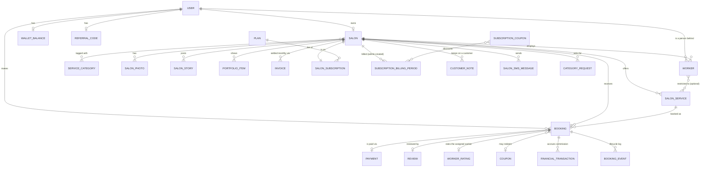

# 03 — Domain Model

This document explains the core business concepts and how they relate to each other conceptually. For the literal database schema (columns, constraints, FKs), see [04-database.md](./04-database.md).

## Conceptual entity map

This is a *conceptual* diagram — see [04-database.md](./04-database.md) for the literal schema, which implements every relationship above as a bare foreign-key column (no ORM relation), and some (worker↔service, salon↔category) as an explicit composite-PK join table.

## Core concepts

### User
The single account table for every person on the platform — customer, salon owner, worker, and admin are all rows in `users`, distinguished by `role` (`customer | provider | admin`). There is no separate "provider" signup: a user becomes `provider` automatically the moment they create a salon (`UsersService.promoteToProvider`). A "worker" is not a role at all — it's a `workers` row that *points at* a `User` (see below); a worker logs in exactly like a customer and is distinguished only by owning a `workers` row somewhere.

### Salon
The unit of discovery and booking. One salon per owner (`salons.owner_id` is unique). Has a moderation lifecycle (`pending → approved | rejected | suspended`), a `genderTarget` (`women|men`) that gates every search/listing result with no bypass, a free-text `city`, a PostGIS `location` point, and now a set of owner-curated category tags (`salon_categories`, independent of which services it currently offers). Only `approved` salons are ever publicly visible.

### SalonService
A single bookable offering at a salon (e.g. "Haircut — 45 min — 250,000 toman"), scoped to a `ServiceCategory`. Carries its own optional direct discount (`discountPercent`).

### Worker
A staff member at a salon, backed by a real `User` account (added by the owner via phone number, using the same `findOrCreateByPhone` idiom as OTP signup). Workers can optionally be restricted to a subset of the salon's services (`worker_services` join table) — see [09-booking-engine.md](./09-booking-engine.md) for the full eligibility model. Workers accrue their own rating, separate from the salon's overall rating.

### Booking
The central transaction. Links a `User` (customer), a `Salon`, a `SalonService`, optionally a `Worker`, and drives a state machine from `pending_approval` (manual-approval salons only) / `pending_payment` / `confirmed` through to `completed`, a cancellation state (`cancelled_by_user`, `cancelled_by_salon`, `rejected_by_salon`), `expired`, or `no_show`. Two orthogonal provenance fields: `source` (`online` — the customer flow — or `manual` — an owner-entered walk-in/phone booking via `POST /salons/mine/bookings`, which may carry owner `notes`) and `attributionSource` (`qr` / `direct` / `search` / null — the marketing channel the customer arrived through, set once at creation). `confirmationMode` and the `approvalExpiresAt`/`paymentExpiresAt` deadlines are snapshotted at creation and never recomputed. Every money-adjacent subsystem (Payment, Coupon redemption, Wallet spend, Commission, Referral qualifying event) hangs off a Booking. Full detail: [09-booking-engine.md](./09-booking-engine.md), [28-booking-approval-workflow.md](./28-booking-approval-workflow.md), [31-public-handle-and-attribution.md](./31-public-handle-and-attribution.md).

### BookingEvent
An append-only per-booking lifecycle log (`booking_events`: `BOOKING_CREATED`, `APPROVAL_REQUESTED`, `SALON_APPROVED`, `PAYMENT_SUCCEEDED`, `SLOT_RELEASED`, … with an `actorType` of `customer | salon_owner | admin | system`), ordered by a DB-generated `seq`, not by timestamp. Deliberately separate from the admin `audit_log`, which only ever records admin actions — most booking transitions have no admin actor. Read back at `GET /admin/bookings/:id/events`.

### Payment
One-to-one with a `Booking`, created only when a deposit is actually being collected: the deposit is non-zero **and** `feature_online_payment_enabled` is on ([29](./29-global-payment-toggle.md)); for a manual-approval booking it is inserted by `approve()`, not at request time. Tracks the Zarinpal payment session and its lifecycle: `initiated → paid → refund_pending → refunded` or `failed`. Customer-facing booking responses expose `depositPaid` (true iff a Payment reached `paid`/`refund_pending`/`refunded`) so a UI never infers "paid" from a non-zero `depositAmount`. Full detail: [11-payment-system.md](./11-payment-system.md).

### Review / WorkerRating
A customer can leave exactly one `Review` per completed `Booking` (DB-enforced), optionally with a linked `WorkerRating` if the booking had an assigned worker. Both feed into a live-recomputed aggregate (`salons.rating_avg`/`rating_count`, `workers.rating_avg`/`rating_count`). Moderation is reactive, not pre-publish.

### Coupon / CouponRedemption
A discount code, either platform-wide (admin-issued) or salon-scoped (owner-issued), or a single-recipient code issued automatically by the referral system. One redemption per user per code, DB-enforced. See [13-financial-system.md](./13-financial-system.md).

### Wallet
An internal, non-withdrawable ledger per user (`toman` or `points` currency), currently **accrue-only from the platform's side** (referral rewards, admin adjustments) with **spend-only at booking checkout** (apply wallet balance toward a deposit). There is no cash-out flow. See [12-wallet.md](./12-wallet.md).

### Referral
A one-lifetime-code-per-person referral program. A new user can redeem someone's code at registration; a reward (wallet credit, cashback, loyalty points, or a discount coupon) is granted to one or both sides after the referred user's first qualifying booking, subject to a holdback window and full reversal on refund. See [13-financial-system.md](./13-financial-system.md).

### FinancialTransaction / Invoice
Every completed or no-show booking **with a `paid` Payment** accrues a commission row (`financial_transactions`) at booking-completion time, with `payment.amount` as the gross — a booking on which the platform never held money (online payment off, manual booking, no deposit) accrues nothing. Once a Jalali (Persian) calendar month has fully closed, those rows are rolled up into one `Invoice` per salon per month — the platform's record of "here's what we're keeping vs. what we owe you back." There is no automated payout; settlement is a human bank transfer, recorded manually. See [14-commission.md](./14-commission.md).

### Content: Photos, Stories, Portfolio, Blog
Salons present themselves via photos (persistent gallery), stories (Instagram-style, 24h TTL, DB-clock-enforced), and a portfolio (persistent sample-work gallery, optionally linked to a bookable service). None of this content is required — it's an engagement/trust-building layer on top of the core booking flow. Separately, admins author a Markdown blog for SEO/content marketing, entirely decoupled from salons.

### Trust & safety: Reports, Audit Log, Admin Notifications
A verified customer (one completed booking at the salon) can report a salon, a review, a story, or a portfolio item. Every admin mutation across the whole platform is captured in an immutable `audit_log` via a declarative `@AuditAction` decorator. An admin notification queue (`admin_notifications`, with per-admin read state in `admin_notification_reads`) surfaces new reports, salon resubmissions, and operator alerts to the admin panel.

### Plan / SalonSubscription
An admin-configurable subscription tier (`plans`: stable `key`, editable `name`/`monthlyPriceToman`/`isActive`, exactly one `isDefault`, and an open `entitlements` jsonb bag) and the one-per-salon row pointing at it (`salon_subscriptions`: `status` `active | canceled`, plus an optional `entitlementOverrides` jsonb merged over the plan's own). Every salon is on a plan from creation (the default plan), and a canceled/missing subscription resolves back to the default plan's entitlements. Only one entitlement key is enforced today, `smsMonthlyQuota`. See [30](./30-subscription-plan-foundation.md), [33](./33-salon-sms-quota.md).

### SubscriptionBillingPeriod / SubscriptionCoupon
Architecture-only billing: an admin creates a `subscription_billing_periods` row for an active subscription (plan and `baseAmountToman` frozen at creation), optionally discounted by a percent-only, platform-wide `SubscriptionCoupon` (redeemed **by salon**, one redemption per salon per code — a separate entity from the booking `Coupon`, whose redemptions are keyed to a booking), and later settles it exactly once (`pending → paid | comped | void`; voiding hands the coupon redemption back). No cron creates a billing period and there is no gateway charge. See [34](./34-subscription-coupons-and-billing.md).

### CRM: CustomerNote / SalonSmsMessage
There is no Customer entity — a salon's "customers" are derived from its bookings. `customer_notes` are salon-private free text on a customer; `salon_sms_messages` is the append-only log of owner-initiated SMS to a customer, which is also the quota-usage source of truth (`COUNT` within the current Jalali month, checked against the plan's `smsMonthlyQuota`). Sends require an `approved` salon and are prefixed with the salon name on the wire. See [32](./32-salon-crm.md), [33](./33-salon-sms-quota.md).

### CategoryRequest
An owner's request for a service category that doesn't exist yet (`category_requests`: `pending → approved | rejected`, admin-resolved with a `resolutionNote`; on approval `categoryId` points at the category that was created, `ON DELETE SET NULL`). Owner side `salons/mine/category-requests`, admin side `admin/category-requests`.

## How the concepts compose: booking a haircut, end to end

1. A **User** searches (`Salon.genderTarget`, `Salon.city`→lat/lng, `SalonCategory` filter, PostGIS radius).
2. They land on a **Salon** profile, see its **SalonService** list, **SalonPhoto**/**SalonStory**/**PortfolioItem** gallery, **Review**s, and **Worker** roster.
3. They pick a service and (optionally) a specific **Worker** — the worker picker is pre-filtered server-side to workers eligible for that service (`worker_services`).
4. They pick an open slot (computed from **WorkingHour** + **ScheduleException** + existing **Booking** overlaps).
5. They optionally apply a **Coupon** code and/or their **Wallet** balance.
6. `POST /bookings` creates a **Booking** (+ a **Payment** if a deposit is owed and online payment is enabled) and, if a coupon won, a **CouponRedemption**; a manual-approval salon first gets a `pending_approval` request and the owner's `approve()` is what opens the payment window. Every step writes a **BookingEvent**.
7. The customer pays via Zarinpal; the **Payment** callback confirms the **Booking**. (With online payment off, the booking is confirmed at creation and no Payment ever exists.)
8. The salon owner marks the booking `completed` (or `no_show`) after the appointment. This triggers: a **FinancialTransaction** (commission accrual — only if a `paid` Payment exists), a **Review**/**WorkerRating** prompt for the customer, and — if this was the customer's first paid/completed booking and they were referred — a **Referral** reward grant.
9. At month-end, the accrued **FinancialTransaction** rows roll up into an **Invoice** for the salon.

## Related documents

- [04-database.md](./04-database.md) — literal schema
- [09-booking-engine.md](./09-booking-engine.md)
- [11-payment-system.md](./11-payment-system.md)
- [13-financial-system.md](./13-financial-system.md)
- [14-commission.md](./14-commission.md)
