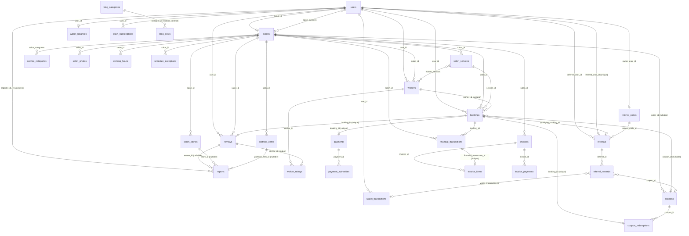

# 04 — Database

PostgreSQL 16 + PostGIS. TypeORM 0.3 with `synchronize: false` — the migration files under `apps/api/src/migrations/` are the sole source of truth for schema. Migrations run via `pnpm --filter @gheychi/api migration:run` and are **never** run automatically on deploy/boot (a deliberate manual step — see [25-future-improvements.md](./25-future-improvements.md) / deployment docs).

**Codebase-wide convention: no ORM relations.** Every entity file declares foreign keys as bare `@Column({ name: 'xxx_id' }) xxxId: string`, never a TypeORM `@ManyToOne`/`@OneToMany`/`@JoinColumn`. All joins are done by hand in service code — either a manual batched `In(...)` lookup (e.g. `SalonsService.attachCategories`, `BookingsService.attachNames`, `SalonWorkersController.attachServiceIds`) or a raw `QueryBuilder`. This is confirmed with zero exceptions across all 33 entity files.

## Full ER diagram

## Migration history (chronological)

All under `apps/api/src/migrations/`, filename-timestamp-ordered. This list doubles as a changelog of every schema-affecting product change.

| Migration | What it did |
|---|---|
| `1751600000000-initial-schema` | Enables PostGIS. Creates `users`, `salons` (with GIST-indexed `location geography`), `service_categories`, `salon_services`, `salon_photos`, `working_hours`, `schedule_exceptions`, `platform_config`. Seeds 8 categories + 5 config rows. |
| `1751700000000-booking-payments-schema` | Creates `bookings`, `payments` (1:1 via unique `booking_id`). |
| `1751800000000-reviews-schema` | Creates `reviews` (unique `booking_id`). |
| `1751900000000-featured-and-favorites` | Adds `salons.is_featured`/`featured_until`. Creates `salon_favorites` (composite PK). |
| `1752000000000-push-and-reminders` | Creates `push_subscriptions`. Adds `bookings.reminded_at`. Seeds `reminder_lead_hours=3`. |
| `1752100000000-salon-photo-storage-key` | Adds `salon_photos.storage_key`. |
| `1752200000000-salon-rejection-reason` | Adds `salons.rejection_reason`. |
| `1752300000000-user-status` | Adds `users.status` (`active|suspended`). |
| `1752400000000-localize-service-categories` | Data migration: replaces 8 English categories with 14 Farsi ones. |
| `1752500000000-platform-hardening` | Creates `audit_log`, `reports` (partial-unique open-report-per-target index), `admin_notifications`. Adds `salons.suspended_cause`. |
| `1752600000000-blog-cms` | Creates `blog_categories`, `blog_posts`. |
| `1752700000000-payment-refunds` | Adds `payments.refund_requested_at`/`refund_ref_id`/`refunded_at`. Redefines prior `'refunded'` rows to `'refund_pending'`. |
| `1752800000000-salon-showcase` | Adds `salons.tagline`/`about`/`instagram_handle`. Creates `salon_stories`, `portfolio_items`. Adds `reports.story_id`/`portfolio_item_id`/`target_type`, rebuilds the open-report dedup index to exclude orphaned content reports. |
| `1752900000000-coupons-and-service-discounts` | Adds `salon_services.discount_percent`. Creates `coupons`, `coupon_redemptions` (unique `(coupon_id,user_id)`). Adds `bookings.coupon_id`/`discount_percent`/`original_price_snapshot`. |
| `1753000000000-workers-and-worker-ratings` | Creates `workers` (unique `(salon_id,user_id)`), `worker_ratings` (unique `review_id`). Adds `bookings.worker_id`. Seeds `review_edit_window_hours=72`. |
| `1753100000000-wallet-ledger` | Creates `wallet_balances` (composite PK `(user_id,currency)`), `wallet_transactions`. |
| `1753200000000-referral-codes-and-tracking` | Creates `referral_codes` (unique `owner_user_id`), `referral_reward_types` (3-row config table), `referrals` (unique `referred_user_id`). |
| `1753300000000-referral-reward-granting` | Creates `referral_rewards` (unique `(referral_id,beneficiary_role)`). Adds `partially_granted` status. Adds `payments.paid_at`. |
| `1753400000000-referral-discount-coupons` | Adds `coupons.issued_to_user_id`. |
| `1753500000000-fixed-amount-discount-support` | Adds `coupons.discount_fixed_amount` + CHECK (percent XOR fixed). Mirrors onto `bookings`. |
| `1753600000000-shift-bookings-to-real-utc-instants` | **Pure data fix**: shifts existing `bookings.starts_at`/`ends_at` by −3h30m to correct a historical timezone bug (see [10-scheduling.md](./10-scheduling.md)). |
| `1753700000000-payment-authorities` | Creates `payment_authorities` (append-only, **no TypeORM entity** — raw SQL only). Backfills from `payments.authority`. |
| `1753800000000-wallet-booking-spend` | Adds `booking_spend`/`booking_spend_reversal` to the wallet-transaction `type` CHECK. Adds `bookings.wallet_amount_used`. |
| `1753900000000-commission-invoicing-ledger` | Creates `financial_transactions`, `invoices` (unique `(salon_id,jalali_year,jalali_month)`), `invoice_items` (unique `financial_transaction_id`), `invoice_payments`. |
| `1754000000000-salon-categories` | Creates `salon_categories` (composite PK), backfilled from distinct `salon_services.category_id`. |
| `1754200000000-worker-services` | Creates `worker_services` (composite PK), no backfill (empty = unrestricted). |

## Table-by-table reference

### `users`
`id (uuid PK)`, `phone (unique)`, `name?`, `gender? ('female'|'male')`, `role ('customer'|'provider'|'admin', default customer)`, `status ('active'|'suspended', default active)`, `created_at`. Referenced by nearly every other table.

### `salons`
`id`, `owner_id (unique — 1 salon/owner)`, `name`, `slug (unique)`, `description?`, `tagline? (≤120)`, `about? (≤2000)`, `instagram_handle? (≤30, strict charset)`, `gender_target ('women'|'men')`, `status ('pending'→'approved'|'rejected'|'suspended')`, `rejection_reason?`, `suspended_cause? ('admin'|'owner_suspended')`, `address`, `city` (**free text, no FK to any city table**), `location geography(Point,4326)` (GIST-indexed), `capacity (default 1)`, `rating_avg numeric(3,2)` / `rating_count`, `is_featured` / `featured_until?`, `created_at`.

### `salon_services`
`id`, `salon_id (cascade)`, `category_id (restrict)`, `name`, `description?`, `price bigint`, `duration_min`, `is_active (default true)`, `discount_percent? (1–100)`, `created_at`.

### `salon_categories` — join table
Composite PK `(salon_id, category_id)`. `salon_id` cascades; `category_id` restricts (mirrors `salon_services.category_id`). Owner-curated tags, independent of which services the salon currently offers — see [07-salon-panel.md](./07-salon-panel.md).

### `workers`
`id`, `salon_id (cascade)`, `user_id (restrict)`, `name (≤120)`, `active (default true, soft-deactivate only)`, `rating_avg` / `rating_count`, `created_at`. Unique `(salon_id, user_id)`.

### `worker_services` — join table
Composite PK `(worker_id, service_id)`, both cascade. **Zero rows for a worker = unrestricted** (eligible for every salon service); rows present = restricted to exactly those services. No backfill on introduction — matches every pre-existing worker's actual behavior. Full detail: [09-booking-engine.md](./09-booking-engine.md).

### `working_hours`
`id`, `salon_id (cascade)`, `weekday (smallint 0–6)`, `open_time`/`close_time (Postgres time)`. Unique `(salon_id, weekday, open_time)`.

### `schedule_exceptions`
`id`, `salon_id (cascade)`, `date`, `is_closed (default true)`. One-off closures; consumed by the availability algorithm — see [10-scheduling.md](./10-scheduling.md).

### `salon_photos`
`id`, `salon_id (cascade)`, `url`, `sort_order`, `is_cover`, `storage_key`.

### `salon_stories`
`id`, `salon_id (cascade)`, `url`, `storage_key`, `caption? (≤200)`, `service_id? (SET NULL)`, `status ('published'|'removed')`, `created_at`, `expires_at` (stamped by the **DB clock**, `now() + interval '24 hours'` at insert time).

### `portfolio_items`
`id`, `salon_id (cascade)`, `url`, `storage_key`, `caption? (≤300)`, `service_id? (SET NULL)`, `status`, `sort_order`, `created_at`.

### `bookings`
`id`, `user_id`, `salon_id`, `service_id`, `starts_at`/`ends_at (timestamptz)`, `price_snapshot bigint`, `deposit_amount bigint`, `status` (see [09-booking-engine.md](./09-booking-engine.md)), `reminded_at?`, `coupon_id? (SET NULL)`, `discount_percent?`, `discount_fixed_amount?` (mutually exclusive, DB CHECK), `original_price_snapshot?`, `worker_id? (SET NULL)`, `wallet_amount_used?`, `created_at`.

### `payments`
`id`, `booking_id (unique — 1:1)`, `amount bigint`, `gateway (default 'zarinpal')`, `authority?`, `ref_id?`, `refund_requested_at?`, `refund_ref_id?`, `refunded_at?`, `status` (see [11-payment-system.md](./11-payment-system.md)), `paid_at?`, `created_at`.

### `payment_authorities` — **no TypeORM entity, raw SQL only**
`payment_id (cascade)`, `authority (unique)`, `created_at`. Append-only history of every Zarinpal authority ever minted for a payment (a retry mints a new one without losing the old session's resolvability). Deliberately not modeled as an entity — accessed only from `bookings.service.ts`, `payments.service.ts`, `payment-reconciliation.job.ts`.

### `reviews`
`id`, `booking_id (unique — one review per booking, forever)`, `salon_id`, `user_id`, `rating (1–5)`, `comment?`, `status ('published'|'rejected'|'withdrawn', varchar, no DB CHECK)`, `salon_reply?`/`salon_reply_at?`, `created_at`.

### `worker_ratings`
`id`, `review_id (unique)`, `booking_id`, `worker_id`, `salon_id`, `user_id` (all denormalized), `rating (1–5)`, `status ('published'|'rejected', **real DB CHECK**)`, `created_at`.

### `coupons`
`id`, `code`, `salon_id? (nullable = platform-wide, cascade)`, `discount_percent?` / `discount_fixed_amount?` (mutually exclusive, DB CHECK `coupons_discount_shape_chk`), `expires_at?`, `max_redemptions?`, `is_active (default true)`, `issued_to_user_id? (SET NULL — restricts to one recipient, used by referrals)`, `created_at`.

### `coupon_redemptions`
`id`, `coupon_id`, `user_id`, `booking_id (unique)`, `discount_amount bigint`, `created_at`. DB constraint `coupon_redemptions_coupon_user_uidx UNIQUE(coupon_id, user_id)` is the authoritative one-redemption-per-user-per-code guarantee.

### `salon_favorites` — join table
Composite PK `(user_id, salon_id)`, both cascade.

### `push_subscriptions`
`id`, `user_id (cascade)`, `endpoint (unique)`, `p256dh`, `auth`, `created_at`.

### `audit_log`
`id`, `actor_id`, `action (≤60)`, `target_type (≤30)`, `target_id? (≤64, polymorphic, not FK'd)`, `payload? jsonb`, `success bool`, `created_at`. Indexed on `created_at DESC` and `actor_id`.

### `reports`
`id`, `reporter_id`, `salon_id (not null)`, `review_id? (SET NULL)`, `story_id? (SET NULL)`, `portfolio_item_id? (SET NULL)`, `target_type ('salon'|'review'|'story'|'portfolio')`, `reason (5–500 chars)`, `status ('open'|...)`, `resolution_note?`, `resolved_by?`, `resolved_at?`, `created_at`. Partial unique index `reports_open_target_uidx` dedupes one open report per reporter per target, deliberately excluding orphaned story/portfolio reports (see [08-admin-panel.md](./08-admin-panel.md)).

### `admin_notifications`
`id`, `type (≤40)`, `title`, `body?`, `link?`, `read_at?` (**one shared column — not per-admin**), `created_at`.

### `platform_config`
`key (varchar PK)` → `value (jsonb)`. Generic key/value store for tunable business constants — see [20-business-rules.md](./20-business-rules.md).

### `blog_categories` / `blog_posts`
Categories: `id (identity)`, `name (unique)`, `slug (unique)`. Posts: `id`, `title`, `slug (unique)`, `excerpt?`, `body_markdown`, `cover_image_key?`, `category_id? (restrict, no ON DELETE clause)`, `author_name?`, `meta_description?`, `og_title?`, `status ('draft'|'published')`, `published_at?`, `created_at`/`updated_at`.

### `wallet_balances`
Composite PK `(user_id, currency)`. `currency ('toman'|'points')`, `balance bigint CHECK >= 0` — a **mutable cache**, recomputed/locked on every write, never the source of truth on its own.

### `wallet_transactions`
`id`, `user_id`, `currency`, `amount bigint` (signed), `balance_after bigint` (snapshot at write time), `type` (`referral_reward`|`referral_reversal`|`admin_adjustment`|`booking_spend`|`booking_spend_reversal`), `reference_type?`/`reference_id?` (polymorphic, **not FK-constrained**), `reason?`, `created_at`. The **append-only ledger** — the actual source of truth.

### `referral_codes`
`id`, `code (unique)`, `owner_user_id (unique — one code per person, ever)`, `disabled_at?`, `created_at`.

### `referral_reward_types`
PK `referral_type ('user'|'salon_owner'|'worker')` — exactly 3 fixed rows. `enabled (default false)`, `referrer_reward_kind`/`value`/`max`, `referred_reward_kind`/`value`/`max` (mirrored), `qualifying_event`, `grant_holdback_hours (default 72)`, `expiration_days?`, `max_referrals_per_referrer?`.

### `referrals`
`id`, `referral_code_id`, `referrer_user_id`, `referred_user_id (unique)`, `referral_type`, `salon_id? (SET NULL)`, reward terms **snapshotted** at redemption time, `status` (`awaiting_qualifying_event`|`partially_granted`|`reward_granted`|`expired`|`cancelled`), `qualifying_booking_id? (SET NULL)`, `reward_granted_at?`, `expires_at?`, `cancelled_reason?`, `created_at`.

### `referral_rewards`
`id`, `referral_id`, `beneficiary_user_id`, `beneficiary_role ('referrer'|'referred')`, `reward_kind`, `reward_value numeric(12,2)`, `wallet_transaction_id?`, `coupon_id?`, `status ('granted'|'reversed')`, `granted_at`, `reversed_at?`, `reversal_reason?`, `reversal_shortfall_amount?`. Unique `(referral_id, beneficiary_role)` caps at exactly 2 rows/referral.

### `financial_transactions`
`id`, `booking_id`, `salon_id` (denormalized), `type ('commission_accrued'|'commission_reversed')`, `gross_amount bigint` (**the deposit, not the full price**), `commission_rate numeric(5,2)` (no transformer — returned as string), `commission_amount bigint`, `net_amount bigint`, `correction_of_id?` (self-referencing), `created_at`. Append-only; a correction is a new offsetting row, never an UPDATE.

### `invoices`
`id`, `salon_id`, `jalali_year`/`jalali_month`, `period_start`/`period_end`, cached totals (`total_gross_amount`, `total_commission_amount`, `total_net_payable`, `paid_total`), `status ('issued'|'partially_paid'|'paid')`, `issued_at`, `paid_at?`, `settlement_id?` (reserved, unused, un-FK'd — see [25-future-improvements.md](./25-future-improvements.md)), `created_at`. Unique `(salon_id, jalali_year, jalali_month)`.

### `invoice_items`
`id`, `invoice_id (cascade)`, `financial_transaction_id (unique)`, denormalized amount copies, `created_at`.

### `invoice_payments`
`id`, `invoice_id`, `amount`, `method ('bank_transfer'|'cash'|'other'|'automatic_payout'|'wallet_credit'` — only the first three are ever actually writable today`)`, `reference_number?`, `note?`, `recorded_by_admin_id`, `created_at`.

## Composite-PK join tables (no surrogate `id`)

`salon_favorites (user_id, salon_id)`, `salon_categories (salon_id, category_id)`, `worker_services (worker_id, service_id)`, `wallet_balances (user_id, currency)`. Two other "one-per-pair" tables use a uuid surrogate PK plus a DB-level `UNIQUE` constraint instead of a composite PK: `coupon_redemptions` (`UNIQUE(coupon_id,user_id)`) and `worker_ratings` (`UNIQUE(review_id)`) — an inconsistent pattern worth knowing about, not a bug.

## `bigint` transformers

Postgres returns `bigint` columns as JS strings by default; every money/amount column gets a local `bigintToNumber` (or `nullableBigintToNumber`) TypeORM transformer, **copy-pasted independently into 10 separate entity files** rather than shared from one utility (see [24-technical-debt.md](./24-technical-debt.md)): `SalonService.price`, `Booking.priceSnapshot/depositAmount/discountFixedAmount/originalPriceSnapshot/walletAmountUsed`, `Payment.amount`, `Coupon.discountFixedAmount`, `CouponRedemption.discountAmount`, `WalletBalance.balance`, `WalletTransaction.amount/balanceAfter`, `FinancialTransaction.grossAmount/commissionAmount/netAmount`, `Invoice.*`, `InvoiceItem.*`, `InvoicePayment.amount`. Referral `numeric(12,2)` columns get a parallel `numericToNumber` transformer. **Three rating/rate `numeric` columns deliberately have no transformer** (`Salon.ratingAvg`, `Worker.ratingAvg`, `FinancialTransaction.commissionRate`) — callers coerce with `Number()` manually.

## Known schema oddities

- **No `cities` table.** `salons.city` is free text with no FK/lookup table and no validation against the canonical `GET /cities` static list (`apps/api/src/cities/iran-cities.ts`) — city-name drift/typos are possible and unguarded against.
- **`payment_authorities` has no TypeORM entity** — the only table in the schema accessed exclusively via raw SQL.
- **PostGIS**: `salons.location geography(Point,4326)`, typed in TypeScript as a hand-rolled `GeoPoint { type:'Point', coordinates:[lng,lat] }` interface, not a TypeORM-provided geometry type. GeoJSON/PostGIS convention is `[lng, lat]` — easy to get backwards.
- **Data-correction migrations exist in the history**: `1753600000000-shift-bookings-to-real-utc-instants` (pure data fix for a timezone bug, no DDL) and `1752400000000-localize-service-categories` (reconciling a category set that had been hand-edited directly on a local DB outside of migrations at some point) — both worth knowing about as operational history, not schema to memorize.

## Related documents

- [03-domain-model.md](./03-domain-model.md)
- [09-booking-engine.md](./09-booking-engine.md)
- [11-payment-system.md](./11-payment-system.md)
- [12-wallet.md](./12-wallet.md)
- [13-financial-system.md](./13-financial-system.md)
- [14-commission.md](./14-commission.md)
