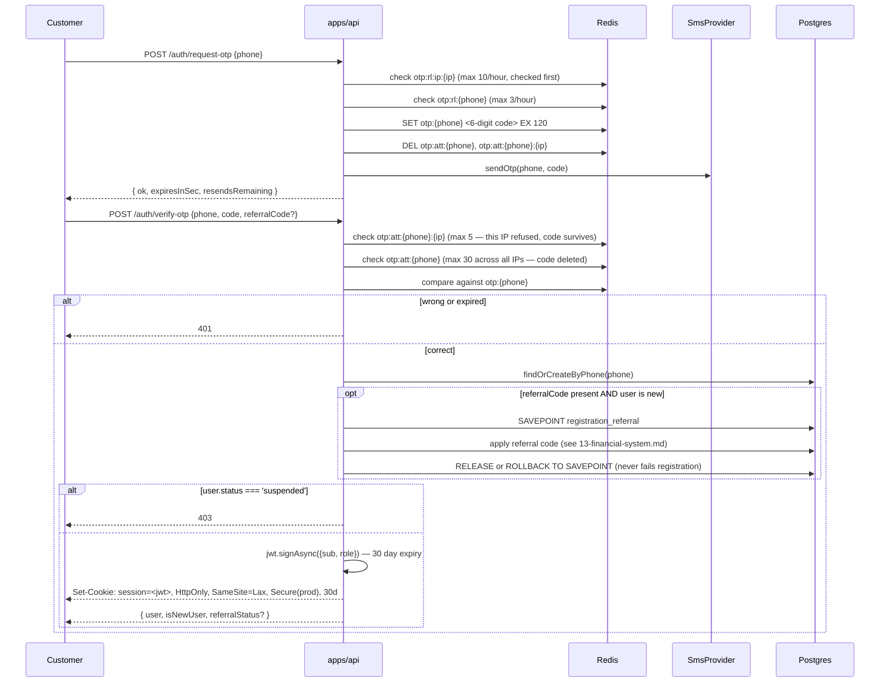

# 05 — Authentication

## Mechanism: OTP over SMS, not passwords

There is no password anywhere in the system. Login is phone number + a 6-digit SMS code. Phone format is validated as `IRAN_MOBILE = /^09\d{9}$/` (`apps/api/src/auth/dto/auth.dto.ts`).

Files: `apps/api/src/auth/auth.controller.ts`, `auth.service.ts` (`OtpService`), `auth.guard.ts`, `roles.guard.ts`, `dto/auth.dto.ts`.

## Login sequence

## Token & cookie details

- **JWT claims**: `{ sub: userId, role: UserRole }` only — no other custom claims.
- **Expiry**: 30 days (`JwtModule.registerAsync`'s `expiresIn: '30d'`), matching the cookie's `maxAge`.
- **Secret**: `JWT_SECRET` env var, required (`getOrThrow`) — the API will not boot without it. In `NODE_ENV=production` it is additionally checked at module registration by `auth/jwt-secret.util.ts` `assertProductionJwtSecret()`: a known `.env.example` placeholder (`dev-secret-change-me`, `test-secret`, `secret`, `changeme`) or anything shorter than 32 characters aborts boot with a clear error, so a forgeable session secret fails the deploy rather than the first login. Dev/test keep their short fixed secrets untouched.
- **No revocation**: the JWT carries no `jti` and there is no denylist — logout clears the cookie, but a copied token stays valid until its 30-day expiry (suspension is the only server-side kill switch, via `AuthGuard`'s per-request status check). Tracked in [24-technical-debt.md](./24-technical-debt.md).
- **Cookie**: name `session`, `httpOnly: true` (never readable by JS on any frontend), `sameSite: 'lax'`, `secure: NODE_ENV === 'production'`.
- Tokens are **never** exposed to JavaScript on any frontend — every frontend's session state is populated by calling `GET /auth/me` and trusting the cookie to do its job silently on every subsequent request (`credentials: 'include'`/`credentials: include` on every `fetch`/`$fetch`).

## Rate limiting & abuse controls (Redis-backed)

| Control | Key | Limit (`auth/otp.service.ts` constants) |
|---|---|---|
| OTP requests per IP | `otp:rl:ip:{ip}` | `IP_RATE_LIMIT_MAX = 10` per hour — checked and incremented **before** the per-phone counter, so a request an abusive IP was going to be refused for never burns the target phone's own resend quota. Targets one attacker cycling many numbers, not a few real users behind one NAT |
| OTP requests per phone | `otp:rl:{phone}` | `RATE_LIMIT_MAX = 3` per hour (`resendsRemaining` in the response is derived from this) |
| Wrong guesses per (phone, IP) | `otp:att:{phone}:{ip}` | `MAX_VERIFY_ATTEMPTS_PER_IP = 5` per 120s code lifetime — past it *that IP* is refused, but the code stays alive for its owner |
| Wrong guesses per phone, all IPs | `otp:att:{phone}` | `MAX_VERIFY_ATTEMPTS_PER_PHONE = 30` — the brute-force backstop; past it the code and both counters are deleted |
| OTP code itself | `otp:{phone}` | expires after 120s; a successful verify deletes it and both attempt keys, a fresh issue resets both attempt keys |

The per-IP guess budget exists because a single per-phone counter was a cheap targeted lockout: five junk guesses from anywhere killed the victim's freshly-issued code, and combined with the 3-codes-per-hour cap that locked the real owner out. The IP is `req.ip` (`main.ts` sets `trust proxy: 1`, so behind Caddy it is the real client address from `X-Forwarded-For`; `'unknown'` if absent). All counters live in Redis with a TTL matching their window — no cleanup job needed, they self-expire. Full Redis key inventory: [18-background-jobs.md](./18-background-jobs.md) (Redis section) / [19-third-party-services.md](./19-third-party-services.md).

## `AuthGuard` — the primary gate

`apps/api/src/auth/auth.guard.ts`, registered globally as `APP_GUARD` in `app.module.ts` — it runs on every route, and a public route opts out with `@Public()` (checked first via `Reflector`, handler-then-class):
1. Reads `req.cookies['session']`; **401** if absent.
2. `jwt.verifyAsync(token)` → **401** if invalid/expired.
3. Looks up `payload.sub` via `UsersService.findById` → **401** if the user no longer exists.
4. **403** if `user.status === 'suspended'` — re-checked on **every request**, not just at login, so a mid-session suspension takes effect immediately.
5. On success, attaches `req.user = user`.

## `RolesGuard` — role gate

`apps/api/src/auth/roles.guard.ts`. Reads `@Roles(...roles)` metadata off the handler/class via `Reflector`. **Must run after `AuthGuard`** (relies on `req.user`). If no `@Roles` metadata is present, it passes through. The only role actually used anywhere in the codebase is `'admin'` — `provider`/`customer` distinctions are enforced structurally (ownership checks), not via `@Roles`.

## `SalonOwnerGuard` — ownership gate

`apps/api/src/salons/salon-owner.guard.ts`. Also must run after `AuthGuard`. Calls `SalonsService.findMine(userId)` (`repo.findOneBy({ ownerId })`) and stashes the result's `id` on `req.salonId`. **404s if the caller owns no salon at all** — it does **not** check the salon's moderation status, so any salon owned by the caller (even `pending`/`rejected`/`suspended`) satisfies the guard; downstream handlers that need to gate on status do so themselves. Used by every `salons/mine/*` provider-facing controller. Full guard inventory: [17-permissions.md](./17-permissions.md).

## Registration & referral interaction

If `verify-otp` is called with a `referralCode` **and** the user is genuinely new, the referral is applied inside the *same* transaction that creates the user row, wrapped in its own `SAVEPOINT registration_referral` — any failure in referral resolution (invalid code, disabled reward type, capacity limit hit) rolls back only to that savepoint and is surfaced as `referralStatus` in the response, **never** failing the registration itself. Full detail: [13-financial-system.md](./13-financial-system.md).

## Logout

`POST /auth/logout` (`AuthGuard`) — `204`, clears the `session` cookie server-side (`res.clearCookie`). Each frontend additionally clears its own local session store (Pinia) and, in `user-app`'s case, unsubscribes push *before* clearing the cookie (`useLogout.ts` — order matters, the unsubscribe call is scoped by `{endpoint, userId}` and needs the cookie to still be valid).

## Frontend session handling (all three apps)

Each app follows the same shape independently (no shared code, per the cross-app isolation convention — see [02-system-architecture.md](./02-system-architecture.md)):

- A single Pinia store (`session.ts`) holding `{ user, checked }`.
- Session is **not** eagerly bootstrapped at app startup — it's lazily populated the first time a route guard/middleware runs `GET /auth/me`.
- A 401 from any API call (via each app's own `useApi.ts`) triggers a redirect to `/login` unless the call explicitly opts out (`redirectOn401: false`) — used for background/best-effort lookups (e.g. wallet balance) that shouldn't force-navigate a user away from what they were doing.
- **`admin-panel`** additionally enforces `role === 'admin'` client-side in its router guard (redirecting non-admins to `/forbidden`) — a defense-in-depth check layered on top of the backend's own `RolesGuard`.
- **`provider-panel`** has no client-side role check at all; its router guard instead branches entirely on whether `GET /salons/mine` resolves (no salon → onboarding; salon not approved → pending-approval screen with carve-outs).
- **`user-app`**'s route guard (`middleware/auth.global.ts`) additionally redirects to `/profile` if the logged-in user is missing `name`/`gender` (`needsProfileCompletion`) — because `gender` is a required parameter for search and there's no separate onboarding route.

## Related documents

- [17-permissions.md](./17-permissions.md) — full guard/role inventory across all four apps
- [13-financial-system.md](./13-financial-system.md) — referral redemption at registration
- [21-security.md](./21-security.md) — cookie/CORS security posture

## Session revocation

Sessions are stateless 30-day JWTs in an HttpOnly cookie. Two independent kill switches:

- **Account-level, always live.** `AuthGuard` reloads the user on every request and rejects
  `status === 'suspended'`, so an admin suspension stops every existing token immediately,
  with no token bookkeeping at all.
- **Session-level.** Every token minted at `verify-otp` carries a `jti` (`randomUUID()`).
  `POST /auth/logout` writes `session:revoked:{jti}` to Redis with a TTL equal to the
  token's own remaining lifetime, and `AuthGuard` checks that key before it even loads the
  user. Clearing the cookie only ends the session in the caller's own browser; revoking the
  `jti` is what ends it for a copied or stolen token — which is the point of logging out on
  a shared device.

Design notes worth keeping:

- **Denylist, not a session store.** Almost every request carries a non-revoked session, so
  an allowlist would mean a Redis write per login and a lookup that must succeed for anyone
  to use the site. A denylist holds only the rare revoked ones and each entry expires with
  the token it refers to, so the set stays small and needs no sweeper.
- **Fail-closed.** If the Redis check throws, the request is rejected. This is the deliberate
  opposite of the alert-dedup fail-open convention: a missed alert is an annoyance, while
  treating a revoked session as valid defeats the whole mechanism. Redis is already a hard
  dependency of login (OTP codes live there), so an outage that breaks this check has
  already broken authentication.
- **Legacy tokens degrade, they do not break.** A token minted before `jti` existed has no id
  to check, so it is accepted and simply cannot be revoked individually — it still expires on
  its own and suspension still stops it. Deploying revocation therefore does not log every
  active user out.
- Logging out one device does **not** log out the others: revocation is per token, not per
  user. A "log out everywhere" control would need a `users.token_version` claim compared on
  each request; not built.

Both behaviours are pinned end-to-end in `test/auth.e2e-spec.ts` (a copied cookie stops
working after logout; a second device's session survives it).
