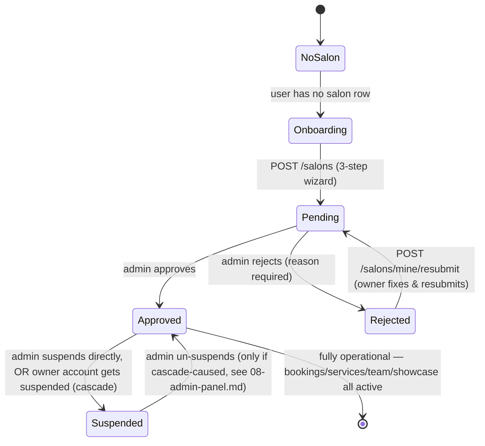

# 07 — Salon Panel (`apps/provider-panel`)

The salon-owner back office. Vue 3 + Vite SPA (no SSR need — fully authenticated tool). Port 3004.

## Routing & guard

`src/router/index.ts`. No `meta.requiresAuth`/`meta.role` flags — a single centralized `router.beforeEach` handles everything:

1. If session not yet `checked`, calls `GET /auth/me` (`redirectOn401:false`); only marks `checked` on a real success or a confirmed 401 (network/5xx errors retry on the next navigation).
2. `meta.public` routes (`/login`): logged-in → `dashboard`; else allowed.
3. Not logged in → `/login`.
4. Logged in: fetches `useSalon()` (module-level singleton), lazily `refetch()`s.
   - No salon → forced to `/onboarding`.
   - Salon `status !== 'approved'` → forced to `/pending-approval`, with carve-outs: `rejected` may still reach `/settings` (to fix and resubmit); `pending` may still reach `/hours` and `/services` (to finish an onboarding that was interrupted partway).
   - Otherwise, `/onboarding`/`/pending-approval` themselves are blocked → redirect to `dashboard`.

**No explicit role check anywhere** — gating is entirely driven by salon-ownership data (`GET /salons/mine`), not `user.role`. Contrast with admin-panel's explicit `role==='admin'` check — see [17-permissions.md](./17-permissions.md).

## Pages (`src/pages/`)

| Page | Purpose |
|---|---|
| `LoginView.vue` | Phone→OTP two-step login, Persian-digit normalization, 120s countdown |
| `OnboardingView.vue` | 3-step wizard: salon info → hours → first service (`POST /salons`, `PUT /salons/mine/hours`, `POST /salons/mine/services`) |
| `PendingApprovalView.vue` | Status screen for pending/rejected/suspended salons; `POST /salons/mine/resubmit` |
| `DashboardView.vue` | Today's/upcoming bookings + 7-tile quick-link grid |
| `BookingsView.vue` | Full booking list, worker assignment, status transitions (`completed`/`no_show`), cancellation |
| `ServicesView.vue` | Service CRUD, inline price/discount/description edits, soft-deactivate (no reactivation path) |
| `CouponsView.vue` | Salon-scoped coupon CRUD (percent-only from this UI), `JalaliDatePicker` for expiry |
| `TeamView.vue` | Worker roster: add worker, toggle active, per-worker service-restriction multi-select, lazy-reveal referral code |
| `HoursView.vue` | Weekly schedule editor + one-off closure exceptions |
| `PhotosView.vue` | Salon photo gallery: upload, set-cover, delete |
| `StoriesView.vue` | 24h-expiring stories (cap 10 active), live countdown |
| `PortfolioView.vue` | Portfolio items (cap 40), caption edit, service link, manual reorder |
| `SalonSettingsView.vue` | Edit salon (reuses onboarding's `SalonInfoStep`) + showcase profile fields + live preview |
| `ReviewsView.vue` | Customer reviews, unanswered-first sort, reply composer |
| `EarningsView.vue` | Read-only: totals row + monthly invoice history |

Every page has a colocated `.spec.ts`.

## Composables (`src/composables/`)

- **`useApi.ts`** — `apiFetch<T>(path, {method, body, silent, redirectOn401})`. Includes a `normalizeApiMessage()` helper (**not** present in admin-panel) that converts NestJS `class-validator`'s English `message: string[]` arrays into a fixed Persian fallback string for 400s — a real, if minor, inconsistency between the two apps.
- **`useSalon.ts`** — module-level singleton, treats a `GET /salons/mine` 404 as "no salon" (not an error state).
- **`useCities.ts`** — fetches `GET /cities` (the backend-canonical Iranian city list with lat/lng).
- **`useServiceCategories.ts`** — fetches `GET /categories`.
- **`useTheme.ts`** — `localStorage['provider-theme']`.
- **`useToast.ts`** — module-level singleton, 5s auto-dismiss.

## UI component library (`src/components/ui/`)

`AppButton`, `AppCard`, `AppIcon`, `AppInput`, `AppMultiSelect` (**provider-panel-only** — `vue-multiselect` in `multiple` mode, used by `TeamView`'s worker-service restriction picker), `AppSelect`, `EmptyState`, `JalaliDatePicker`, `StatusBadge`. Confirmed **not shared** with admin-panel despite being near-byte-identical for several files — see [24-technical-debt.md](./24-technical-debt.md).

## The salon-owner workflow

## Feature depth: the worker-service restriction feature

`TeamView.vue` is the UI for the most recently added feature: letting an owner restrict which of the salon's services each team member is allowed to perform. It fetches `GET /salons/mine/workers` (each worker returned with an attached `serviceIds` array) and `GET /salons/mine/services`, renders an `AppMultiSelect` per worker bound to that worker's `serviceIds`, and on change calls `PATCH /salons/mine/workers/:id/services`. An **empty selection is valid and meaningful** — it clears the worker back to "unrestricted, eligible for every service," not an error. Full backend detail (including how this is enforced at booking time): [09-booking-engine.md](./09-booking-engine.md).

## Styling

Tailwind v4 (`@theme static {}`, no `tailwind.config.js`). Design tokens in `src/assets/css/main.css`: `--color-surface`, `--color-accent(-strong/-deep/-soft/-text)`, `--tone-success/warning/danger/neutral/info(-bg/-text)`, `--shadow-sm/md/lg`. Manual `.dark` class toggle (not OS-only), driven by `useTheme.ts` + `localStorage`. Font: `@fontsource-variable/vazirmatn`, RTL throughout via logical CSS properties (`start-`/`end-`/`ps-`/`pe-`).

A `DESIGN.md` exists in this app's directory but is **materially stale** relative to the shipped code (it describes tokens and components as not-yet-built that are, in fact, already fully implemented and used everywhere) — treat it as a historical snapshot, not ground truth. See [24-technical-debt.md](./24-technical-debt.md) for specifics.

## Related documents

- [09-booking-engine.md](./09-booking-engine.md) — the worker-eligibility feature this panel manages
- [13-financial-system.md](./13-financial-system.md) — coupons, referral codes
- [14-commission.md](./14-commission.md) — the earnings/invoice data this panel displays
- [08-admin-panel.md](./08-admin-panel.md) — the counterpart moderation flow that approves/rejects/suspends this panel's salon
