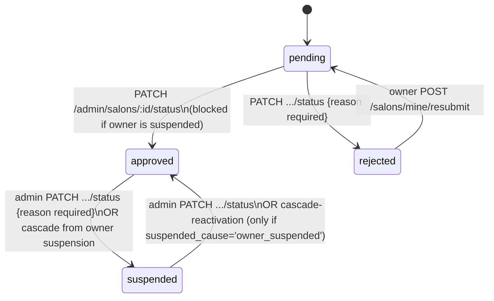

# 08 — Admin Panel (`apps/admin-panel`)

The platform-staff back office. Vue 3 + Vite SPA, same minimal stack as provider-panel but zero shared code. Port 3005.

## Routing & guard

`src/router/index.ts`. Every layout route carries `meta.title` (Persian page title) — a convention provider-panel's router does not have.

Guard logic mirrors provider-panel's `GET /auth/me`-bootstrap-once skeleton, but the terminal check is **role-based, not ownership-based**:
- `!session.isLoggedIn` → `/login`.
- `!session.isAdmin` (`user?.role === 'admin'`) → forced to `/forbidden`.
- On `/forbidden` while actually admin → redirect to `/dashboard`.

This is real client-side defense-in-depth on top of the backend's own `RolesGuard('admin')` — see [17-permissions.md](./17-permissions.md).

## Pages (`src/pages/`)

| Page | Purpose |
|---|---|
| `LoginView.vue` | Phone→OTP login (own copy of the component) |
| `ForbiddenView.vue` | Shown to non-admin logged-in users; only action is logout |
| `DashboardView.vue` | ECharts pie/bar charts (salon status, gender split, user roles, review rating distribution) + stat tiles + quick-links |
| `SalonsView.vue` | Paginated/filterable (status/city/gender/name) salon table, featured-badge logic |
| `SalonDetailView.vue` | Tabbed detail (info/stories/portfolio) for one salon; hosts status-change and showcase-moderation actions |
| `FeaturedView.vue` | Paginated table of approved salons; toggles a salon's featured flag and its (optional) expiry via `PATCH /admin/salons/:id/featured` — moved here from `user-app`'s `/admin/featured`, see [24-technical-debt.md](./24-technical-debt.md) |
| `ReviewsView.vue` | Review moderation queue, distinguishes `withdrawn` (customer self-deleted) from admin `rejected` |
| `WorkerRatingsView.vue` | Same pattern for worker ratings |
| `ReportsView.vue` | Trust & safety report queue (salon/review/story/portfolio targets), graceful fallback rendering when the target content was since deleted/expired |
| `CategoriesView.vue` | Service-category CRUD (inline edit/delete with confirm) |
| `CouponsView.vue` | Platform-wide coupon CRUD |
| `WalletView.vue` | Wallet ledger: phone-search filter, type/date filters, manual balance adjustment |
| `InvoicesView.vue` | Monthly per-salon settlement invoices, expandable item/payment detail, "record payment" action |
| `ReferralsView.vue` | Referral fraud-review table, lazy per-row reward detail, cancel action |
| `ReferralSettingsView.vue` | Fixed 3-row (user/salon_owner/worker) reward-terms editor, "disabled" banner for zero-value defaults |
| `BlogPostsView.vue` | Blog post list + a side blog-categories mini-CRUD panel |
| `BlogEditorView.vue` | Full post editor: title/slug/category/author/excerpt/SEO panel/cover upload/Markdown body with live `v-html` preview, publish/unpublish/delete |
| `UsersView.vue` | Paginated user table (phone/name/role/joined-date filters), suspend/unsuspend action (hidden on the acting admin's own row) |
| `AuditLogView.vue` | Immutable audit trail viewer, action/actor/date filters, JSON payload expander |
| `ConfigView.vue` | Platform config key/value editor, confirm-summary step before submit |

## Composables (`src/composables/`)

- **`useApi.ts`** — same shape as provider-panel's, but **without** the English-array-message guard (a raw NestJS `class-validator` 400 message could leak untranslated into a toast here — a real, unguarded gap).
- **`useTheme.ts`** — identical mechanism, key `'admin-theme'`.
- **`useToast.ts`** — functionally identical to provider-panel's.
- **`usePhoneUserSearch.ts`** — **admin-panel-only.** Debounced (350ms) phone-number user lookup against `GET /admin/users?phone=`, click-outside dismiss, race-guarded via an incrementing token. Shared by `WalletView` and its balance-adjustment card.

No `useSalon.ts` (admin isn't a salon owner). No `useCities.ts` either — city list is a **hardcoded static duplicate** array in `utils/cities.ts`, independent of the backend's canonical `GET /cities` — a real drift risk vs. provider-panel, which fetches the live list. See [24-technical-debt.md](./24-technical-debt.md).

## UI component library (`src/components/ui/`)

`AppButton`, `AppCard`, `AppIcon`, `AppInput`, `AppSelect`, `EmptyState`, `JalaliDatePicker`, `Pagination`, `StatusBadge`. `AppSelect.vue` here has a meaningfully different contract than provider-panel's: `label`/`width`/`searchable` props, `allow-empty:true` (used for "همه.../all" filter options everywhere) — a real, intentional divergence, unlike the accidental duplication of `AppButton`/`AppCard`/`AppInput`/`EmptyState`.

## Admin moderation workflows

### Salon approval state machine

Implementation lives in `apps/api/src/salons/admin-salons.controller.ts` — notably, unlike every owner-facing salon mutation (which goes through `SalonsService`), admin approve/reject/suspend/setFeatured are **raw repository calls embedded directly in the controller**, not routed through a service layer. This is a structural inconsistency: the "can't approve a salon whose owner is suspended" business rule lives in the controller rather than being independently unit-testable. See [24-technical-debt.md](./24-technical-debt.md).

`GET /admin/salons` (queue view, defaults `status=pending`) orders by **`salon.name ASC`, not `createdAt`** — moderators do not see oldest-first by default.

### The owner-suspension cascade

`AdminUsersService.setStatus` (`apps/api/src/users/admin-users.service.ts`), in one transaction:
- Suspend: `salons WHERE owner_id=x AND status='approved' → status='suspended', suspended_cause='owner_suspended'`.
- Reactivate: `salons WHERE owner_id=x AND status='suspended' AND suspended_cause='owner_suspended' → status='approved', suspended_cause=NULL`.

A salon an admin suspended **directly** (`suspended_cause='admin'`) never matches the reactivation `WHERE` — reactivating the owner does not resurrect it. This is exactly what `suspended_cause` exists for.

### Story/portfolio content moderation

`apps/api/src/salons/admin-showcase.controller.ts` — `PATCH /admin/stories/:id/status` and `PATCH /admin/portfolio/:id/status`, body `{ status: 'published'|'removed', reason? }`. Deliberately **not** a hard delete (keeps the row as evidence, reversible). Uses a conditional CAS update keyed on the *opposite* status — a concurrent double-moderation attempt gets a 409 instead of a silent no-op re-application.

### Review & report moderation

Reviews/worker ratings: `PATCH /admin/reviews/:id`, `PATCH /admin/worker-ratings/:id/status` — publish ↔ reject. **Moderation is purely reactive** — content is `published` immediately on creation, admins only ever act *after the fact*, usually prompted by a report. Reports (`PATCH /admin/reports/:id`) resolve/dismiss a queue entry but **do not themselves moderate the underlying content** — those are two separate manual steps.

### Category delete (restrict semantics)

`DELETE /admin/categories/:id` — no pre-check query; relies entirely on the DB foreign key (`salon_services.category_id` and `salon_categories.category_id`, both `NO ACTION`) to reject the delete with a `23503`, translated into a friendly `ConflictException`. Postgres is the source of truth for "in use," not an app-level count.

### Audit log

Every admin mutation across the whole platform (salon status/featured, user status, review/worker-rating moderation, category CRUD, config update, report resolve, coupon CRUD, blog CRUD, referral cancel/reward-type update, wallet adjust) is captured via a declarative `@AuditAction(action, targetType)` decorator + `AuditInterceptor`. Full mechanism: [21-security.md](./21-security.md).

## Known cross-app inconsistencies (this app vs. provider-panel)

Both apps' `DESIGN.md` files are stale relative to the shipped code (both claim missing components/tokens that already exist). `admin-panel`'s `DESIGN.md` also incorrectly claims `JalaliDatePicker.vue` is admin-panel-exclusive — provider-panel has a near-identical copy. Full list: [24-technical-debt.md](./24-technical-debt.md).

## Related documents

- [17-permissions.md](./17-permissions.md) — every guard in this app and the backend it talks to
- [12-wallet.md](./12-wallet.md), [13-financial-system.md](./13-financial-system.md), [14-commission.md](./14-commission.md) — the financial screens this app hosts
- [21-security.md](./21-security.md) — the audit logging mechanism in full
