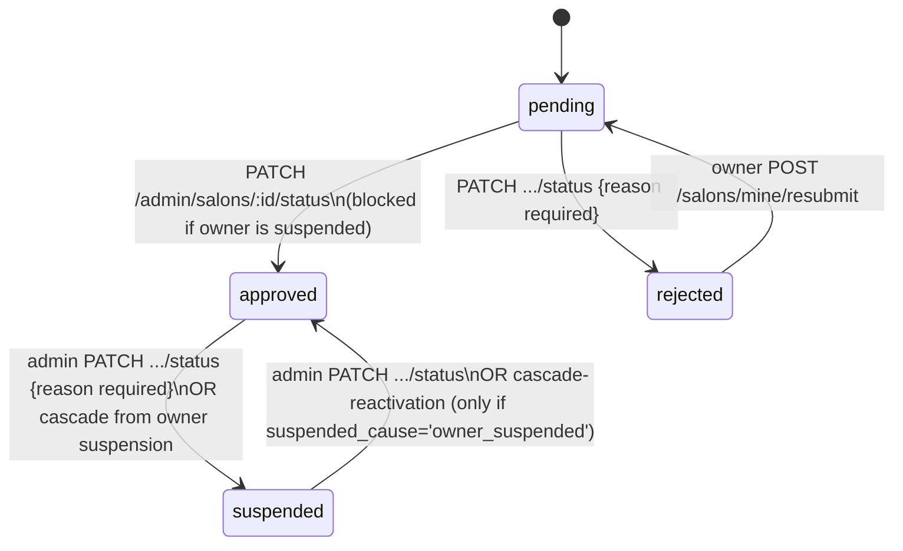

# 08 — Admin Panel (`apps/admin-panel`)

The platform-staff back office. Vue 3 + Vite SPA, same minimal stack as provider-panel but zero shared code. Port 3005.

## Routing & guard

`src/router/index.ts`. Every layout route carries `meta.title` (Persian page title) — a convention provider-panel's router does not have.

Guard logic mirrors provider-panel's `GET /auth/me`-bootstrap-once skeleton, but the terminal check is **role-based, not ownership-based**:
- `!session.isLoggedIn` → `/login`.
- `!session.isAdmin` (`user?.role === 'admin'`) → forced to `/forbidden`.
- On `/forbidden` while actually admin → redirect to `/dashboard`.

This is real client-side defense-in-depth on top of the backend's own `RolesGuard('admin')` — see [17-permissions.md](./17-permissions.md).

## Pages (`src/pages/`)

| Page | Purpose |
|---|---|
| `LoginView.vue` | Phone→OTP login (own copy of the component) |
| `ForbiddenView.vue` | Shown to non-admin logged-in users; only action is logout |
| `DashboardView.vue` | ECharts pie/bar charts (salon status, gender split, user roles, review rating distribution) + stat tiles + quick-links |
| `AnalyticsView.vue` | Product-analytics funnel (`GET /admin/analytics/summary`): per-event totals + day-by-day booking-funnel breakdown over an optional date range (server default: last 30 days) |
| `SalonsView.vue` | Paginated/filterable (status/city/gender/name) salon table, featured-badge logic |
| `SalonDetailView.vue` | Tabbed detail (info/stories/portfolio) for one salon; hosts status-change, showcase-moderation, per-salon booking-timeout overrides, and the `SalonSubscriptionCard` (plan assign/cancel, entitlement overrides, billing periods — each paid/comped/void settle behind an inline confirm step, since a settled period is irreversible) |
| `BookingTimelineView.vue` | `/bookings/:id` — the `booking_events` lifecycle timeline (`GET /admin/bookings/:id/events`), the admin's only cross-salon booking view ([28](./28-booking-approval-workflow.md)) |
| `FeaturedView.vue` | Paginated table of approved salons; toggles a salon's featured flag and its (optional) expiry via `PATCH /admin/salons/:id/featured` — moved here from `user-app`'s `/admin/featured`, see [24-technical-debt.md](./24-technical-debt.md) |
| `ReviewsView.vue` | Review moderation queue, distinguishes `withdrawn` (customer self-deleted) from admin `rejected`. Honors a `?salonId=` deep link (the exact-id filter `ReportsView`'s escalation link uses — backend gives `salonId` precedence over `salonName`), with a request-sequence guard so a slow earlier response can't overwrite a newer filter's result, and no double-fetch on filter change |
| `WorkerRatingsView.vue` | Same pattern for worker ratings |
| `ReportsView.vue` | Trust & safety report queue (salon/review/story/portfolio targets), graceful fallback rendering when the target content was since deleted/expired; links to `/reviews?salonId=` for review-target escalation |
| `CategoriesView.vue` | Service-category CRUD (inline edit/delete with confirm) |
| `CategoryRequestsView.vue` | Provider-submitted new-category requests (`GET /admin/category-requests`, status filter), approve/reject via `ResolveCategoryRequestActions` (`PATCH /admin/category-requests/:id/approve\|reject`) |
| `CouponsView.vue` | Platform-wide booking-coupon CRUD |
| `SubscriptionCouponsView.vue` | Subscription coupons: create/list/deactivate/reactivate (`PATCH {isActive}`), percent-only ([34](./34-subscription-coupons-and-billing.md)) |
| `PlansView.vue` | Plan CRUD (`/admin/plans`): price, entitlements as raw JSON, active toggle, default-plan move; the API refuses to make the default plan inactive ([30](./30-subscription-plan-foundation.md)) |
| `FeatureFlagsView.vue` | `GET`/`PATCH /admin/feature-flags` — every platform feature flag incl. `onlinePaymentEnabled` ([29](./29-global-payment-toggle.md)) |
| `WalletView.vue` | Wallet ledger: phone-search filter, type/date filters, manual balance adjustment |
| `InvoicesView.vue` | Monthly per-salon settlement invoices, expandable item/payment detail, "record payment" action (row-locked and refused on a `void` invoice server-side) |
| `ReferralsView.vue` | Referral fraud-review table, lazy per-row reward detail (a failed rewards fetch is shown as an error and retried on next expand, never cached as "no rewards granted"), cancel action |
| `ReferralSettingsView.vue` | Fixed 3-row (user/salon_owner/worker) reward-terms editor, "disabled" banner for zero-value defaults |
| `BlogPostsView.vue` | Blog post list + a side blog-categories mini-CRUD panel |
| `BlogEditorView.vue` | Full post editor: title/slug/category/author/excerpt/SEO panel/cover upload/Markdown body with live `v-html` preview, publish/unpublish/delete |
| `UsersView.vue` | Paginated user table (phone/name/role/joined-date filters), suspend/unsuspend action (hidden on the acting admin's own row) |
| `AuditLogView.vue` | Immutable audit trail viewer, action/actor/date filters, JSON payload expander. `utils/labels.ts` carries a Persian label for all 47 backend `@AuditAction` keys and every target type; `labels.spec.ts` pins the list length so a new backend action without a label fails the build, not the reader |
| `ConfigView.vue` | Platform config key/value editor, confirm-summary step before submit |

## Composables (`src/composables/`)

- **`useApi.ts`** — same shape as provider-panel's, including its own copy of `normalizeApiMessage()` (a `class-validator` 400's English `string[]` becomes a fixed Persian fallback; arrays on any other status are joined rather than dropped).
- **`useTheme.ts`** — identical mechanism, key `'admin-theme'`.
- **`useToast.ts`** — functionally identical to provider-panel's.
- **`useCities.ts`** — fetches the backend-canonical `GET /cities`, same live list provider-panel uses (the old hardcoded `utils/cities.ts` duplicate is gone).
- **`usePhoneUserSearch.ts`** — **admin-panel-only.** Debounced (350ms) phone-number user lookup against `GET /admin/users?phone=`, click-outside dismiss, race-guarded via an incrementing token. Shared by `WalletView` and its balance-adjustment card.

No `useSalon.ts` (admin isn't a salon owner).

## UI component library (`src/components/ui/`)

`AppButton`, `AppCard`, `AppIcon`, `AppInput`, `AppSelect`, `EmptyState`, `JalaliDatePicker`, `Pagination`, `StatusBadge`. `AppSelect.vue` here has a meaningfully different contract than provider-panel's: `label`/`width`/`searchable` props, `allow-empty:true` (used for "همه.../all" filter options everywhere) — a real, intentional divergence, unlike the accidental duplication of `AppButton`/`AppCard`/`AppInput`/`EmptyState`.

## Admin moderation workflows

### Salon approval state machine

Routes live in `apps/api/src/salons/admin-salons.controller.ts`; the mutations (`setStatus`, `setFeatured`, `updateHandle`) go through `SalonsService` like every owner-facing salon mutation, so the "can't approve a salon whose owner is suspended" rule (`ConflictException` in `SalonsService.setStatus`, via `UsersService.findById`) is unit-testable on its own. The controller only reads the `before` row itself for the audit payload.

`GET /admin/salons` (queue view, defaults `status=pending`) orders by `salon.createdAt ASC` — oldest first, so the longest-waiting salon is at the top.

### The owner-suspension cascade

`AdminUsersService.setStatus` (`apps/api/src/users/admin-users.service.ts`), in one transaction:
- Suspend: `salons WHERE owner_id=x AND status='approved' → status='suspended', suspended_cause='owner_suspended'`.
- Reactivate: `salons WHERE owner_id=x AND status='suspended' AND suspended_cause='owner_suspended' → status='approved', suspended_cause=NULL`.

A salon an admin suspended **directly** (`suspended_cause='admin'`) never matches the reactivation `WHERE` — reactivating the owner does not resurrect it. This is exactly what `suspended_cause` exists for.

### Story/portfolio content moderation

`apps/api/src/salons/admin-showcase.controller.ts` — `PATCH /admin/stories/:id/status` and `PATCH /admin/portfolio/:id/status`, body `{ status: 'published'|'removed', reason? }`. Deliberately **not** a hard delete (keeps the row as evidence, reversible). Uses a conditional CAS update keyed on the *opposite* status — a concurrent double-moderation attempt gets a 409 instead of a silent no-op re-application.

### Review & report moderation

Reviews/worker ratings: `PATCH /admin/reviews/:id`, `PATCH /admin/worker-ratings/:id/status` — publish ↔ reject. **Moderation is purely reactive** — content is `published` immediately on creation, admins only ever act *after the fact*, usually prompted by a report. Reports (`PATCH /admin/reports/:id`) resolve/dismiss a queue entry but **do not themselves moderate the underlying content** — those are two separate manual steps.

### Category delete (restrict semantics)

`DELETE /admin/categories/:id` — no pre-check query; relies entirely on the DB foreign key (`salon_services.category_id` and `salon_categories.category_id`, both `NO ACTION`) to reject the delete with a `23503`, translated into a friendly `ConflictException`. Postgres is the source of truth for "in use," not an app-level count.

### Audit log

Every admin mutation across the whole platform (salon status/featured, user status, review/worker-rating moderation, category CRUD, config update, report resolve, coupon CRUD, blog CRUD, referral cancel/reward-type update, wallet adjust) is captured via a declarative `@AuditAction(action, targetType)` decorator + `AuditInterceptor`. Full mechanism: [21-security.md](./21-security.md).

## Known cross-app inconsistencies (this app vs. provider-panel)

Both apps' `DESIGN.md` files were rewritten on 2026-08-07 and now match the shipped code; `admin-panel/DESIGN.md` explicitly records that `JalaliDatePicker.vue` is a shared pattern maintained as two near-identical copies (not admin-exclusive) and that `Pagination.vue` is the one genuinely admin-only reusable component worth back-porting. The remaining cross-app duplication cost is catalogued in [24-technical-debt.md](./24-technical-debt.md).

## Related documents

- [17-permissions.md](./17-permissions.md) — every guard in this app and the backend it talks to
- [12-wallet.md](./12-wallet.md), [13-financial-system.md](./13-financial-system.md), [14-commission.md](./14-commission.md) — the financial screens this app hosts
- [21-security.md](./21-security.md) — the audit logging mechanism in full
