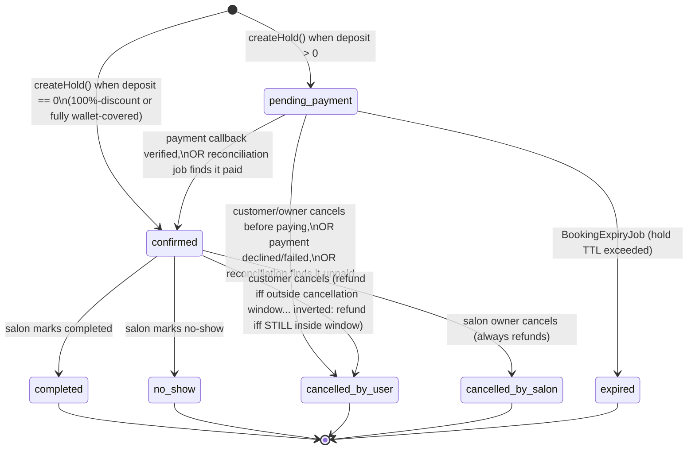
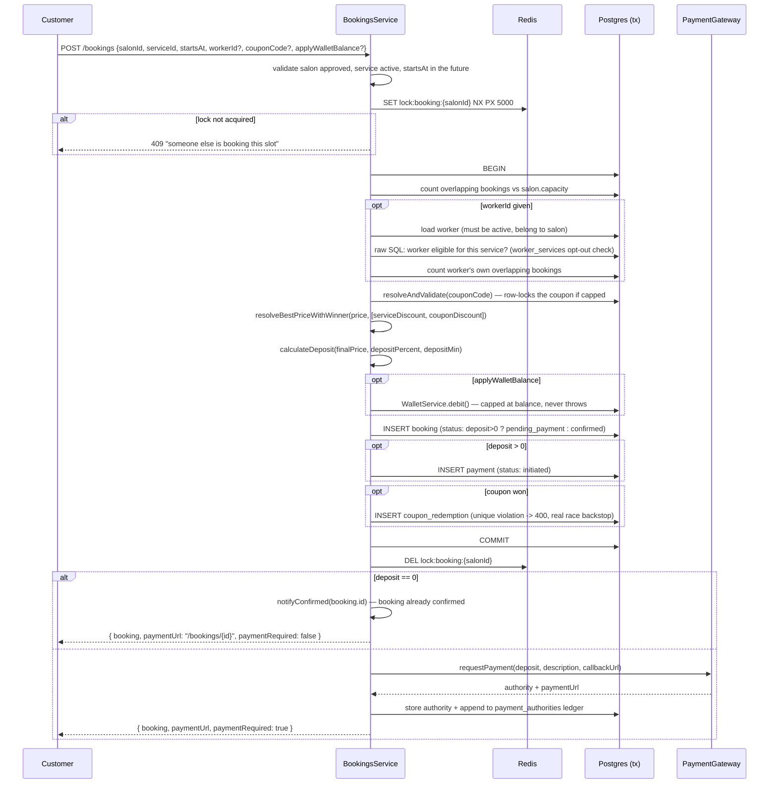

# 09 — Booking Engine

Core files: `apps/api/src/booking/bookings.service.ts`, `booking.entity.ts`, `bookings.controller.ts`, `salon-bookings.controller.ts`, `dto/booking.dto.ts`.

## `Booking.status` state machine



> **This diagram describes `automatic` mode.** A salon may instead run **manual approval**
> (`salons.booking_confirmation_mode`), which inserts a `pending_approval` state before any
> payment exists at all, and adds a `rejected_by_salon` terminal state. The full extended state
> machine, and why an approval timeout reuses `expired` rather than a new status, is documented
> in [28-booking-approval-workflow.md](./28-booking-approval-workflow.md).

All terminal states (`completed`, `no_show`, both cancellation states, `expired`, `rejected_by_salon`) are truly terminal — nothing in the codebase transitions out of them. Every write that moves a booking between states uses a **conditional CAS `UPDATE ... WHERE status = <expected>`** and checks `affected`, throwing `ConflictException` on a lost race — this idiom is used consistently everywhere in this subsystem (and echoed in several other modules — see [20-business-rules.md](./20-business-rules.md)).

## `createHold()` — the core transaction



### Every validation/business rule inside `createHold`, in order

1. Salon must exist and be `status='approved'`.
2. Service must exist, belong to the salon, and be `isActive`.
3. `startsAt` must be a valid ISO date strictly in the future. `endsAt = startsAt + service.durationMin`.
4. **Redis lock** `lock:booking:{salonId}` (`SET NX PX 5000`) — locked **per salon, not per exact slot**, because two different-duration services can produce overlapping intervals with different `startsAt` values that a slot-keyed lock wouldn't serialize correctly under READ COMMITTED. Released in a `finally`.
5. **Salon capacity**: count of overlapping `pending_payment`/`confirmed` bookings must be `< salon.capacity`.
6. **Worker checks** (only if `workerId` given), *independent of and in addition to* capacity:
   - Worker exists, belongs to the salon, and `active` — else 400/404.
   - **Service eligibility** (the opt-out model): `NOT EXISTS(worker_services WHERE worker_id) OR EXISTS(worker_services WHERE worker_id AND service_id)` — a worker with **zero** rows is eligible for everything; a worker with rows is restricted to exactly those. Else 400 ("این کارمند این خدمت را انجام نمی‌دهد").
   - **Worker double-booking**: any overlapping booking for that specific worker → 409. Race-safety rides on the same per-salon Redis lock (a worker can't belong to two salons).
7. **Coupon resolution**: `CouponsService.resolveAndValidate(code, salonId, userId, em)` — the `em`-bearing call activates row-locking (see [13-financial-system.md](./13-financial-system.md)).
8. **Discount resolution — best price wins, never stacked**: compares the service's own `discountPercent` candidate against the coupon's candidate (percent or fixed) by **resulting price**, not raw magnitude; the coupon is only actually consumed (`couponApplied=true`, `CouponRedemption` row written) if it strictly wins.
9. **Deposit**: `calculateDeposit(finalPrice, depositPercent, depositMinToman)` = `min(max(round(price*pct/100), depositMin), price)` — see [11-payment-system.md](./11-payment-system.md) for the formula and why it's capped at the price itself.
10. **Wallet application** (only if `applyWalletBalance`): debits up to `min(depositBeforeWallet, walletBalance)` — never throws, never blocks the booking on insufficient balance.
11. `requiresPayment = deposit > 0` after the wallet reduction — this is the branch point for a **zero-deposit booking**, which is confirmed immediately with no `Payment` row at all (deliberately load-bearing throughout the rest of the system: cancellation, earnings, the referral `first_paid_booking` trigger all correctly never fire for these).

### Zero-deposit bookings

If the final deposit is `0` (a 100%-off coupon, or wallet balance fully covering it), the booking is inserted **already `confirmed`**, no `Payment` row is created at all, and `notifyConfirmed()` is called directly (best-effort) since there's no payment callback to trigger it otherwise. The returned `paymentUrl` deliberately points at the booking-detail page, not a payment-success page (which would falsely imply a deposit was charged).

## Cancellation — `cancel()`

- Only from `pending_payment`/`confirmed`.
- Caller must be the booking's customer or the salon's owner.
- **Cancellation window rule**: owner cancel → always refunds. Customer cancel → refunds only if `(startsAt - now) >= cancellation_window_hours` (config, seeded 24h); a late customer cancellation forfeits the deposit.
- Uses a conditional CAS update keyed on the *exact* status just read (not merely "still cancellable"), specifically guarding against a payment callback racing the cancel.
- If the booking **was `confirmed`**: payment → `refund_pending` (if refunding) or stays `paid` (deposit forfeited). Refund is attempted inline afterward (best-effort; `RefundRetryJob` self-heals failures) — see [11-payment-system.md](./11-payment-system.md).
- If the booking **was `pending_payment`** (nothing captured yet): payment → `failed`, and `releaseBookingHold()` gives back any coupon redemption / wallet debit.

> Under manual approval, `cancel()` additionally refuses an **owner** cancelling a
> `pending_approval` request: that must go through `reject()`, which records the honest
> status and requires a reason. The customer's own withdrawal path is unchanged. See
> [28](./28-booking-approval-workflow.md).

## Completion / no-show — `updateStatus()`

Provider-only, only from `confirmed`. Conditional CAS. In one transaction: records commission (`InvoicingService.recordCommission`, identical treatment for both outcomes — see [14-commission.md](./14-commission.md)); on `'completed'` only, best-effort triggers `ReferralsService.tryGrantReward(...)` (see [13-financial-system.md](./13-financial-system.md)).

## Worker assignment — `assignWorker()`

Provider-side, `PATCH /salons/mine/bookings/:id/assign-worker`. Re-validates the worker belongs to the salon and is active, re-runs the same service-eligibility check as `createHold`. **No status guard and no overlap re-check** against other bookings at that slot — a real, unmitigated gap (a provider can, in principle, assign a worker into a double-booking after the fact). See [24-technical-debt.md](./24-technical-debt.md).

## Retry payment

`POST /bookings/:id/retry-payment` — only the booking's own customer, only from `pending_payment`, and only while the booking's `payment_expires_at` has not passed (the status lags the deadline by up to one cron tick, and handing out a live payment link in that gap produces a capture on a booking that is about to expire). Mints a **fresh** Zarinpal session for the same `depositAmount`; the prior session stays chargeable via the append-only `payment_authorities` ledger (so reconciliation can still find it if the customer pays through the old link).

## Data enrichment — `attachNames`

`BookingsService.listMine`/`listForSalon`/`findMine` all go through a private `attachNames()` helper: batches 3 parallel `In(...)` lookups (salon/service/worker names, skipping the worker query entirely if none of the bookings have one) rather than N+1 queries or an ORM join. `findMine` additionally attaches a customer-facing `refundStatus` derived from the linked `Payment`'s status.

## Earnings

`GET /salons/mine/earnings` sums `amount` over `paid` payments belonging to the salon's bookings; commission/net-payout figures are a pure aggregation, not backed by any separate payout ledger table (that's `financial_transactions`/`invoices` — see [14-commission.md](./14-commission.md)).

## DTOs

```ts
CreateBookingDto: { salonId: UUID; serviceId: UUID; startsAt: ISO8601;
                     couponCode?: string(1-30); applyWalletBalance?: boolean; workerId?: UUID }
UpdateBookingStatusDto: { status: 'completed' | 'no_show' }
AssignWorkerDto: { workerId: UUID }   // lives in salons/dto/worker.dto.ts, not booking.dto.ts
```

## Known limitations (see also [24-technical-debt.md](./24-technical-debt.md))

- `assignWorker` has no overlap re-check.
- The blocking-status list is now the single shared `SLOT_BLOCKING_STATUSES` constant
  (`booking.entity.ts`) rather than six inline copies — see [28](./28-booking-approval-workflow.md).
- `LOCK_TTL_MS = 5000` is a hardcoded constant, not config-driven — a `createHold` transaction that takes longer than 5s under load could let a second request acquire the lock mid-critical-section.
- A captured-then-refunded booking does **not** get its coupon redemption or wallet spend reversed — only `releaseBookingHold`'s "never captured" paths do that. Referral reward reversal is the one thing that *does* happen on refund (see [13-financial-system.md](./13-financial-system.md)).
- Worker-eligibility SQL is hand-written twice (here and in `PublicSalonContentController.listWorkers`) rather than shared — a rule change requires touching both files.

## Related documents

- [10-scheduling.md](./10-scheduling.md) — how open slots are computed
- [11-payment-system.md](./11-payment-system.md) — the Payment side of this transaction
- [13-financial-system.md](./13-financial-system.md) — coupon/discount/referral mechanics referenced above
- [18-background-jobs.md](./18-background-jobs.md) — expiry, reminder, reconciliation, refund-retry jobs
