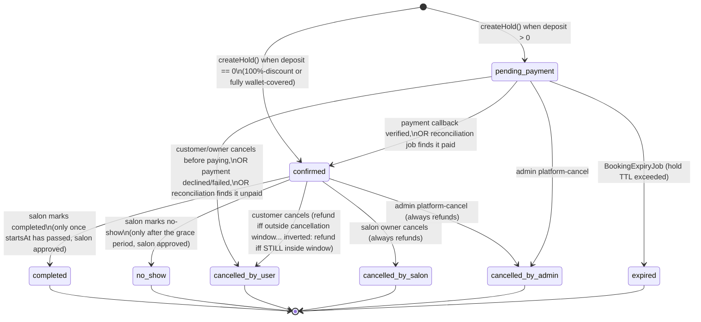
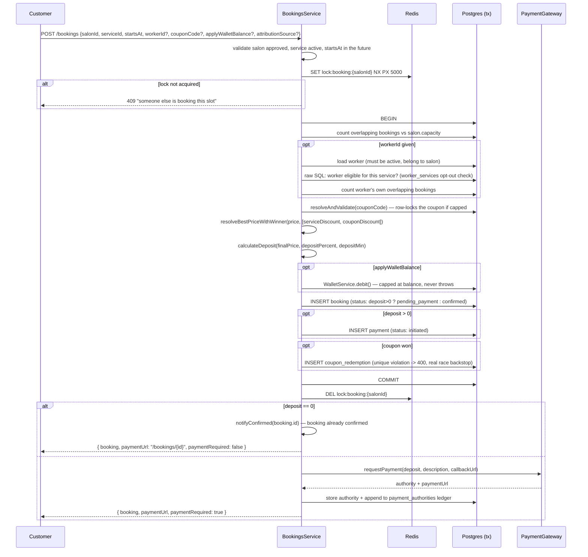

# 09 — Booking Engine

Core files: `apps/api/src/booking/bookings.service.ts`, `booking.entity.ts`, `booking-event.entity.ts`/`booking-events.service.ts`, `bookings.controller.ts`, `salon-bookings.controller.ts`, `admin-booking-settings.controller.ts`, `booking-hold-release.util.ts`, `dto/booking.dto.ts`.

## `Booking.status` state machine


```mermaid
stateDiagram-v2
    [*] --> pending_payment: createHold() when deposit > 0
    [*] --> confirmed: createHold() when deposit == 0\n(100%-discount or fully wallet-covered)
    pending_payment --> confirmed: payment callback verified,\nOR reconciliation job finds it paid
    pending_payment --> expired: BookingExpiryJob (hold TTL exceeded)
    pending_payment --> cancelled_by_user: customer/owner cancels before paying,\nOR payment declined/failed,\nOR reconciliation finds it unpaid
    confirmed --> cancelled_by_user: customer cancels (refund iff outside cancellation window... inverted: refund iff STILL inside window)
    confirmed --> cancelled_by_salon: salon owner cancels (always refunds)
    confirmed --> cancelled_by_admin: admin platform-cancel (always refunds)
    pending_payment --> cancelled_by_admin: admin platform-cancel
    confirmed --> completed: salon marks completed\n(only once startsAt has passed, salon approved)
    confirmed --> no_show: salon marks no-show\n(only after the grace period, salon approved)
    completed --> [*]
    no_show --> [*]
    cancelled_by_user --> [*]
    cancelled_by_salon --> [*]
    cancelled_by_admin --> [*]
    expired --> [*]
```

> **This diagram describes `automatic` mode with online payment enabled.** A salon may instead run **manual approval**
> (`salons.booking_confirmation_mode`), which inserts a `pending_approval` state before any
> payment exists at all, and adds a `rejected_by_salon` terminal state. The full extended state
> machine, and why an approval timeout reuses `expired` rather than a new status, is documented
> in [28-booking-approval-workflow.md](./28-booking-approval-workflow.md). `pending_approval` can also be
> platform-cancelled (`cancelled_by_admin`). Separately, the platform-wide
> `feature_online_payment_enabled` flag (seeded **off**) turns every `deposit > 0` branch below into the
> zero-deposit path — the booking is `confirmed` at creation with no `Payment` row and no gateway call,
> `deposit_amount` still records what *would* have been owed — see [29-global-payment-toggle.md](./29-global-payment-toggle.md).
> Every transition additionally appends a `booking_events` row (`BookingEventsService`), the append-only
> lifecycle log read back at `GET /admin/bookings/:id/events`.

All terminal states (`completed`, `no_show`, the three cancellation states `cancelled_by_user`/`cancelled_by_salon`/`cancelled_by_admin`, `expired`, `rejected_by_salon`) are truly terminal — nothing in the codebase transitions out of them. Every write that moves a booking between states uses a **conditional CAS `UPDATE ... WHERE status = <expected>`** and checks `affected`, throwing `ConflictException` on a lost race — this idiom is used consistently everywhere in this subsystem (and echoed in several other modules — see [20-business-rules.md](./20-business-rules.md)).

## Customer-side guards on `createHold()` (trust & launch readiness)

Applied in this order, all with Persian messages:

1. **Per-user rate limit** — `BookingsController.create` counts *attempts* per customer in Redis (`booking:create:rl:{userId}`, 15 per 10 minutes, same `INCR`+`EXPIRE` idiom as OTP/referral-validate) and answers `429` beyond that, before anything else runs.
2. **No self-booking** — the salon's owner and its **active** workers cannot be the customer (`400`). `createManual` applies the same check to the customer its phone resolves to (before the optional name write, so a refused attempt leaves that account untouched). An inactive (former) worker may book like anyone else.
3. **Abuse caps** (inside the transaction, after the salon/worker slot checks): the customer may hold at most `booking_max_active_per_user` (default **5**, admin range 1–50) active future bookings overall and `booking_max_active_per_salon_per_user` (default **2**, range 1–20) at one salon — *active* = `SLOT_BLOCKING_STATUSES` with `starts_at > now`. A booking that overlaps one the same customer already holds (any salon) is refused `409 CUSTOMER_DOUBLE_BOOKED`; a cap hit is `400 BOOKING_LIMIT_REACHED`. **Race-safety:** the per-salon Redis lock cannot serialize one customer's requests to *different* salons, so the counts run under a transaction-scoped Postgres advisory lock keyed on the customer (`pg_advisory_xact_lock(hashtextextended('booking-active:'||userId, 0))`); a competing request blocks until the first commits and then sees its booking. Proven by `test/booking-trust-guards.e2e-spec.ts` (8 parallel requests, cap 3, exactly 3 succeed).
4. **Cancellation-window snapshot** — `bookings.cancellation_window_hours` is written from the live config at creation (also by `createManual`).

## `createHold()` — the core transaction


```mermaid
sequenceDiagram
    participant C as Customer
    participant BS as BookingsService
    participant R as Redis
    participant DB as Postgres (tx)
    participant PG as PaymentGateway

    C->>BS: POST /bookings {salonId, serviceId, startsAt, workerId?, couponCode?, applyWalletBalance?, attributionSource?}
    BS->>BS: validate salon approved, service active, startsAt in the future
    BS->>R: SET lock:booking:{salonId} NX PX 5000
    alt lock not acquired
        BS-->>C: 409 "someone else is booking this slot"
    end
    BS->>DB: BEGIN
    BS->>DB: count overlapping bookings vs salon.capacity
    opt workerId given
        BS->>DB: load worker (must be active, belong to salon)
        BS->>DB: raw SQL: worker eligible for this service? (worker_services opt-out check)
        BS->>DB: count worker's own overlapping bookings
    end
    BS->>DB: resolveAndValidate(couponCode) — row-locks the coupon if capped
    BS->>BS: resolveBestPriceWithWinner(price, [serviceDiscount, couponDiscount])
    BS->>BS: calculateDeposit(finalPrice, depositPercent, depositMin)
    opt applyWalletBalance
        BS->>DB: WalletService.debit() — capped at balance, never throws
    end
    BS->>DB: INSERT booking (status: deposit>0 ? pending_payment : confirmed)
    opt deposit > 0
        BS->>DB: INSERT payment (status: initiated)
    end
    opt coupon won
        BS->>DB: INSERT coupon_redemption (unique violation -> 400, real race backstop)
    end
    BS->>DB: COMMIT
    BS->>R: DEL lock:booking:{salonId}
    alt deposit == 0
        BS->>BS: notifyConfirmed(booking.id) — booking already confirmed
        BS-->>C: { booking, paymentUrl: "/bookings/{id}", paymentRequired: false }
    else
        BS->>PG: requestPayment(deposit, description, callbackUrl)
        PG-->>BS: authority + paymentUrl
        BS->>DB: store authority + append to payment_authorities ledger
        BS-->>C: { booking, paymentUrl, paymentRequired: true }
    end
```

### Every validation/business rule inside `createHold`, in order

1. Salon must exist and be `status='approved'`.
2. Service must exist, belong to the salon, and be `isActive`.
3. `startsAt` must be a valid ISO date strictly in the future. `endsAt = startsAt + service.durationMin`.
4. **Redis lock** `lock:booking:{salonId}` (`SET NX PX 5000`) — locked **per salon, not per exact slot**, because two different-duration services can produce overlapping intervals with different `startsAt` values that a slot-keyed lock wouldn't serialize correctly under READ COMMITTED. Released in a `finally`.
5. **Salon capacity**: count of overlapping `pending_payment`/`confirmed` bookings must be `< salon.capacity`.
6. **Worker checks** (only if `workerId` given), *independent of and in addition to* capacity:
   - Worker exists, belongs to the salon, and `active` — else 400/404.
   - **Service eligibility** (the opt-out model): `NOT EXISTS(worker_services WHERE worker_id) OR EXISTS(worker_services WHERE worker_id AND service_id)` — a worker with **zero** rows is eligible for everything; a worker with rows is restricted to exactly those. Else 400 ("این کارمند این خدمت را انجام نمی‌دهد"). The SQL lives once, in `salons/worker-eligibility.service.ts` (`WorkerEligibilityService.isWorkerEligibleForService`), shared by `createHold`, `assignWorker`, `AvailabilityService`, and the public worker roster.
   - **Worker double-booking**: any overlapping booking for that specific worker → 409. Race-safety rides on the same per-salon Redis lock (a worker can't belong to two salons).
7. **Coupon resolution**: `CouponsService.resolveAndValidate(code, salonId, userId, em)` — the `em`-bearing call activates row-locking (see [13-financial-system.md](./13-financial-system.md)).
8. **Discount resolution — best price wins, never stacked**: compares the service's own `discountPercent` candidate against the coupon's candidate (percent or fixed) by **resulting price**, not raw magnitude; the coupon is only actually consumed (`couponApplied=true`, `CouponRedemption` row written) if it strictly wins.
9. **Deposit**: `calculateDeposit(finalPrice, depositPercent, depositMinToman)` = `min(max(round(price*pct/100), depositMin), price)` — see [11-payment-system.md](./11-payment-system.md) for the formula and why it's capped at the price itself.
10. **Wallet application** (only if `applyWalletBalance` **and** online payment is enabled): debits up to `min(depositBeforeWallet, walletBalance)` — never throws, never blocks the booking on insufficient balance. With the flag off there is no deposit to offset, so the wallet is left untouched.
11. `requiresPayment = deposit > 0 && onlinePaymentEnabled` after the wallet reduction — this is the branch point for a **zero-deposit booking**, which is confirmed immediately with no `Payment` row at all (deliberately load-bearing throughout the rest of the system: cancellation refunds, commission accrual, earnings, the referral `first_paid_booking` trigger all correctly never fire for these).
12. `attributionSource` (`'qr' | 'direct' | 'search'`, optional) is copied verbatim onto the row and into the `booking_started` analytics event — a marketing-channel tag, never used for any business rule ([31](./31-public-handle-and-attribution.md)).

### Zero-deposit bookings

If the final deposit is `0` (a 100%-off coupon, or wallet balance fully covering it), the booking is inserted **already `confirmed`**, no `Payment` row is created at all, and `notifyConfirmed()` is called directly (best-effort) since there's no payment callback to trigger it otherwise. The returned `paymentUrl` deliberately points at the booking-detail page, not a payment-success page (which would falsely imply a deposit was charged).

## Owner-entered bookings — `createManual()`

`POST /salons/mine/bookings` (`CreateManualBookingDto: { phone, name?, serviceId, workerId?, startsAt, notes? }`) lets an owner record a walk-in/phone customer. The customer is resolved with the same `findOrCreateByPhone` idiom the worker roster uses (a real `users` row either way; `name` is only applied to a brand-new or still-unnamed account, never overwriting a registered customer's own name). It takes the same per-salon Redis lock and runs the same capacity, worker-eligibility, and worker-overlap checks as `createHold`, then inserts the row **directly as `confirmed`** with `source='manual'`, `deposit_amount=0`, no coupon/wallet/discount resolution and no `Payment` — even when the salon runs `manual_approval` (the owner *is* the approver). Salon must be `approved`. Tracked as `booking_started` with `flow: 'manual'`. Manual bookings therefore never accrue commission and never appear in earnings.

## Cancellation — `cancel()`

- Only from `pending_approval`/`pending_payment`/`confirmed`.
- Caller must be the booking's customer or the salon's owner.
- **Cancellation window rule**: owner cancel → always refunds. Customer cancel → refunds only if `(startsAt - now) >= bookings.cancellation_window_hours` — the window **frozen on the row at creation** (live `cancellation_window_hours` config only for a row whose snapshot is NULL; the migration backfilled every pre-existing row). Changing the platform config therefore never rewrites the terms of a booking already made. `reschedule()` (customer) reads the same snapshot. A late customer cancellation forfeits the deposit.
- Uses a conditional CAS update keyed on the *exact* status just read (not merely "still cancellable"), specifically guarding against a payment callback racing the cancel.
- If the booking **was `confirmed`**: payment → `refund_pending` (if refunding) or stays `paid` (deposit forfeited). When refunding, `releaseBookingHold()` runs in the same transaction, so the **wallet credit that funded part of the deposit and the coupon code come back with the refund** (a booking paid *fully* by wallet has no Payment row and is made whole the same way). A forfeited cancellation keeps both — they were spent into a deposit the salon keeps. Refund is attempted inline afterward (best-effort; `RefundRetryJob` self-heals failures) — see [11-payment-system.md](./11-payment-system.md).
- If the booking **was `pending_payment`** (nothing captured yet): payment → `failed`, and `releaseBookingHold()` gives back any coupon redemption / wallet debit.

### Platform cancellation — `adminCancel()`

`POST /admin/bookings/:id/cancel` `{ reason: string(3–500, trimmed) }` (`RolesGuard` + `@Roles('admin')`, `@AuditAction('booking.cancelled_by_admin')`, pinned in `route-guard-audit.spec.ts`). From `pending_approval | pending_payment | confirmed` → terminal `cancelled_by_admin`; anything else is `409`. Built from the same pieces as a salon cancellation: status CAS, `releaseBookingHold()` (wallet + coupon back), a `paid` Payment → `refund_pending` settled by `PaymentsService.attemptRefund` / `RefundRetryJob` (always a **full** refund — the late-cancel forfeit never applies), a `BOOKING_CANCELLED` event with `actorType: 'admin'` carrying the reason and prior status, and `SLOT_RELEASED`. The customer is told by push always, by SMS only if the booking was `confirmed`; the owner gets a push. The reason is internal (event + audit row) and is not forwarded. The status is also an `admin/bookings` list filter. It is not counted as a customer or salon cancellation by the CRM.

> Under manual approval, `cancel()` additionally refuses an **owner** cancelling a
> `pending_approval` request: that must go through `reject()`, which records the honest
> status and requires a reason. The customer's own withdrawal path is unchanged. See
> [28](./28-booking-approval-workflow.md).

## Completion / no-show — `updateStatus()`

Provider-only, only from `confirmed`, and only while the salon is `approved` (a suspended salon gets `403` for both outcomes — an admin is resolving its bookings). `completed` is refused (`400`) before `startsAt`; `no_show` additionally needs `no_show_grace_minutes` to have elapsed. Conditional CAS. In one transaction: records commission (`InvoicingService.recordCommission`, identical treatment for both outcomes — **but only if the booking has a `paid` Payment row**, whose `amount` is the gross; a flag-off, manual, or zero-deposit booking writes no ledger row at all — see [14-commission.md](./14-commission.md)); on `'completed'` only, best-effort triggers `ReferralsService.tryGrantReward(...)` (which additionally requires `booking.source = 'online'` — an owner-entered booking can never qualify a referral — and, for a salon-scoped referral, a matching `salon_id`; see [13-financial-system.md](./13-financial-system.md)). The no-show SMS says the deposit is not returned **only** if a Payment reached `paid`.

## Approve / reject — manual-approval salons

`POST /salons/mine/bookings/:id/approve` and `/:id/reject` (`RejectBookingDto: { reason }`) move a `pending_approval` request forward. `approve()` re-checks capacity and worker availability under the same per-salon lock, inserts the `Payment` row and opens the payment window in one transaction — or, with `feature_online_payment_enabled` off, confirms immediately and hands back any wallet balance staked at request time via `reverseWalletSpend()` (`booking-hold-release.util.ts` — the wallet half of `releaseBookingHold`, coupon left in place). Full detail: [28](./28-booking-approval-workflow.md).

## Response fields added for the customer, the salon and the admin

- **Customer** (`GET /bookings/mine`, `GET /bookings/:id`): `depositPaid`, and `reviewable` — true iff `status='completed'`, `source='online'` and no `reviews` row exists for the booking (a withdrawn review still occupies the UNIQUE `booking_id`, so counts as reviewed). There is no creation deadline for a review; only editing/withdrawing is time-boxed. `ReviewsService.create` refuses a `source='manual'` booking (`400`).
- **Salon** (`GET /salons/mine/bookings`, and every salon-side mutation response): `depositPaid`, `prepaidAmount` and `amountDue`.
  - `prepaidAmount` = the Payment amount while its status is `paid`, else `0` (nothing captured, or already being/been returned).
  - `amountDue` = `max(0, priceSnapshot − prepaidAmount − walletAmountUsed)` — what the salon still collects in person (the wallet portion is part of the deposit the customer settled). `null` for a non-`fixed`-priced service; `0` for a dead (`DEAD_BOOKING_STATUSES`) or `no_show` booking.
- **Admin** (`GET /admin/bookings`): `depositPaid` (a Payment reached `paid`/`refund_pending`/`refunded`). `depositAmount` is unchanged and still means *what would be owed* — with online payment off it is non-zero though nothing was collected; read `depositPaid`/`payment` for the truth.

## Worker assignment — `assignWorker()`

Provider-side, `PATCH /salons/mine/bookings/:id/assign-worker`. Takes the **same per-salon Redis lock** `createHold` uses, then inside one transaction: worker must belong to the salon and be active, must pass `WorkerEligibilityService` for the booking's service, and must have **no overlapping `SLOT_BLOCKING_STATUSES` booking** (this booking's own row excluded, so re-assigning the same worker never conflicts with itself) — else 409 `WORKER_UNAVAILABLE`. There is still no guard on the *booking's own* status (a worker can be assigned to an already-completed booking), which is harmless but worth knowing.

## Retry payment

`POST /bookings/:id/retry-payment` — only the booking's own customer, only from `pending_payment`, and only while the booking's `payment_expires_at` has not passed (the status lags the deadline by up to one cron tick, and handing out a live payment link in that gap produces a capture on a booking that is about to expire). Mints a **fresh** Zarinpal session for the same `depositAmount`; the prior session stays chargeable via the append-only `payment_authorities` ledger (so reconciliation can still find it if the customer pays through the old link).

## Data enrichment — `attachNames`

`BookingsService.listMine`/`listForSalon`/`findMine` all go through a private `attachNames()` helper: batches 3 parallel `In(...)` lookups (salon/service/worker names, skipping the worker query entirely if none of the bookings have one) rather than N+1 queries or an ORM join. `findMine` additionally attaches a customer-facing `refundStatus` derived from the linked `Payment`'s status. Both customer-facing reads (`GET /bookings/mine`, `GET /bookings/:id`) also carry **`depositPaid: boolean`** — true iff a `Payment` for the booking reached `paid` (including one since moved on to `refund_pending`/`refunded`), computed in one batched query by `depositPaidFor()`. This exists because `deposit_amount` is non-zero even when nothing was collected (online payment off), so the user-app branches its "deposit paid" copy on `depositPaid`, never on the amount or on `paymentExpiresAt`.

## Earnings

`GET /salons/mine/earnings` sums `gross_amount`/`commission_amount`/`net_amount` over the salon's `financial_transactions` rows — the same append-only ledger monthly invoices are built from — plus the platform's *current* `commission_percent` as an informational figure. It is not a live payments aggregation: a booking with no `paid` Payment contributes nothing (see [14-commission.md](./14-commission.md)).

## DTOs

```ts
CreateBookingDto: { salonId: UUID; serviceId: UUID; startsAt: ISO8601;
                     couponCode?: string(1-30); applyWalletBalance?: boolean; workerId?: UUID;
                     attributionSource?: 'qr' | 'direct' | 'search' }
CreateManualBookingDto: { phone; name?; serviceId: UUID; workerId?: UUID; startsAt: ISO8601; notes?: string(≤500) }
UpdateBookingStatusDto: { status: 'completed' | 'no_show' }
AdminCancelBookingDto: { reason: string(3-500, trimmed before validation) }
RejectBookingDto: { reason: string(1-300, trimmed before validation) }
AssignWorkerDto: { workerId: UUID }   // lives in salons/dto/worker.dto.ts, not booking.dto.ts
```

## Known limitations (see also [24-technical-debt.md](./24-technical-debt.md))

- `assignWorker` has no guard on the booking's own status (it does re-check worker eligibility and overlap under the salon lock — see above).
- The blocking-status list is now the single shared `SLOT_BLOCKING_STATUSES` constant
  (`booking.entity.ts`) rather than six inline copies — see [28](./28-booking-approval-workflow.md).
- `LOCK_TTL_MS = 5000` is a hardcoded constant, not config-driven — a `createHold` transaction that takes longer than 5s under load could let a second request acquire the lock mid-critical-section.
- `releaseBookingHold` returns the coupon and wallet on every "never captured" path **and** on every *refunded* cancellation (in-window customer, salon, admin). A forfeited (late) cancellation, a no-show and a completion keep both. A late-captured payment refunded by reconciliation (`recoverCapturedOnDeadBooking`) lands on a booking that already died through a release path, so it is already whole. Referral reward reversal also happens on refund (see [13-financial-system.md](./13-financial-system.md)).
- `BookingReminderJob` skips bookings of salons that are not `approved` (filtered in the query so they cannot starve real reminders, and re-checked per row).

## Related documents

- [10-scheduling.md](./10-scheduling.md) — how open slots are computed
- [11-payment-system.md](./11-payment-system.md) — the Payment side of this transaction
- [13-financial-system.md](./13-financial-system.md) — coupon/discount/referral mechanics referenced above
- [18-background-jobs.md](./18-background-jobs.md) — expiry, reminder, reconciliation, refund-retry jobs

## Rescheduling

`POST /bookings/:id/reschedule` (customer) and `POST /salons/mine/bookings/:id/reschedule`
(salon owner, audited as `booking.rescheduled`). Both take only `startsAt`. (The salon-side response carries the same money fields as the salon booking list.)

Before this existed, the only way to move an appointment was cancel-and-rebook — which for
a within-window cancellation forfeited the customer's deposit through no fault of their own,
and in every case destroyed the booking's identity and history.

**The same row moves.** Its id, its `Payment`, its coupon/wallet stake and its whole
`booking_events` history survive. `endsAt` is always recomputed from the service's own
duration and never taken from the client (a client-supplied end could silently shorten a
booking and free part of a slot it still occupies).

**Who may move it, and the rule that matters:**

- The **salon**, always (subject to the status rules below) — it is already trusted with
  cancelling outright, and moving a booking is accommodating the customer.
- The **customer**, only while still **outside** the cancellation window (more than
  the booking's frozen `cancellation_window_hours` before its **original** start, never the requested
  new one) — i.e. exactly the same "far enough out" condition that lets a free cancellation
  through. Without that, reschedule is a free escape hatch from deposit forfeiture: a
  customer an hour before their appointment could push it a week out and then cancel "early"
  for a full refund, defeating exactly what the cancellation window exists to prevent.

**Statuses:** only `SLOT_BLOCKING_STATUSES` (`pending_approval`, `pending_payment`,
`confirmed`) can move. A completed/no-show booking already happened; a cancelled or expired
one is not something to resurrect by moving it — the honest action there is a new booking.

**Concurrency:** the same per-salon Redis lock `createHold`/`approve()` use wraps the
availability re-check and the write, and the write is a status-conditioned CAS. Both overlap
checks (salon capacity, and the worker's own) exclude this booking's own row, so moving a
booking never conflicts with the slot it is vacating.

**Payment is untouched.** A captured deposit follows the appointment: nothing is
re-captured, nothing refunded, because the same booking is still owed. For a booking still
in `pending_payment`, `paymentExpiresAt` is **not** extended — deadlines are snapshots, and
a reschedule is not a reason to hand the customer more time to pay for a slot they already
hold.

**Side effects:** `remindedAt` is cleared so the reminder fires again for the new time (a
booking already reminded for its old slot would otherwise never be reminded again); two
events are recorded (`BOOKING_RESCHEDULED` with from/to, plus `SLOT_RELEASED` with
`cause: 'rescheduled'` for the vacated interval); and both parties are notified by SMS +
push — this changes an appointment they have planned their day around, and the party who
did not initiate it has no other way to find out.

Covered end-to-end by `test/booking-reschedule.e2e-spec.ts`, including the escape-hatch
rule, capacity conflicts, both IDOR directions, and the `remindedAt` reset.

