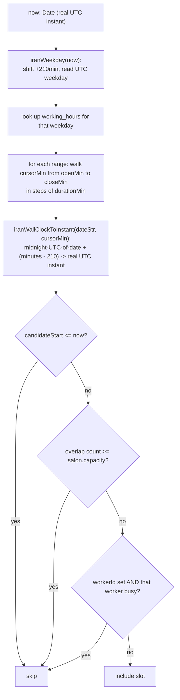

# 10 — Scheduling & Availability

Core files: `apps/api/src/booking/availability.service.ts`, `availability.util.ts`, `salons/schedule.controller.ts`, `salons/working-hour.entity.ts`, `salons/schedule-exception.entity.ts`.

## Inputs to availability

1. **`working_hours`** — weekly recurring open/close ranges per weekday (0–6), managed wholesale via `PUT /salons/mine/hours` (delete-all-then-reinsert on every save — no per-weekday PATCH). No overlap validation between two ranges submitted for the same weekday in one request — a real gap, left to client-side discipline.
2. **`schedule_exceptions`** — one-off closures (`isClosed`, default `true`) in three shapes: a **whole-salon, whole-day** closure (`worker_id` NULL, no times — the original and still most common case), a **whole-salon partial-day** closure (`start_time`/`end_time` set — the salon's normal hours still apply outside that interval), or a **per-worker whole-day** day off (`worker_id` set; partial-hour ranges for a specific worker are rejected with 400 — v1 cut). Consumed directly by the availability algorithm.
3. **Existing `bookings`** — every `SLOT_BLOCKING_STATUSES` (`pending_approval`/`pending_payment`/`confirmed`) booking overlapping the query window, used for both salon-capacity and (if a worker is specified) worker-specific exclusion.

## `AvailabilityService.computeFor(salonId, serviceId, now, workerId?)`

1. Salon must be `approved`; service must exist/be active.
2. If `workerId` given: short-circuits to `[]` immediately if that worker is ineligible for the service (the shared `WorkerEligibilityService`, same opt-out `worker_services` check as `createHold` — see [09-booking-engine.md](./09-booking-engine.md)) rather than showing slots that would fail at booking time.
3. `windowEnd = now + 14 days` (`AVAILABILITY_WINDOW_DAYS`).
4. Fetches, in parallel: all `working_hours`, whole-salon `schedule_exceptions` (`isClosed`, `workerId IS NULL` — folded into `exceptionsByDate: Map<date, 'whole-day' | {startTime,endTime}>`), per-worker exceptions (`workerId IS NOT NULL` — folded into `workerOffDates: Map<workerId, Set<date>>`), and all overlapping bookings in the window. The two exception sets are deliberately fetched separately: a per-worker row must never close the whole salon.
5. Delegates to the pure function `computeAvailableSlots()`.

## The Iran-timezone algorithm — why it's non-trivial

Iran uses a **fixed UTC+3:30 offset year-round** (`IRAN_UTC_OFFSET_MIN = 210`) — DST was abolished in 2022, so no DST table is needed, a deliberate simplification. But `working_hours.open_time`/`close_time` are Postgres `time` columns holding exactly what the provider typed on their own (Iran) wall clock, with no timezone attached, while `bookings.starts_at`/`ends_at` are real UTC instants. Converting correctly between the two, on both a date-boundary edge and an hour-boundary edge, is the entire complexity here.



**The historical bug this fixed** (documented at length in the code): the module used to treat wall-clock digits as if they *were* UTC digits, and required every caller to pass `now` the same skewed way — but `AvailabilityService` passed a genuine `new Date()` while every display path renders instants in `Asia/Tehran`. Net effect: a salon open 09:00–20:00 Iran time offered slots that *rendered* as 12:30–23:30 — three hours past actual closing, and never during the first 3.5 open hours. The fix keeps the wall-clock↔instant conversion strictly at this module's boundary; every `Date` crossing it is a real UTC instant on both sides. A separate, one-time **data migration** (`1753600000000-shift-bookings-to-real-utc-instants`) corrected every pre-existing `bookings.starts_at`/`ends_at` row by the same −3h30m offset.

## Slot grid mechanics

- Slots are a **fixed grid** at exact multiples of the service's `durationMin`, starting at the working-hour range's open time — not staggered, not overlapping.
- A `durationMin <= 0` short-circuits to `[]` immediately — a defensive guard against an infinite loop (`cursorMin += durationMin` never advancing), since this function trusts a DB-read value it can't independently verify.
- A candidate slot is skipped if it's in the past, if salon capacity is already exhausted for that interval, or (when a worker is specified) if that specific worker already has an overlapping booking — **both checks are independent**, mirroring `createHold`'s own dual-check design (a worker "is never merely one more unit of capacity").
- Per-day results are sorted ascending (working-hour ranges aren't guaranteed to be stored in chronological order) and only non-empty days are returned.

## `schedule_exceptions` enforcement

All read-side enforcement lives in `availability.util.ts` (the schedule controller only manages the CRUD side):

- A whole-salon exception mapped to `'whole-day'` skips that entire date in the slot loop.
- A whole-salon exception with a time range is **subtracted** from each of that day's working-hour ranges (`subtractInterval()`, yielding 0–2 remaining sub-ranges) before the slot grid is walked — so a salon can shorten one day without touching its weekly schedule. Extending hours on a one-off basis is still not supported.
- A per-worker day off is only consulted in the `requestedWorkerId` branch (`workerOffDates.get(requestedWorkerId).has(dateStr)` skips the day); "any available worker" mode never narrows by an individual worker's days off, and salon capacity is unaffected.

Write-side rules (`schedule.controller.ts`): `startTime`/`endTime` must be given together and `startTime < endTime` (mirrored by the DB CHECK); a `workerId` must belong to the salon; `workerId` + a time range is rejected (per-worker time off is whole-day only in v1); a duplicate date hits one of the two partial unique indexes and returns 409.

## API surface

```
GET /salons/mine/hours          (owner)  — list working hours
PUT /salons/mine/hours          (owner)  — replace the whole weekly schedule
GET /salons/mine/exceptions?workerId=     (owner)  — list closures (all, or one worker's)
POST /salons/mine/exceptions    (owner)  — add a closure {date, startTime?, endTime?, reason?, workerId?}
DELETE /salons/mine/exceptions/:id (owner)

GET /salons/:salonId/availability?serviceId=&workerId=   (public) — computed open slots, 14-day window
```

## Related documents

- [09-booking-engine.md](./09-booking-engine.md) — how a slot becomes a real booking
- [22-performance.md](./22-performance.md) — availability loads the full overlapping-bookings set into memory rather than pushing the check into SQL; a documented, accepted scaling limit at current volume
