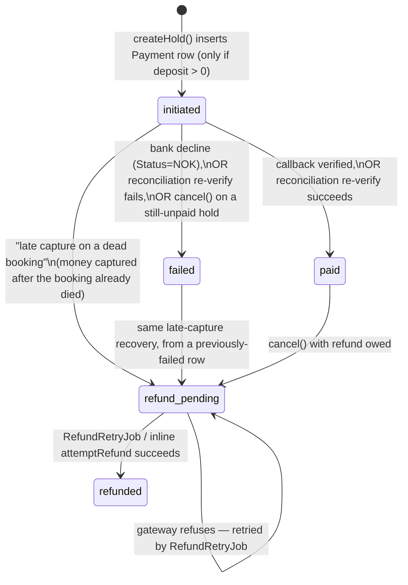
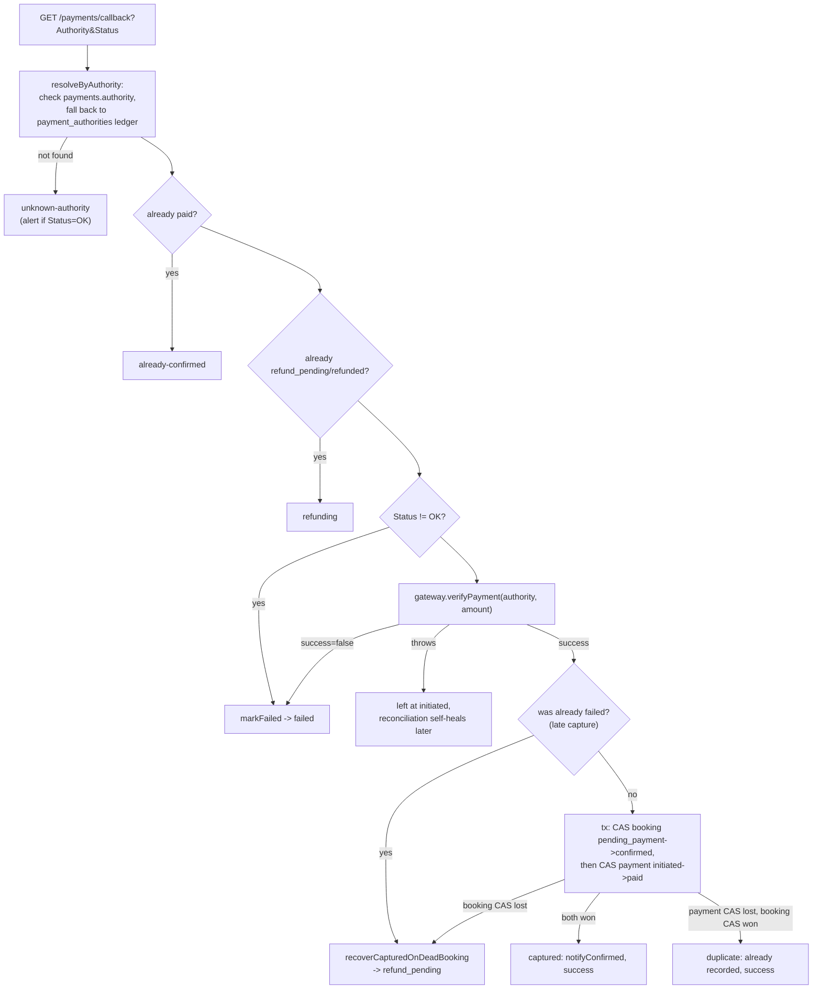

# 11 — Payment System

Core files: `apps/api/src/booking/payment.entity.ts`, `payment-gateway.ts` (interface), `mock-payment.gateway.ts`, `zarinpal-payment.gateway.ts`, `payments.service.ts`, `payments.controller.ts`, `payment-reconciliation.job.ts`, `refund-retry.job.ts`, `booking-hold-release.util.ts`.

## `Payment.status` state machine



> Under **manual approval** ([28](./28-booking-approval-workflow.md)) the `Payment` row is not
> created by `createHold` at all — it is inserted by `approve()`, in the same transaction that
> opens the payment window. A `pending_approval` booking therefore has no payment and no
> authority, which is precisely why declining or expiring one can never owe a refund.

Important semantic note baked into the code: **`refund_pending` is not a flavor of `failed`** — `failed` means strictly "nothing was ever captured."

## Gateway abstraction

`PaymentGateway` interface (`requestPayment`, `verifyPayment`, `refundPayment`), selected by `PAYMENT_GATEWAY=mock|zarinpal`.

- **`MockPaymentGateway`** (default in dev/test) — fabricates `MOCK-{hex}` authorities and self-completes by appending `?Authority=&Status=OK` directly to the callback URL; `verifyPayment` fails only if the authority starts with `MOCK-FAIL`; `refundPayment` fails only if it contains `MOCK-REFUND-FAIL`.
- **`ZarinpalGateway`** — real integration, described below.

## Zarinpal integration

- **`requestPayment`**: `POST payment.zarinpal.com/pg/v4/payment/request.json`, amount converted toman→rial (×10), 10s timeout. Success = `data.code === 100`. Returns `{authority, paymentUrl}`.
- **`verifyPayment`**: `POST .../verify.json`; `code 100` or `101` (already-verified) both count as success. A non-2xx HTTP response **throws** rather than returning `{success:false}` — deliberately, so an infrastructure failure is never indistinguishable from a genuine decline.
- **`refundPayment`**: `POST .../refund.json`, Bearer `ZARINPAL_ACCESS_TOKEN`; `code 100`/`101` → success.

### ⚠️ Known, blocking issue: the refund contract is stale and unverified

The source file itself carries a `WARNING (2026-07-17 research)` block stating that `refund.json` implements Zarinpal's **legacy, de-documented REST contract** (removed ~2023). The **current** official refund API is a GraphQL `AddRefund` mutation on a different host, keyed by `session_id` (not `authority`), with no numeric `code` in its response — meaning the existing `code===100||101` parser would likely **misread a real success as a failure**. Zarinpal also permits only **one refund request per transaction**, undermining the code's "101 = already refunded, treat as success" idempotency assumption (a repeat is probably an *error*, not success).

**No sandbox exists for refunds at all** — only `request.json`/`verify.json`/StartPay are swappable in sandbox mode. A dedicated runbook, `docs/deployment/ZARINPAL-REFUND-VERIFICATION.md`, exists specifically to verify this against a real production transaction before any refund is trusted. Until that runbook is executed, **treat refunds as unverified/likely broken in production** — this is the single biggest go-live risk in the payment system, not a stale doc note.

## Callback handling — `payments.controller.ts` + `payments.service.ts`

```
GET /payments/callback?Authority=&Status=OK|NOK
```

Public, unauthenticated (this is Zarinpal's browser redirect target, not a webhook). Always ends in a **302 redirect** to `${FRONTEND_BASE_URL}/booking/callback?status={success|refunding|failed}&bookingId=`, never JSON.



`notifyConfirmed(bookingId)` sends SMS + push to both customer and salon owner, concurrently, both best-effort (never rolls back the booking on notification failure).

## The 20-minute reconciliation window and "late capture after expiry"

`PaymentReconciliationJob` (every 5 min) re-verifies any `initiated` payment older than **20 minutes**, trying **every authority ever issued** for it (via `payment_authorities`) until one verifies successfully — this is what correctly resolves a customer who paid through a superseded `retryPayment` session and never returned to the app.

The same late-capture machinery is what makes the manual-approval payment window safe: a customer
paying through a still-open tab after their window closed hits the identical
`pending_payment → confirmed` CAS failure and is refunded rather than resurrecting the booking.
That path needed no new code.

The 20-minute threshold used to rest on an unwritten coincidence: the payment window was a
single global number (`booking_hold_ttl_minutes`, seeded 15), always shorter than 20, so a
payment old enough to be selected here always belonged to a booking `BookingExpiryJob` had
already killed — and this job's `status = 'pending_payment'` guards therefore never fired on
a live booking. Once the payment window became **per-salon and admin-configurable up to 1440
minutes** ([28](./28-booking-approval-workflow.md)) that coincidence broke: a salon with a
60-minute window would have had every unpaid-but-still-valid booking selected at minute 21,
fail verification (the customer simply hadn't paid yet), and be cancelled 39 minutes before
the deadline the customer was shown.

The selection is therefore **deadline-aware**, not clock-only: a payment is stale only once
its booking genuinely can't be paid for any more — it has already left `pending_payment`, or
its own snapshotted `payment_expires_at` has passed. Legacy rows with no snapshot keep the
original clock-only behaviour. A payment that never got an authority at all (possible since
`approve()` opens the payment window before the customer clicks "pay") is now **retired** to
`failed` rather than skipped — skipping made those rows immortal and they would eventually
have crowded out the 200-row batch.

The 20-minute threshold is still **intentionally longer** than the default 15-minute hold
TTL, so it is common and expected for a genuinely-late-but-successful payment to find its
booking already `expired` by the time reconciliation runs. This is **handled, not a bug**: the payment still ends up `paid` and then refunded via the late-capture path — the booking is never resurrected into a slot that may have been rebooked. **These two numbers are tuned relative to each other and must not be changed independently** without re-verifying that relationship.

## Refund retry & escalation

`RefundRetryJob` (every 5 min): skips anything younger than a 2-minute grace period (avoiding a redundant gateway call right after `cancel()`'s own inline attempt), retries every `refund_pending` payment via `attemptRefund`. Anything stuck past **24 hours** logs an error and pages a `critical` operator alert (deduped daily) — see [16-notifications.md](./16-notifications.md).

`attemptRefund` only acts on `refund_pending` rows; a missing `authority` (shouldn't happen) pages critical and requires manual intervention; on success it CAS-updates to `refunded`, sends a refund SMS, and best-effort reverses any tied referral reward (see [13-financial-system.md](./13-financial-system.md)).

## What refund does *not* reverse

A refund reverses the referral reward tied to the booking (if any), but **does not** give back a spent coupon redemption or a wallet-balance debit once payment had actually captured — that reversal only happens via `releaseBookingHold()`, which only runs on the "never captured" paths (expired hold, cancel-while-unpaid, failed callback, reconciliation verify-failure). This asymmetry is explicit, documented, unbuilt-by-choice — see [24-technical-debt.md](./24-technical-debt.md).

## API surface

```
POST /bookings                          — createHold, mints the payment session (see 09-booking-engine.md)
POST /bookings/:id/retry-payment        — fresh session for a still-pending_payment booking
GET  /payments/callback                 — Zarinpal redirect target (public)
```

## Related documents

- [09-booking-engine.md](./09-booking-engine.md) — how a Payment row comes to exist
- [18-background-jobs.md](./18-background-jobs.md) — every cron job mentioned above, consolidated
- [16-notifications.md](./16-notifications.md) — SMS/push/alert delivery this subsystem triggers
- [23-known-limitations.md](./23-known-limitations.md) — the Zarinpal refund contract risk, stated as a platform-level known gap
