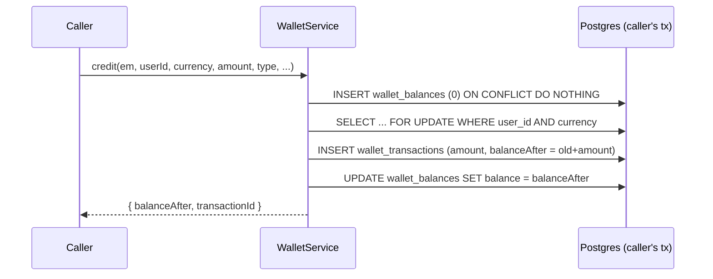

# 12 — Wallet

Core files: `apps/api/src/wallet/wallet.service.ts`, `wallet-balance.entity.ts`, `wallet-transaction.entity.ts`, `wallet.controller.ts`, `admin-wallet.controller.ts`.

## Model: append-only ledger + a locked cache balance

- **`wallet_transactions`** — the source of truth. One row per movement, `amount` signed (+credit/−debit), `balanceAfter` a snapshot computed *inside* the same locked transaction (never recomputed later).
- **`wallet_balances`** — a **mutable cache**, one row per `(user_id, currency)`, always derived from and kept in lockstep with the ledger, never trusted as authoritative on its own without the lock discipline below.
- Two currencies: `toman` (real money-equivalent) and `points` (loyalty points — used only for `loyalty_points`-kind referral rewards).

## The locking primitive



`credit()`/`debit()` **never open their own transaction** — they always take an `EntityManager` the caller already owns, because in real usage a wallet movement is always one leg of a larger transaction (e.g. crediting a referrer *and* inserting the `referral_rewards` row atomically). The upsert-then-lock pattern (`INSERT ... ON CONFLICT DO NOTHING` then `SELECT FOR UPDATE`) is race-safe for two concurrent first-time credits to the same user.

## `credit()`

Rejects `amount <= 0`. Straightforward: lock, compute new balance, ledger row, cache update. Returns `transactionId` so a caller (e.g. `ReferralsService`) can immediately backfill its own row's `walletTransactionId` without a second query.

## `debit()` — the "never negative" rule

```
actualDebit = min(amount, currentBalance)
shortfall = amount - actualDebit
if actualDebit === 0: return { debited: 0, shortfall, balanceAfter: currentBalance, transactionId: null }  // no ledger row at all
```

**This is the critical money-safety invariant of the whole subsystem**: `debit()` caps at the available balance and reports the shortfall instead of throwing. It never fails the caller's transaction on insufficient funds. This is deliberate — a referral-reversal clawback (see [13-financial-system.md](./13-financial-system.md)) must never blow up mid-transaction just because the user already spent the credited money; instead the shortfall is recorded and paged to an operator. Callers that need strict all-or-nothing semantics (the admin manual-adjustment endpoint) check `result.shortfall > 0` themselves and throw to roll back.

When `actualDebit === 0`, **no ledger row is written**. This matters for `BookingsService.createHold`, which doesn't have a booking id yet at the point it calls `debit()` for a wallet-applied deposit — a zero-debit no-op means there's nothing to backfill a reference onto later.

## Transaction types

| `type` | Written by | Currency |
|---|---|---|
| `admin_adjustment` | `POST /admin/wallet/adjust` only | toman or points |
| `referral_reward` | `ReferralsService.tryGrantReward` | toman (wallet_credit/cashback) or points (loyalty_points) |
| `referral_reversal` | `ReferralsService.reverseIfNeeded` (on confirmed refund) | matches the original reward's currency |
| `booking_spend` | `BookingsService.createHold` (applyWalletBalance) | toman |
| `booking_spend_reversal` | `reverseWalletSpend` (`booking/booking-hold-release.util.ts`) — called by `releaseBookingHold` (hold/request died before capture: expiry, rejection, approval-expiry) and directly by `BookingsService.approve()` when the global online-payment flag is **off** at approval time but the request staked wallet balance while it was on | toman |

`booking_spend`/`booking_spend_reversal` are written **outside** the wallet module entirely, from `apps/api/src/booking/*` — see [09-booking-engine.md](./09-booking-engine.md). `reverseWalletSpend` is the wallet half of `releaseBookingHold` on its own (coupon redemption left in place) with the same conditional-UPDATE idempotency guard; `approve()` needs it because its flag-off path confirms the booking outright with no `Payment` row, exactly like `createHold`'s own flag-off path — which never debits the wallet in the first place — so without handing the debit back the customer would pay the full price in cash *and* lose real wallet credit. Notably, **only the never-captured paths reverse a `booking_spend`** — a booking that actually captured payment and was *later refunded* does not get its wallet portion reversed; that's an explicit, documented, not-yet-built gap (see [24-technical-debt.md](./24-technical-debt.md)).

## Admin surface

`GET /admin/wallet/transactions` — global ledger search/filter (user/type/date), enriched with `userPhone`/`userName` via a follow-up `IN` lookup. `POST /admin/wallet/adjust` — the only writer of `admin_adjustment`; runs `credit`/`debit` in its own transaction and **explicitly rejects a shortfall as 400** (unlike the referral-reversal caller, which wants the capped/never-throw behavior). `reason` is required.

## Customer surface

`GET /wallet/mine`, `GET /wallet/mine/transactions` — read-only.

## Known limitations

- **Accrue-only from the platform's side, spend-only at checkout.** There is no cash-out/withdrawal flow anywhere in the system — this is explicit MVP scope, not a bug.
- **A shortfall on referral reversal is a real, permanent, uncollected loss** by design (the never-negative rule) — it only pages a critical alert and depends on a human following up.
- **Currency is never converted** — `toman` and `points` are entirely separate ledgers/balances with no exchange mechanism between them.

## Related documents

- [13-financial-system.md](./13-financial-system.md) — the referral reward system that is the wallet's primary writer
- [09-booking-engine.md](./09-booking-engine.md) — `applyWalletBalance` at checkout
- [16-notifications.md](./16-notifications.md) — the alert mechanism a reversal shortfall triggers
