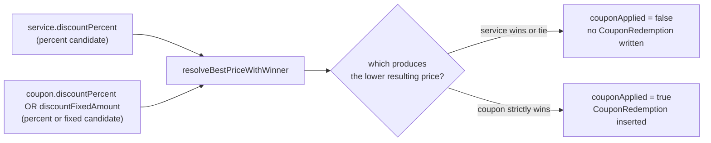
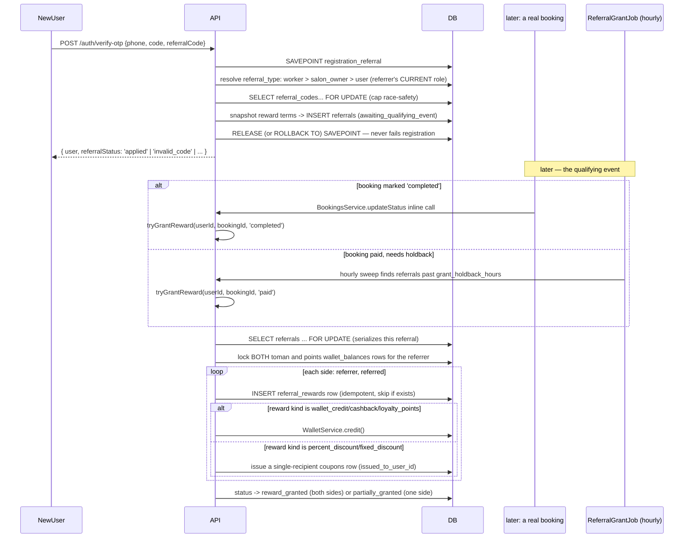

# 13 — Financial System: Coupons & Referrals

Core files: `apps/api/src/coupons/*`, `apps/api/src/referrals/*`, plus `apps/api/src/booking/discount.util.ts` and `apps/api/src/booking/referral-grant.job.ts` (note: this job physically lives under `booking/`, not `referrals/`).

## Part A — Coupons & discount resolution

### Coupon model

`coupons.salon_id` **NULL = platform-wide** (admin-issued), non-null = scoped to that one salon (owner-issued or referral-issued). `discountPercent`/`discountFixedAmount` are mutually exclusive (DB CHECK). `issuedToUserId` NULL = unrestricted (every manually-created coupon); non-null = usable only by that one user — set exclusively by the referral system when paying out a discount-kind reward.

### `resolveAndValidate()` — two callers, two guarantee levels

1. **Preview** (`em` omitted) — `POST /coupons/validate`. Read-only, no locking, purely advisory for the frontend.
2. **Real redemption** (`em` passed) — called from *inside* `BookingsService.createHold`'s own transaction.

Validation order: code lookup (normalized upper/trim) → active + correct-salon-scope check (generic "invalid code" message for both a nonexistent code *and* a wrong-salon code, deliberately, so a caller can't probe which is true) → `issuedToUserId` restriction check (same generic message) → expiry → already-used pre-check → (if `maxRedemptions` set and `em` present) **row-lock the coupon itself** before counting redemptions against the cap.

**Why the coupon row-lock matters specifically for platform-wide coupons**: a capped platform-wide coupon can be redeemed concurrently from entirely unrelated salons' bookings — not covered by `createHold`'s per-salon Redis lock. Without locking the coupon row, two concurrent bookings against two different salons could both read `count < max` before either commits, exceeding the cap.

**The actual "one redemption per user per code" backstop is the DB constraint** `UNIQUE(coupon_id, user_id)` on `coupon_redemptions`, hit when `createHold` inserts the redemption row — `resolveAndValidate`'s own pre-check is explicitly documented as best-effort/losable under a genuine race.

### Best-price-wins discount resolution (`discount.util.ts`)

`resolveBestPriceWithWinner(price, candidates)` computes each candidate's **resulting price** (percent: `round(price*(100-value)/100)`; fixed: `max(0, price-value)`) and keeps whichever is strictly lower than the current best (which starts at the undiscounted price). **On an exact tie, the earlier candidate wins** — since `createHold` always passes `[serviceDiscount, couponDiscount]` in that order, a tie means the service's own discount wins and the coupon is **not consumed**. This fixed a real prior bug: a coupon that ties or loses used to still permanently burn the customer's one-per-user redemption for zero benefit.



### API surface

```
POST /coupons/validate                      (customer, preview)
GET/POST /salons/mine/coupons                (owner, salon-scoped — excludes referral-issued coupons from the list)
PATCH/DELETE /salons/mine/coupons/:id        (owner)
GET/POST /admin/coupons                      (admin, platform-wide)
PATCH/DELETE /admin/coupons/:id              (admin)
```

`salon-coupons.controller.ts`'s `list()` deliberately excludes `issuedToUserId IS NOT NULL` rows — editing/deactivating a referral-issued reward through the generic owner UI would silently break a promise the platform already made to that customer.

---

## Part B — Referral program

### Entities

- **`referral_codes`** — one lifetime code per person, ever (`owner_user_id` unique).
- **`referral_reward_types`** — exactly 3 fixed config rows (`user`/`salon_owner`/`worker`), all seeded `enabled=false` with placeholder values. Nothing pays out until an admin turns one on with real numbers in `/referrals/settings`.
- **`referrals`** — one row per successful redemption. Reward terms are **snapshotted at redemption time and frozen forever** — an admin later changing `referral_reward_types` never retroactively affects an existing referral.
- **`referral_rewards`** — up to 2 rows per referral (one per side), `UNIQUE(referral_id, beneficiary_role)`.

### Full lifecycle



### Referral type resolution — dynamic, not stored on the code

`resolveReferralType()` checks, at the moment of redemption: **active worker → salon owner → falls back to plain user**. This is recomputed every time, never cached on the code itself — the same code can theoretically resolve to a different tier if the referrer's role changes between two (impossible, since a code redeems only once per *referred* person, but the mechanism is general) redemptions.

### Race-safety: the `max_referrals_per_referrer` cap

`SELECT id FROM referral_codes WHERE id = $1 FOR UPDATE` locks the referrer's own code row **before** counting existing referrals against the cap. This was a real bug found and fixed by adversarial testing during development: with the lock removed, 8 concurrent registrations against a cap of 2 all applied; with the lock, the same test correctly produces exactly 2.

### `tryGrantReward` — the money-moving transaction

Locks the specific `referrals` row (`FOR UPDATE`) first — this is what makes a webhook retry racing the hourly sweep for the same referred user structurally impossible to double-process. Then enforces **R6** itself: for a salon-scoped referral (`referrals.salon_id` non-null — every salon_owner/worker-type referral) the triggering booking's `salon_id` must equal `referral.salon_id`, else the call is a no-op. This check has to live here and not only in the hourly sweep's SQL, because the `'completed'` trigger calls in directly from `BookingsService.updateStatus` with whatever booking just completed — without it, a booking at an unrelated salon paid the referring salon's reward and froze the referral as `reward_granted`, so the customer's later genuinely-qualifying booking at the referrer could never count. For `first_paid_booking` events specifically, enforces the **72-hour holdback** (`grant_holdback_hours`, config on `referral_reward_types`, measured from `payments.paid_at`) before granting — this closes the "pay, get rewarded, immediately refund" fraud loop. Locks **both** the toman and points wallet balances for the referrer up front (even before knowing which currency this grant needs), serializing the entire two-sided grant against any other concurrent referral crediting the same referrer. Never throws — any failure is caught, logged, and pages a `critical` alert, since this runs inline inside booking-completion/payment flows that must not fail because of a reward bug.

### `partially_granted` — a transient state, not a dead end

Historically (during the feature's incremental rollout) this represented "one side granted, the other side's reward kind wasn't supported yet." As of the current code, all five reward kinds are supported for both sides, so this status is kept purely as defense-in-depth for a hypothetical future unsupported kind. `ReferralGrantJob`'s hourly sweep unconditionally retries every `partially_granted` referral (cheap, since granting is idempotent per side), so a config change from an unsupported to a supported kind self-heals with no migration needed.

### Reversal on refund — `reverseIfNeeded()`

Called only from `PaymentsService.attemptRefund` when a payment's status actually flips to `refunded`. Locks the matching `referrals` row and its `referral_rewards` rows.

- **Wallet-kind reward**: `WalletService.debit(..., 'referral_reversal')` — capped at available balance (per the never-negative rule); any shortfall is recorded on the reward row and pages a `critical` alert (real, uncollected money).
- **Coupon-kind reward**, unredeemed: voided in place (`is_active=false`).
- **Coupon-kind reward, already redeemed on a distinct completed booking**: **not reversible** — an explicit, accepted product decision. The reward's `reversal_reason` is annotated (visible to admins) without touching `status`/`reversed_at`, so it stays queryable but is **deliberately not paged as an incident** ("a false incident page here would train operators to ignore real ones").

### `ReferralGrantJob` — hourly sweep

Lives at `apps/api/src/booking/referral-grant.job.ts` (**not** under `referrals/` — easy to miss when searching). `@Cron('0 * * * *')`. Two sub-sweeps: (1) a conservative SQL pre-filter for referrals plausibly past their `first_paid_booking` holdback window (the authoritative age check re-runs inside `tryGrantReward` itself); (2) unconditional retry of every `partially_granted` row.

A sibling `ReferralExpiryJob` (`booking/referral-expiry.job.ts`, also hourly) flips `awaiting_qualifying_event` referrals past their `expires_at` to `expired` in a single conditional `UPDATE` (status re-checked in the same statement, so a grant committing concurrently is never expired out from under it), batched 500/run.

### API surface

```
GET /referrals/my-code               (auth) — get/create caller's own code
GET /referrals/validate              (public, IP rate-limited 20/hr) — is this code redeemable?
GET /referrals/mine                  (auth) — referral history
GET /referrals/mine/rewards          (auth) — reward history
GET/PATCH /admin/referral-reward-types
GET /admin/referrals                 GET /admin/referrals/:id/rewards
POST /admin/referrals/:id/cancel     (only from awaiting_qualifying_event)
```

## Related documents

- [12-wallet.md](./12-wallet.md) — the credit/debit primitive referrals write through
- [09-booking-engine.md](./09-booking-engine.md) — where a coupon/discount is actually applied at checkout
- [05-authentication.md](./05-authentication.md) — referral redemption at registration, including the SAVEPOINT isolation
- [18-background-jobs.md](./18-background-jobs.md) — the grant and expiry sweeps' schedules
- [14-commission.md](./14-commission.md) — the *other* ledger (`financial_transactions`), which accrues only on captured money and is unaffected by coupons/wallet except through the resulting `Payment.amount`
