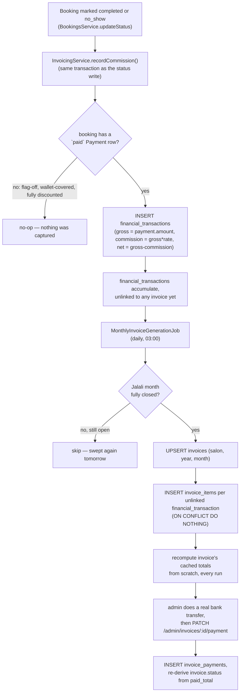

# 14 — Commission & Invoicing

Core files: `apps/api/src/invoicing/*` (`financial-transaction.entity.ts`, `invoice.entity.ts`, `invoice-item.entity.ts`, `invoice-payment.entity.ts`, `invoicing.service.ts`, `monthly-invoice-generation.job.ts`, `jalali-period.util.ts`, `admin-invoices.controller.ts`, `salon-invoices.controller.ts`).

## Mental model: this is not the platform billing the salon

The platform holds customer-paid **deposits** on the salon's behalf. This subsystem's `invoices` answer "how much of what we're holding are we keeping (commission) vs. owe back to you (net payout)" — the payment direction is the reverse of a naive SaaS-invoice mental model. There is **no automated payout integration anywhere** — every settlement is a human bank transfer that an admin performs outside the system and then manually records.

## Data flow



## `InvoicingService.recordCommission()`

Called from `BookingsService.updateStatus`'s `'completed'`/`'no_show'` branch **and from `cancel()`'s forfeited (non-refunded) branch**, in every case **inside the same transaction as the booking-status write** (signature `recordCommission(em, {id, salonId})`) — commission applies **identically** to a no-show, a genuine completion, and a late customer cancellation whose deposit was forfeited (all three leave the deposit with the salon, so all three owe the platform its cut — the design spec always said so, but only the first two were implemented until 2026-09-03). It first looks up the booking's `Payment` row with `status = 'paid'` and uses **`grossAmount = payment.amount`** — the deposit the platform *actually captured online*, never the full service price (the rest, commonly the majority, is cash paid customer-to-salon in person and is invisible to this ledger) and never `booking.depositAmount`. **No paid Payment → no row at all**, a deliberate no-op rather than a zero-amount row: that covers a fully wallet-covered or fully discounted deposit, and — the case that motivated the change — every booking confirmed while `feature_online_payment_enabled` is off (the seeded production default), where `depositAmount` is still recorded on the row for reporting but nothing was ever collected. Accruing on `depositAmount` there invoiced salons a "net payout" of money the platform never held, and inflated `GET /salons/mine/earnings` the same way. Pinned by `test/booking-payment-toggle.e2e-spec.ts`.

`commissionAmount = round(gross * commissionPercent / 100)` (config `commission_percent`, seeded 10%), `netAmount = gross - commission`. Both `commissionRate` and the computed amounts are **frozen at write time** — read once from `PlatformConfigService` inside this transaction, never recomputed if the platform's commission config later changes. A correction is a new offsetting row via `correction_of_id` (self-referencing), never an in-place UPDATE — `financial_transactions` is strictly append-only.

## `MonthlyInvoiceGenerationJob`

`@Cron('0 3 * * *')` — **runs daily at 03:00**, not just on the 1st of the month, so a late-completing booking or a skipped run is still swept whenever this next fires.

1. Finds every `financial_transactions` row with no matching `invoice_items` row yet (plain `LEFT JOIN ... WHERE ii.id IS NULL`).
2. Buckets each row by Jalali (Persian solar) month **in application code** (`jalaliMonthOf`, via the `jalaali-js` library) — there is no native Jalali calendar function in Postgres, and the table is small enough that this is simpler than a stored procedure.
3. **Skips the still-open current month** — a month is only invoiced once it has fully ended (`isJalaliMonthClosed`), so it's never recomputed mid-month while bookings are still accruing into it.
4. For each closed `(salon, month)` group, in its own transaction: upserts the `invoices` row, inserts each `invoice_items` row (`ON CONFLICT DO NOTHING`), then **recomputes the invoice's cached totals from scratch** by summing all its items — never incrementally, so a rerun or a late-arriving item can never leave the cache stale. Status re-derivation: `paid_total >= total && total > 0` → `paid`; `paid_total > 0` → `partially_paid`; else unchanged.
5. Per-`(salon, month)` try/catch isolation — one salon's failure doesn't block the rest of the run; unlinked rows simply retry the next day.

**Note**: a late-arriving `financial_transactions` item on an already-`'paid'` invoice can drop its status back to `'partially_paid'` if the new total now exceeds what was already paid — this is a real, if edge-case, consequence of always recomputing from scratch rather than incrementally.

## `jalali-period.util.ts`

`jalaliMonthOf(instant)` shifts by the same `IRAN_UTC_OFFSET_MIN` convention used in [10-scheduling.md](./10-scheduling.md) before converting Gregorian→Jalali. `jalaliMonthBounds(month)` returns `[periodStart, periodEnd)` as real UTC instants, `periodEnd` exclusive (Iran-local midnight of the first day of the next Jalali month). `isJalaliMonthClosed = periodEnd <= now`.

## Manual settlement recording

`PATCH /admin/invoices/:id/payment` — an admin "records" a payment they already made outside the system (a real bank transfer); **never touches `financial_transactions`/`invoice_items`**, only inserts an `invoice_payments` row and re-derives `invoice.status` from the running `paid_total` (supports partial payments across multiple calls). `InvoicingService.recordPayment` row-locks the invoice (`setLock('pessimistic_write')`) before the read-then-add on `paidTotal` — two concurrent admin records used to lose one — and throws `409` on a `void` invoice. `invoice_payments.method` allows `'bank_transfer'|'cash'|'other'|'automatic_payout'|'wallet_credit'`, but **only the first three are ever actually recordable** from the current DTO — `automatic_payout`/`wallet_credit` are reserved values with zero writers.

## `settlement_id` — a reserved, unused seam

`invoices.settlement_id` is a nullable, un-FK'd column, explicitly documented as "a reserved seam for a future automated-payout batch table, deliberately not built yet." Nothing writes to it today. See [25-future-improvements.md](./25-future-improvements.md).

## API surface

```
GET /salons/mine/invoices                    (owner, read-only settlement history)
GET /admin/invoices                          (admin, list)
GET /admin/invoices/:id                      (admin, detail)
GET /admin/invoices/:id/payments             (admin, payment records)
PATCH /admin/invoices/:id/payment            (admin, record a manual payment)
```

## Known limitations

- **Commission only ever reflects money captured online**, never the full service price — the platform's real revenue-capture rate depends entirely on the configured deposit percentage *and* on `feature_online_payment_enabled` being on; with it off (today's production default) this ledger accrues nothing at all, and the cash-at-salon portion is completely outside its visibility either way.
- **Grouping happens in application memory, not SQL** — fine at current scale, a latent performance risk if the unlinked-transaction backlog ever grows large. See [22-performance.md](./22-performance.md).
- **No automated payout integration** — see [25-future-improvements.md](./25-future-improvements.md) for the `settlement_id` seam this would eventually plug into.

## Related documents

- [09-booking-engine.md](./09-booking-engine.md) — where a booking becomes `completed`/`no_show`
- [20-business-rules.md](./20-business-rules.md) — the commission-percent config rule, consolidated with every other tunable business constant
