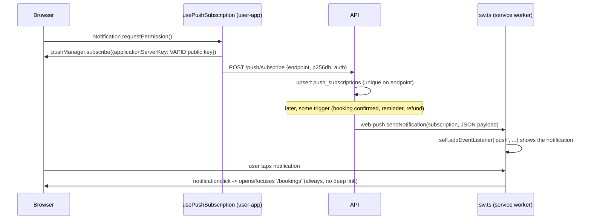
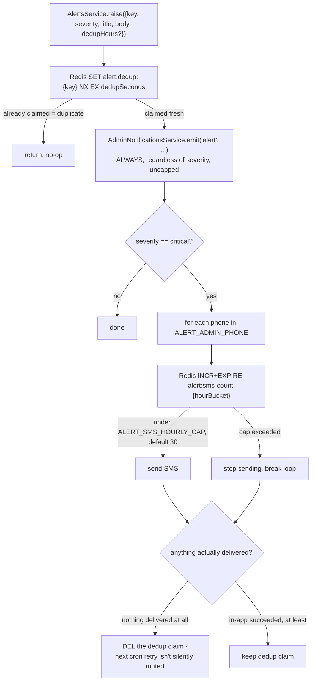

# 16 — Notifications

Three distinct channels exist: **SMS**, **Web Push**, and an in-app **admin notification queue**, plus an **operator alerting** layer built on top of all three.

## SMS

Interface `SmsProvider` (`apps/api/src/sms/sms.provider.ts`), selected via `SMS_PROVIDER=console|kavenegar`.

- **`ConsoleSmsProvider`** — logs only, default outside `kavenegar` mode.
- **`KavenegarSmsProvider`** — calls Kavenegar's REST API (`fetch`, 10s timeout). OTP uses a template-based lookup endpoint (`KAVENEGAR_OTP_TEMPLATE`, default `gheychi-otp`); everything else uses the plain send endpoint. Both throw on a non-200 HTTP response or a Kavenegar-level failure status. The OTP send URL embeds the raw code as a query parameter — flagged in code as something request-logging middleware must never log verbatim.

**Every SMS actually sent, by trigger:**

| Trigger | Source | Message |
|---|---|---|
| OTP login | `auth.controller.ts` | the 6-digit code |
| Booking confirmed | `payments.service.ts` `notifyConfirmed` | to customer: confirmation + address; to salon owner: new-booking notice |
| Appointment reminder | `booking-reminder.job.ts` | reminder + address, configurable lead time |
| Refund issued | `payments.service.ts` `notifyRefunded` | "your deposit was refunded" |
| Critical operator alert | `alerts.service.ts` | paged to `ALERT_ADMIN_PHONE` |

Confirmation/reminder/refund sends are all `.catch(()=>{})` — best-effort, never roll back booking/payment state. Alert SMS is the one channel with its own dedup + hourly cap (below).

## Web Push

Interface `PushProvider` (`apps/api/src/push/push.provider.ts`), selected via `PUSH_PROVIDER=console|webpush`.

- **`WebPushProvider`** wraps the `web-push` npm library, configured once at construction with `VAPID_PUBLIC_KEY`/`VAPID_PRIVATE_KEY`/`VAPID_SUBJECT`.
- `push.service.ts`'s `sendToUser(userId, payload)` fans a notification out to **every** subscription the user has registered (multiple devices/browsers), each independently `.catch(()=>{})`'d so one dead device never blocks or fails the others.

**Ownership rebinding**: because a `PushSubscription` is per-browser, not per-user, `usePushSubscription.rebindOwnership()` (user-app) re-POSTs `/push/subscribe` on every login/status refresh to reclaim the endpoint for whoever is currently logged in — this prevents a shared-device scenario where a second user keeps receiving the first user's push notifications.

**Known limitation**: every push notification always opens `/bookings` on tap, regardless of what it's actually about — no deep-linking to the specific booking.

## Admin notification queue

Not a push channel — an in-app, polled (60s cadence per the admin panel) queue of `admin_notifications` rows. `AdminNotificationsService.emit(type, title, body, link, manager?)` — **throws on failure by contract**, so each caller decides whether to swallow it.

Two emit points exist:
1. **`report_created`** (`ReportsService.create`) — called **with** the enclosing transaction's `EntityManager`, so the report and its notification commit or roll back together (a strict guarantee).
2. **`salon_resubmitted`** (`SalonsService.resubmitMine`) — called **without** a transaction, wrapped in try/catch that only logs on failure ("a fire-safe side effect... a lost notification must never fail the owner's resubmission"). This is a genuinely lossy delivery path — no retry, no dead-letter.

**Known limitation, confirmed at the schema level**: `read_at` is a single column on the notification row — there is **no per-admin read state**. Any admin marking a notification read clears it for every admin. A real multi-admin operations team will need a join table (`admin_notification_reads`) before this scales past a single-operator setup.

## Operator alerting — `AlertsService.raise()`

`apps/api/src/alerts/alerts.service.ts`. The paging layer for money-critical conditions: stuck refunds, refused refunds, captured money on a dead booking, orphaned payment authorities, referral-reward shortfalls, referral-grant failures, notification-persist failures.

- **Dedup window**: default 6 hours (`ALERT_DEDUP_HOURS`), overridden to 24h for stuck-refund escalation and referral-reward-shortfall alerts.
- **Fails open on Redis errors** for both dedup and the SMS cap check — the stated philosophy is "a duplicate alert beats a dropped one."
- **The SMS cap is per-phone, per-hour-bucket, not per-incident** — with multiple `ALERT_ADMIN_PHONE` numbers configured, the effective "distinct incidents paged per hour" is `cap / numberOfPhones`, since the loop increments a shared bucket per phone and breaks (not continues) once any phone hits the cap.
- `raise()` itself can never throw — it runs inline inside payment/booking-adjacent code paths that must not fail because of an alerting bug.

Known `alert:dedup:` key identities in use: `authority-persist:{bookingId}`, `verify-persist:{paymentId}`, `late-capture:{paymentId}`, `refund-no-authority:{paymentId}`, `refund-refused:{paymentId}`, `refund-stuck:{paymentId}` (24h), `reconcile-failed:{paymentId}`, `referral-grant-failed:{userId}:{bookingId}`, `referral-reward-shortfall:{rewardId}` (24h), `referral-reversal-failed:{bookingId}`.

## Related documents

- [11-payment-system.md](./11-payment-system.md) — the money-critical conditions that trigger most alerts
- [13-financial-system.md](./13-financial-system.md) — referral-reward shortfall alerting
- [19-third-party-services.md](./19-third-party-services.md) — Kavenegar/Web Push provider configuration

## Manual-approval notifications

Five additional customer/owner messages, all through the same `PaymentsService.notifyOne`
helper and the same `SmsProvider`/`PushService` abstractions:
`notifyApprovalRequested` (customer + owner), `notifyApproved`, `notifyRejected`,
`notifyApprovalExpired`, and `notifyPaymentExpired`.

Every one of them states explicitly whether money changed hands — "your request expired" is
easily misread as "you lost your deposit", and in this flow nothing was ever charged.
`notifyPaymentExpired` also closed a pre-existing silence: `BookingExpiryJob` never told the
customer anything. All five are best-effort and fired after their transaction commits, so a
failed SMS can never roll back a booking decision. See
[28-booking-approval-workflow.md](./28-booking-approval-workflow.md).
