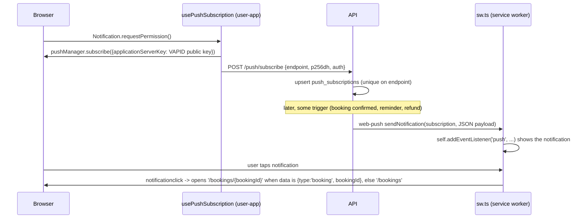
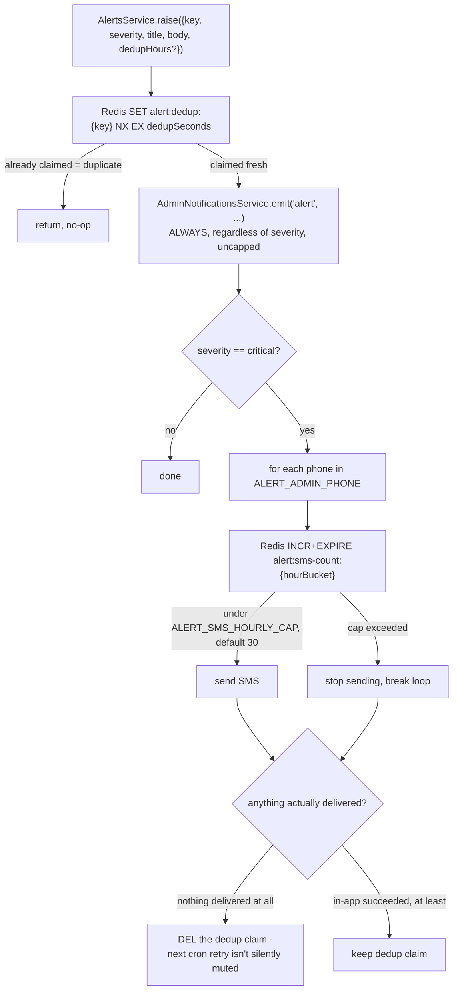

# 16 — Notifications

Three distinct channels exist: **SMS**, **Web Push**, and an in-app **admin notification queue**, plus an **operator alerting** layer built on top of all three.

## SMS

Interface `SmsProvider` (`apps/api/src/sms/sms.provider.ts`), selected via `SMS_PROVIDER=console|kavenegar|payamakyab|faragostaresh-relay` (four implementations — see [19-third-party-services.md](./19-third-party-services.md) for credentials and the temporary-relay caveat).

- **`ConsoleSmsProvider`** — logs only, the default.
- **`KavenegarSmsProvider`** — calls Kavenegar's REST API (`fetch`, 10s timeout). OTP uses a template-based lookup endpoint (`KAVENEGAR_OTP_TEMPLATE`, default `gheychi-otp`); everything else uses the plain send endpoint. Both throw on a non-200 HTTP response or a Kavenegar-level failure status. The OTP send URL embeds the raw code as a query parameter — flagged in code as something request-logging middleware must never log verbatim.
- **`PayamakYabSmsProvider`** — hand-rolled SOAP envelope against a plain `.asmx` panel, no SOAP client dependency.
- **`FaragostareshRelaySmsProvider`** — a temporary stopgap that relays through a small PHP endpoint (bearer token from `FARAGOSTARESH_RELAY_TOKEN`, `getOrThrow`) until our server IP is authorized on the PayamakYab panel directly.

**Every SMS actually sent, by trigger:**

| Trigger | Source | Message |
|---|---|---|
| OTP login | `auth.controller.ts` | the 6-digit code |
| Booking confirmed | `payments.service.ts` `notifyConfirmed` | to customer: confirmation + address; to salon owner: new-booking notice |
| Booking cancelled | `payments.service.ts` `notifyCancelled` | always the customer; the salon owner too when the customer cancelled |
| Manual-approval lifecycle | `payments.service.ts` `notifyApprovalRequested`/`notifyApproved`/`notifyRejected`/`notifyApprovalExpired`/`notifyApprovalFailedAvailability`/`notifyPaymentExpired` | see the "Manual-approval notifications" section below for which of these actually spend an SMS |
| Appointment reminder | `booking-reminder.job.ts` | reminder + address, configurable lead time |
| Refund issued | `payments.service.ts` `notifyRefunded` | "your deposit was refunded" |
| Worker added to a salon roster | `salons/salon-workers.controller.ts` `notifyWorkerAdded` | "you were added as staff by «salon», log in with this number" + login URL — **only if the salon is `approved`** (the roster row is created regardless). Any self-registered user can create a `pending` salon with an arbitrary name, so without the gate this was a channel for attacker-worded SMS to any number at platform cost. Also metered against the salon's `smsMonthlyQuota` via `SalonSmsQuotaService.tryConsume` — see [33-salon-sms-quota.md](./33-salon-sms-quota.md) |
| Owner-initiated customer SMS | `crm/customer-sms.service.ts` `send` | the owner's free text, sent on the wire as `"{salon.name}: {message}"` (anti-impersonation framing on the platform's shared sender number; the logged `salon_sms_messages.message` is the owner's own unprefixed text). `409` unless the salon is `approved` and within its monthly quota — see [33-salon-sms-quota.md](./33-salon-sms-quota.md) |
| Critical operator alert | `alerts.service.ts` | paged to `ALERT_ADMIN_PHONE` |

Confirmation/cancellation/refund/approval sends are all `.catch(()=>{})` — best-effort, never roll back booking/payment state. The reminder job logs an SMS failure and releases its claim so the next tick retries (and raises a `reminder-failed:{bookingId}` alert). The owner-initiated customer SMS is the one send whose failure is **not** swallowed — it is the owner's own primary action, so the error surfaces to them. Alert SMS is the one channel with its own dedup + hourly cap (below).

## Web Push

Interface `PushProvider` (`apps/api/src/push/push.provider.ts`), selected via `PUSH_PROVIDER=console|webpush`.

- **`WebPushProvider`** wraps the `web-push` npm library, configured once at construction with `VAPID_PUBLIC_KEY`/`VAPID_PRIVATE_KEY`/`VAPID_SUBJECT`.
- `push.service.ts`'s `sendToUser(userId, payload)` fans a notification out to **every** subscription the user has registered (multiple devices/browsers), each independently `.catch(()=>{})`'d so one dead device never blocks or fails the others.

**Ownership rebinding**: because a `PushSubscription` is per-browser, not per-user, `usePushSubscription.rebindOwnership()` (user-app) re-POSTs `/push/subscribe` on every login/status refresh to reclaim the endpoint for whoever is currently logged in — this prevents a shared-device scenario where a second user keeps receiving the first user's push notifications.

**Deep linking**: every booking-related push carries `data: { type: 'booking', bookingId }`; `sw.ts`'s `resolveTargetUrl` opens `/bookings/{bookingId}` on tap when the id passes a UUID check, and falls back to the `/bookings` list for anything else (malformed data, non-booking payloads).

## Admin notification queue

Not a push channel — an in-app, polled (60s cadence per the admin panel) queue of `admin_notifications` rows. `AdminNotificationsService.emit(type, title, body, link, manager?)` — **throws on failure by contract**, so each caller decides whether to swallow it.

Four emit points exist:
1. **`report_created`** (`ReportsService.create`) — called **with** the enclosing transaction's `EntityManager`, so the report and its notification commit or roll back together (a strict guarantee).
2. **`salon_resubmitted`** (`SalonsService.resubmitMine`) — called **without** a transaction, wrapped in try/catch that only logs on failure ("a fire-safe side effect... a lost notification must never fail the owner's resubmission"). This is a genuinely lossy delivery path — no retry, no dead-letter.
3. **`category_requested`** (`catalog/category-requests.service.ts`) — a provider asking for a new service category; same fire-and-forget `.catch(() => {})` posture as `salon_resubmitted`, linking to `/category-requests`.
4. **`alert`** (`AlertsService.raise`, below) — every operator alert, regardless of severity.

**Read state is per admin**: `admin_notification_reads` (join table, `PRIMARY KEY (notification_id, admin_id)`) records who read what; list/unread-count queries `LEFT JOIN` it on the caller's `admin_id`, and `markRead` is an idempotent `INSERT ... ON CONFLICT (notification_id, admin_id) DO UPDATE` with a harmless self-set (so `RETURNING read_at` always yields the original read time). One admin marking a notification read never affects any other admin. (The legacy `admin_notifications.read_at` column still exists on the entity but is not what the service reads.)

## Operator alerting — `AlertsService.raise()`

`apps/api/src/alerts/alerts.service.ts`. The paging layer for money-critical conditions: stuck refunds, refused refunds, captured money on a dead booking, orphaned payment authorities, referral-reward shortfalls, referral-grant failures, notification-persist failures.

- **Dedup window**: default 6 hours — `ALERT_DEDUP_HOURS` is a hardcoded `const` in `alerts.service.ts`, not an env var; callers widen it per alert via `dedupHours` (24h for stuck-refund escalation and referral-reward-shortfall alerts). Only the SMS cap (`ALERT_SMS_HOURLY_CAP`) and the phone list (`ALERT_ADMIN_PHONE`) are env-configurable.
- **Fails open on Redis errors** for both dedup and the SMS cap check — the stated philosophy is "a duplicate alert beats a dropped one."
- **The SMS cap is per-phone, per-hour-bucket, not per-incident** — with multiple `ALERT_ADMIN_PHONE` numbers configured, the effective "distinct incidents paged per hour" is `cap / numberOfPhones`, since the loop increments a shared bucket per phone and breaks (not continues) once any phone hits the cap.
- `raise()` itself can never throw — it runs inline inside payment/booking-adjacent code paths that must not fail because of an alerting bug.

Known `alert:dedup:` key identities in use: `authority-persist:{bookingId}`, `verify-persist:{paymentId}`, `late-capture:{paymentId}`, `refund-no-authority:{paymentId}`, `refund-refused:{paymentId}`, `refund-stuck:{paymentId}` (24h), `reconcile-failed:{paymentId}`, `unknown-authority`, `referral-grant-failed:{userId}:{bookingId}`, `referral-reward-shortfall:{rewardId}` (24h), `referral-reversal-failed:{bookingId}`, `reminder-failed:{bookingId}`, `invoice-generation-failed:{salonId}:{year}-{month}`, `cron-job-failed:{jobName}`, `cron-job-slow:{jobName}`, `backup-failed`, `backup-stale`.

## Related documents

- [11-payment-system.md](./11-payment-system.md) — the money-critical conditions that trigger most alerts
- [13-financial-system.md](./13-financial-system.md) — referral-reward shortfall alerting
- [19-third-party-services.md](./19-third-party-services.md) — Kavenegar/Web Push provider configuration

## Manual-approval notifications

Five additional customer/owner messages, all through the same `PaymentsService.notifyOne`
helper and the same `SmsProvider`/`PushService` abstractions:
`notifyApprovalRequested` (customer + owner), `notifyApproved`, `notifyRejected`,
`notifyApprovalExpired`, and `notifyPaymentExpired`.

SMS is spent deliberately, not on every event: the request-created message reaches the
customer by push only (they are looking at the screen) while the owner gets a real SMS (short
window, not in the app), and `notifyPaymentExpired` is invoked for manual-approval bookings
only — an abandoned automatic checkout is never texted. Every one of them states explicitly
whether money changed hands — "your request expired" is
easily misread as "you lost your deposit", and in this flow nothing was ever charged.
`notifyPaymentExpired` also closed a pre-existing silence: `BookingExpiryJob` never told the
customer anything. All five are best-effort and fired after their transaction commits, so a
failed SMS can never roll back a booking decision. See
[28-booking-approval-workflow.md](./28-booking-approval-workflow.md).

## Gaps closed 2026-09-03

Three lifecycle moments used to notify nobody at all:

- **No-show.** The customer's deposit is forfeited and commission accrues against it, in
  silence. `notifyNoShow` now tells them — it is the one event where they lose money without
  having asked for anything, and their only cue to dispute it if it was recorded in error.
- **Reconciliation-confirmed bookings.** When `PaymentReconciliationJob` (not the callback)
  is the one that discovers a successful payment — the exact case that job exists for — it
  flipped the booking to `confirmed` and told neither party, and wrote no `booking_events`
  row either, so the admin timeline showed a booking that became confirmed by magic. It now
  calls `notifyConfirmed` post-commit and records `PAYMENT_SUCCEEDED` + `BOOKING_CONFIRMED`
  with `metadata.via = 'reconciliation'`.
- **Reschedule.** New `notifyRescheduled` reaches **both** parties by SMS and push. Unlike
  most events this changes an appointment the recipient has already planned around, and the
  party who did not initiate it has no other way to find out. The initiator is told too, so
  the two phones' message histories cannot disagree about what was agreed.

Still deliberately silent, all recorded SMS-budget decisions: the customer on
request-created (they are on screen — push only), automatic-mode payment expiry, and the
owner before an approval deadline they were already told about once.

