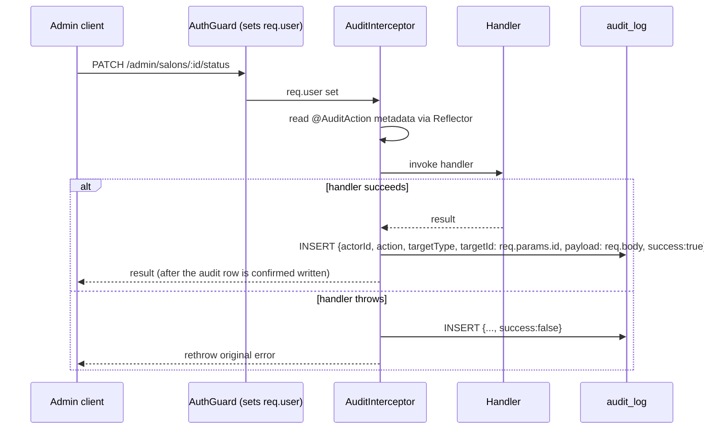

# 21 — Security

## Authentication & session

Cookie-based, HttpOnly JWT session (`session` cookie), never exposed to JavaScript, never stored in localStorage on any frontend. Full detail: [05-authentication.md](./05-authentication.md). `sameSite:'lax'`, `secure` in production. **Load-bearing assumption**: CORS credentialed origins (`FRONTEND_BASE_URL`/`PROVIDER_APP_BASE_URL`/`ADMIN_APP_BASE_URL`) must stay same-site with the API's own host for the cookie to work at all — flagged directly in a `main.ts` code comment as something a future domain restructuring could silently break.

## Authorization

Three guards (`AuthGuard`, `RolesGuard`, `SalonOwnerGuard`), no global guard, applied per-route. Full matrix: [17-permissions.md](./17-permissions.md). **A new route without an explicit `@UseGuards(...)` is public by default** — the single biggest structural risk in the authorization model, mitigated only by developer discipline/code review, not by any automated check.

## CORS

`main.ts`: `app.enableCors({ origin: buildAllowedOrigins(config), credentials: true })`. Exactly three allowed origins, config-driven (`src/cors-origins.util.ts`) — no wildcard, no reflection of the request's `Origin` header.

## Input validation

Global `ValidationPipe({ whitelist: true, transform: true })` — every request body/query is validated against its DTO's `class-validator` decorators, and any field not declared on the DTO is silently stripped (not merely ignored — `whitelist` actively removes it before the handler sees it). **There is no schema validation for environment variables** — a missing required env var (`getOrThrow`) only surfaces the first time a code path that needs it actually runs.

## File upload security

Every upload endpoint (salon photos/stories/portfolio, blog cover) shares:
- Hard 5MB cap enforced by Multer before the handler runs.
- **Real magic-number MIME sniffing** via the `file-type` package (reads actual file bytes), not the client-supplied `Content-Type` header — restricted to `image/jpeg|png|webp`, `422` on mismatch.
- **Storage keys are server-generated** (`randomUUID()` + extension derived from the *validated* mimetype), never from `file.originalname` — explicitly to avoid path-traversal via a crafted client filename.

## XSS posture — the blog Markdown invariant

Blog posts store **raw Markdown**, never sanitized HTML, because nothing needs sanitizing: both frontends that render post bodies (`user-app`, `admin-panel`) instantiate `markdown-it` with **`html: false`** — raw HTML in the source is escaped to inert text and never parses into DOM. This is the entire XSS story for user-generated-adjacent content on the blog, and it is **pinned by an invariant test in both apps** (`markdown.spec.ts` in each) that explicitly asserts `` and `` render as escaped text. The two `v-html` bindings in the whole codebase (the admin editor's live preview, and the user-app article body) are commented as sanctioned *solely* by this invariant — **never enable `html:true` or add a third `v-html` site without re-deciding the whole model.**

Both Markdown utilities also force `rel="noopener noreferrer"` on every rendered link (including auto-linkified bare URLs) to prevent reverse-tabnabbing.

## Audit logging

`apps/api/src/audit/audit.service.ts` + `audit.decorator.ts` + `audit.interceptor.ts`. A declarative `@AuditAction(action, targetType)` decorator, combined with `@UseInterceptors(AuditInterceptor)`, on essentially every state-mutating admin route.

- `targetId` is read from `req.params.id` — a route without an `:id` param records `targetId: null`.
- `payload` captures the **raw request body**, not filtered by the DTO's own field whitelist — explicitly accepted as fine for an "admin-only, body-parser-bounded surface," but worth knowing before adding a hypothetical future admin DTO that accepts something sensitive.
- **`audit.service.ts`'s `record()` swallows its own failures** — logged via `Logger.error`, never rethrown, by explicit design ("an audit-log outage must never fail the admin's request"). There is no alerting on a failed audit write and no retry — the log line is the only trace.
- No before/after value snapshots — the log answers "who did what, to what, with what input, when," not "what changed."
- No retention/rotation policy exists — `audit_log` grows unbounded.

## Secrets handling

Every third-party credential (JWT secret, Kavenegar key, Zarinpal access token, S3 keys, VAPID keys) is an env var, loaded via `@nestjs/config`. `docs/deployment/DEPLOY.md` explicitly warns that `docker compose config` inlines every `env_file` secret in its output and must be redacted before ever being shared/pasted anywhere.

## Error-tracking redaction

`ErrorTrackingService.captureException(error, context)` (`error-tracking/`) is the one place an exception's contextual metadata leaves the request-handling code and gets logged (today) / will eventually leave the process to a real APM. `ErrorTrackingContext` only exposes three explicitly-safe typed fields (`requestId`, `userId`, `route`) plus a free-form `extra` bag. **Never pass a JWT, session cookie, OTP code, card/payment credential, or password/secret into `context` or `extra`.** As a defense-in-depth backstop (not a substitute for call-site discipline), `extra` is recursively redacted by `redact-context.ts` before anything is logged: any key that normalizes to contain `password`, `token`, `jwt`, `cookie`, `session`, `secret`, `otp`, `cvv`, `card`, `authorization`, `apikey`, or `privatekey` — however deeply nested — is replaced with `'[redacted]'`. An `Error`'s own `.message`/`.stack` string is **not** scanned (same boundary `CronJobRunner`/`AlertsService` already rely on elsewhere — they log `err.message` directly); call sites must not construct an error message that embeds a raw secret.

## Rate limiting & abuse controls

Redis-backed, narrowly scoped to the two genuinely abusable surfaces: OTP request/verify (see [05-authentication.md](./05-authentication.md)) and the public referral-code-validation endpoint (20/hour per IP — a code-enumeration surface). No general-purpose rate limiting exists on any other endpoint.

## Known security-adjacent gaps

- **A salon's reply to a review has no audit trail and no moderation gate** — an owner can post an unmoderated, unaudited public reply to any of their published reviews at will (`SalonReviewReplyController` carries no `@AuditAction`).
- **No profanity/spam filtering** on review comments or salon replies beyond a `MaxLength` DTO constraint — moderation is 100% human/reactive.
- **`payment_authorities` has no entity/repository** — accessed only via raw SQL, which is fine functionally but means it's outside the normal TypeORM migration/entity review surface anyone auditing the schema would naturally check.

## Related documents

- [05-authentication.md](./05-authentication.md), [17-permissions.md](./17-permissions.md) — the mechanisms this document assumes
- [24-technical-debt.md](./24-technical-debt.md) — several findings above repeated with fuller context
