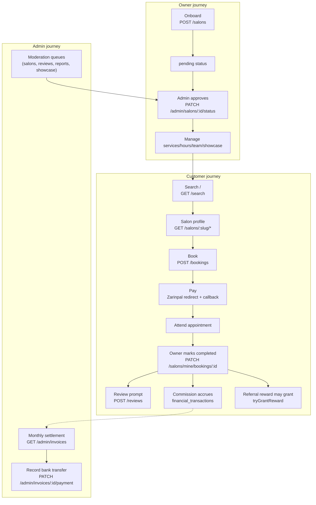

# 26 — System Map

A cross-cutting reference: the development timeline mapped to the files each stage touched, a full module-to-file glossary, and the big-picture data-flow diagrams that don't belong to any single subsystem document.

## Development timeline → files touched

| Plan | What shipped | Primary files/modules |
|---|---|---|
| 1 — Foundation | Users, salons, categories, search | `users/`, `salons/salon.entity.ts`, `catalog/`, `search/` |
| 2 — Booking & payments | Booking holds, Zarinpal, deposits | `booking/` (core), `booking/payment-gateway.ts`, `zarinpal-payment.gateway.ts` |
| 3 — Reviews & moderation | Reviews, reactive moderation | `reviews/` |
| 4 — User-app frontend | Nuxt PWA, featured salons, push reminders | `apps/user-app/`, `push/`, `booking/booking-reminder.job.ts` |
| 5 — Provider panel | Salon-owner back office, photo upload | `apps/provider-panel/`, `storage/`, `salons/salon-photos.controller.ts` |
| 6 — Admin panel | Salon approval workflow, moderation UI | `apps/admin-panel/`, `salons/admin-salons.controller.ts` |
| 7 — Platform hardening | Audit log, reports, cascade suspend, admin notifications | `audit/`, `reports/`, `admin-notifications/`, `users/admin-users.service.ts` |
| 8 — Blog CMS | Markdown blog, admin editor, public SEO pages | `content/` |
| 9 — Production deployment | Docker images, Caddy, CI/CD, DB backups | `docker-compose.prod.yml`, `Caddyfile`, `.github/workflows/ci.yml`, `docker/backup/` |
| — Real payment refunds | Refund state machine, retry job | `payments.service.ts` (refund path), `refund-retry.job.ts` |
| — Money-critical alerting | Operator paging | `alerts/` |
| — Salon showcase (2026-07-17) | Stories, profile fields, portfolio | `salons/salon-story.entity.ts`, `portfolio-item.entity.ts`, `salons/story-cleanup.job.ts` |
| — Coupons & discounts (2026-07-19) | Coupon codes, per-service discounts | `coupons/`, `booking/discount.util.ts` |
| — Referrals & ratings (2026-07-22) | Workers, worker ratings, wallet, referral program | `salons/worker.entity.ts`, `reviews/worker-rating.entity.ts`, `wallet/`, `referrals/` |
| — Commission & invoicing | Per-booking commission, monthly invoices | `invoicing/` |
| — Multi-category + worker restrictions | Salon category tagging, per-worker service eligibility | `salons/salon-category.entity.ts`, `salons/worker-service.entity.ts`, `salons/worker-eligibility.service.ts` |
| — Production-readiness hardening (2026-08-07) | Cron job distributed locking/failure paging, cursor-paginated search, categories cache, cities promoted to a real DB table, stored-XSS closed, OTP per-IP rate limiting, N+1 fixes | `common/cron-job-runner.service.ts`, `common/cron-lock.service.ts`, `search/search.service.ts`, `cities/`, `common/trusted-image-upload.ts`, `auth/otp.service.ts` |
| — Production-readiness hardening, continued (2026-08-10, most recent) | Per-request correlation-id logging, an error-tracking abstraction + global exception filter, a product-analytics foundation seeded on the booking funnel, `/liveness`+`/readiness` split from `/health`, stable booking-conflict/payment-failure error codes, IDOR/role-escalation/upload-spoofing test-coverage closure + a full route-guard audit, k6 load-test baselines, the per-salon booking Redis lock made release-ownership-aware, real concurrent-request e2e coverage for four money-critical races, multi-file sitemap pagination, a cross-app design-consistency audit fix | `common/request-context*.ts`, `common/request-context-logger.service.ts`, `error-tracking/`, `analytics/`, `health/health.controller.ts`, `booking/booking-error-codes.ts`, `route-guard-audit.spec.ts`, `load-tests/`, `booking/bookings.service.ts` (`acquireSalonLock`/`releaseSalonLock`), `common/sitemap-pagination.ts` |

Design specs live in `docs/superpowers/specs/`, execution records in `docs/superpowers/plans/`, one file per plan — treat these as the historical "why," while this documentation set is the current "what."

## Module → primary files glossary

| Module (backend) | Directory | Key files |
|---|---|---|
| Auth | `apps/api/src/auth/` | `auth.controller.ts`, `auth.service.ts` (OtpService), `auth.guard.ts`, `roles.guard.ts` |
| Users | `apps/api/src/users/` | `user.entity.ts`, `users.service.ts`, `admin-users.controller.ts`, `admin-users.service.ts` |
| Salons | `apps/api/src/salons/` | `salon.entity.ts`, `salons.service.ts`, `salon-owner.guard.ts`, `worker.entity.ts`, `worker-service.entity.ts`, `worker-eligibility.service.ts`, `salon-category.entity.ts` |
| Booking | `apps/api/src/booking/` | `booking.entity.ts`, `bookings.service.ts`, `availability.service.ts`/`.util.ts`, `deposit.util.ts`, jobs |
| Payments | `apps/api/src/booking/` (same module) | `payment.entity.ts`, `payment-gateway.ts`, `zarinpal-payment.gateway.ts`, `payments.service.ts` |
| Reviews | `apps/api/src/reviews/` | `review.entity.ts`, `worker-rating.entity.ts`, `reviews.service.ts` |
| Coupons | `apps/api/src/coupons/` | `coupon.entity.ts`, `coupon-redemption.entity.ts`, `coupons.service.ts` |
| Wallet | `apps/api/src/wallet/` | `wallet-balance.entity.ts`, `wallet-transaction.entity.ts`, `wallet.service.ts` |
| Referrals | `apps/api/src/referrals/` | `referral.entity.ts`, `referral-reward.entity.ts`, `referrals.service.ts` (job lives in `booking/`!) |
| Invoicing | `apps/api/src/invoicing/` | `financial-transaction.entity.ts`, `invoice.entity.ts`, `invoicing.service.ts` |
| Reports | `apps/api/src/reports/` | `report.entity.ts`, `reports.service.ts` |
| Audit | `apps/api/src/audit/` | `audit-log.entity.ts`, `audit.service.ts`, `audit.decorator.ts`, `audit.interceptor.ts` |
| Admin notifications | `apps/api/src/admin-notifications/` | `admin-notification.entity.ts`, `admin-notifications.service.ts` |
| Content/Blog | `apps/api/src/content/` | `blog-post.entity.ts`, `blog-category.entity.ts`, `content.service.ts` |
| Search | `apps/api/src/search/` | `search.service.ts` |
| Catalog | `apps/api/src/catalog/` | `service-category.entity.ts` |
| Cities | `apps/api/src/cities/` | `city.entity.ts`, `cities.service.ts` (DB-backed, in-process cached; retired the old static `iran-cities.ts`) |
| Favorites | `apps/api/src/favorites/` | `favorite.entity.ts` |
| Push | `apps/api/src/push/` | `push-subscription.entity.ts`, `push.service.ts`, `web-push.provider.ts` |
| SMS | `apps/api/src/sms/` | `sms.provider.ts`, `kavenegar-sms.provider.ts` |
| Storage | `apps/api/src/storage/` | `storage.provider.ts`, `local-disk-storage.provider.ts`, `s3-storage.provider.ts` |
| Alerts | `apps/api/src/alerts/` | `alerts.service.ts` |
| Error tracking | `apps/api/src/error-tracking/` | `error-tracking.service.ts`, `global-exception.filter.ts` (`APP_FILTER`), `logger-error-tracking.service.ts`, `redact-context.ts` |
| Analytics | `apps/api/src/analytics/` | `analytics.service.ts`, `analytics.provider.ts`, `console-analytics.provider.ts` |
| Platform config | `apps/api/src/platform-config/` | `platform-config.entity.ts`, `platform-config.service.ts` |
| Redis | `apps/api/src/redis/` | `redis.module.ts` |
| Common utils | `apps/api/src/common/` + top-level | `postgres-error-codes.ts`, `slug.util.ts`, `cors-origins.util.ts`, `numeric-transformers.ts`, `cron-job-runner.service.ts`/`cron-lock.service.ts`, `trusted-image-upload.ts`, `request-logging.middleware.ts`, `request-context.ts`/`request-context-logger.service.ts`, `sitemap-pagination.ts` |

| Frontend app | Directory | Entry points |
|---|---|---|
| user-app | `apps/user-app/` | `nuxt.config.ts`, `app/pages/`, `app/middleware/auth.global.ts`, `app/stores/session.ts` |
| provider-panel | `apps/provider-panel/` | `src/router/index.ts`, `src/pages/`, `src/composables/useSalon.ts` |
| admin-panel | `apps/admin-panel/` | `src/router/index.ts`, `src/pages/`, `src/composables/usePhoneUserSearch.ts` |

## The big picture: how a single request touches the whole system

## Cross-references by concern (quick lookup)

| If you're touching... | Read these documents |
|---|---|
| A new API endpoint | [15](./15-api-reference.md), [17](./17-permissions.md), [21](./21-security.md) |
| Anything money-related | [09](./09-booking-engine.md), [11](./11-payment-system.md), [12](./12-wallet.md), [13](./13-financial-system.md), [14](./14-commission.md), [20](./20-business-rules.md) |
| A new background job | [18](./18-background-jobs.md) |
| Any of the three frontends | [06](./06-user-panel.md), [07](./07-salon-panel.md), [08](./08-admin-panel.md), [24](./24-technical-debt.md) (cross-app duplication) |
| Schema changes | [04](./04-database.md) |
| Anything touching a third-party service | [19](./19-third-party-services.md) |
| Before assuming a limitation is a bug | [23](./23-known-limitations.md) vs [24](./24-technical-debt.md) |

## Related documents

This file is the map; every numbered document from [01](./01-project-overview.md) through [25](./25-future-improvements.md) is a territory it points into. Start at [00-index.md](./00-index.md) if you're new here.
