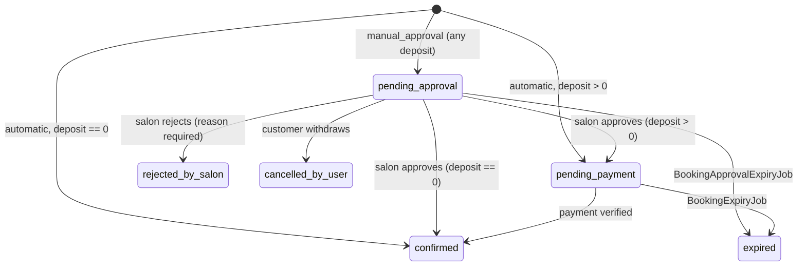

# 28 — Booking Approval Workflow

The optional, per-salon **manual approval** workflow: a salon owner can require that they accept a
booking request *before* the customer is asked to pay anything.

Core files: `apps/api/src/booking/booking.entity.ts`, `bookings.service.ts` (`createHold` /
`approve` / `reject`), `booking-settings.service.ts`, `booking-approval-expiry.job.ts`,
`booking-expiry.job.ts`, `booking-event.entity.ts`, `booking-events.service.ts`,
`admin-booking-settings.controller.ts`, `salon-bookings.controller.ts`,
migration `1755200000000-booking-approval-workflow.ts`.

## The two modes

`salons.booking_confirmation_mode` — **the only booking setting a salon owner controls.**

| Mode | Flow |
|---|---|
| `automatic` (default, and every salon that predates this feature) | select slot → create booking → pay → `confirmed` |
| `manual_approval` | select slot → create **request** → slot held → salon approves → payment window opens → pay → `confirmed` |

Existing salons were backfilled to `automatic` by the column DEFAULT, so **nothing about an existing
salon's behaviour changed** when this shipped.

## State machine



Two new members on `BookingStatus`: **`pending_approval`** and **`rejected_by_salon`**.

- `rejected_by_salon` is deliberately distinct from `cancelled_by_salon`. The latter always means
  "a real, already-confirmed appointment was called off, refund the customer"; the former means "an
  unpaid request was declined", which owes nothing. Collapsing them would make rejection rate
  indistinguishable from cancellation rate, and would drag a rejection through refund logic.
- An approval timeout lands on the **existing** `expired`, not a bespoke status. From the customer's
  and the availability engine's point of view an un-answered request and an unpaid hold are the same
  outcome; what actually happened is recorded losslessly in `booking_events`.
- `bookings.status` is `varchar(20)` with **no** CHECK constraint, so both new values were a
  code-only change — but note the 20-char ceiling (`rejected_by_salon` is 17).

## No money moves before approval

This is the feature's central guarantee, and it is what makes rejection cheap:

- A `pending_approval` booking has **no `Payment` row at all** and **no gateway authority**. The
  `Payment` row is inserted by `approve()`, in the same transaction as the status transition.
- Therefore rejecting or expiring a request can never owe a refund — there is nothing to refund.
- The customer is never redirected to Zarinpal before the salon accepts. `POST /bookings` returns
  `paymentRequired: false` and a `paymentUrl` pointing at the in-app booking page.

### What a request *does* consume, and how it is given back

Wallet balance and a coupon code are still applied at **request** time, inside `createHold`'s
transaction, because they are what determine the deposit figure the salon is accepting. They are
returned by `releaseBookingHold()` on every path where the request dies before capture — rejection,
approval expiry, payment expiry, and customer cancellation.

This is deliberately the *existing* mechanism, not a new one: `releaseBookingHold` already backed the
"expired hold" and "cancel-while-unpaid" paths, and rejection/approval-expiry are exactly the same
"never captured" case. No new reversal logic exists, which is why a rejected request cannot burn a
customer's single-use coupon.

Commission and referral rewards are untouched: commission accrues only at `completed`/`no_show`, and
`first_paid_booking` requires a genuinely `paid` payment. Neither can fire for a request.

## Deadlines are snapshots, never recomputed

Two immutable columns on `bookings`:

| Column | Stamped when | Read by |
|---|---|---|
| `approval_expires_at` | request creation (manual mode only) | `BookingApprovalExpiryJob` |
| `payment_expires_at` | when the booking enters `pending_payment` — at creation (automatic) or at approval (manual) | `BookingExpiryJob` |

The value is computed from the configuration **in force at that moment** and then frozen. An admin
raising the global approval timeout from 10 to 60 minutes does **not** hand every in-flight request
another 50 minutes.

This also fixed a pre-existing bug: `BookingExpiryJob` used to derive its cutoff as
`created_at < now() - booking_hold_ttl_minutes`, read fresh from config on every tick, so editing
that key silently moved the deadline of every hold already in flight. The job now uses a two-armed
predicate — the snapshot when present, else the legacy `created_at` derivation — so **rows created
before this shipped keep their original behaviour exactly** while new rows are snapshotted.

## Configuration: admin owns the timing, the owner owns the mode

```
approval timeout = salons.approval_timeout_minutes  ?? platform_config.booking_approval_timeout_minutes  (10)
payment timeout  = salons.payment_timeout_minutes   ?? platform_config.booking_hold_ttl_minutes          (15)
```

Resolved in exactly one place: `BookingSettingsService.resolveFor()`. `NULL` on either salon column
means "inherit the global default"; `??` (not `||`) so a `0` would be a real value rather than
silently reading as unset.

Only **one** new global key was introduced. The payment window's global default reuses the existing
`booking_hold_ttl_minutes`, which already meant exactly "how long the customer has to pay" — forking
it into a second key would have left two sources of truth for one concept.

### The enforcement boundary

| Who | May change | Route |
|---|---|---|
| Salon owner | `bookingConfirmationMode` **only** | `PATCH /salons/mine` |
| Admin | `approvalTimeoutMinutes`, `paymentTimeoutMinutes` (per salon) | `PATCH /admin/salons/:id/booking-settings` |
| Admin | the two global defaults | `PATCH /admin/config` |

The split into two routes is the enforcement mechanism, not a URL-tidiness preference:
`SalonsService.updateMine()` applies its DTO with a blanket `Object.assign`, so merely *adding* the
timeout fields to `UpdateSalonDto` would have handed providers the ability to set their own
deadlines. They are absent from that DTO by design, and the global `ValidationPipe({whitelist:true})`
strips them from a provider request that tries anyway.

Per-salon overrides are bounded `1..1440` minutes at **both** the DTO and the DB CHECK. Zero is
rejected (every request would expire before a human could see it) and so is an unbounded value
(a salon could sit on a customer's slot indefinitely). Admin changes are audited as
`booking-settings.update`.

## Availability

`pending_approval` blocks a slot exactly as `pending_payment` and `confirmed` do — otherwise a salon
could approve a request it has no room for. This is enforced through a single shared constant:

```ts
// booking.entity.ts
export const SLOT_BLOCKING_STATUSES: BookingStatus[] = ['pending_approval', 'pending_payment', 'confirmed'];
```

This list was previously written out inline at **six** separate call sites (`createHold`'s two
overlap checks, `createManual`'s two, `assignWorker`'s, and `AvailabilityService`'s). Centralising it
was a prerequisite for the feature, not a drive-by cleanup: adding a status by hand at five of six
sites would have produced a silent, intermittent double-booking bug rather than a test failure.

## Concurrency

Every transition uses the house CAS idiom — a conditional `UPDATE ... WHERE status = <expected>`,
`ConflictException` on `affected === 0`:

```ts
const result = await em.update(Booking, { id: bookingId, status: 'pending_approval' }, { ... });
if (!result.affected) throw new ConflictException('این درخواست دیگر در انتظار تایید نیست');
```

A second approve, a reject, an approval-expiry tick, and a customer cancellation all contend on that
one predicate, so exactly one wins and every loser gets a 409. Both expiry jobs express their CAS as
the `WHERE status = ...` on a set-based `UPDATE ... RETURNING id`, so a cron tick can never overwrite
a decision a human made microseconds earlier, and a re-run is a no-op.

### The late-payment race

A customer can pay through a still-open Zarinpal tab after their payment window closed. This needed
**no new code**: the pre-existing "late capture on a dead booking" path already handles it. The
booking CAS `pending_payment → confirmed` loses, and `recoverCapturedOnDeadBooking()` moves the
payment to `refund_pending` (alerting an operator) rather than resurrecting a booking into a slot
someone else may now hold. Covered end-to-end in `booking-approval.e2e-spec.ts`.

## Lifecycle events (`booking_events`)

An append-only log answering *"what happened to this booking"* — deliberately **not** the admin
`audit_log`, which answers *"which admin did what"* and covers only admin mutations. Most transitions
here have no admin actor at all: the customer's request, the salon's decision, the crons that expire
both.

`{ bookingId, eventType, actorType, actorId, metadata, createdAt }`, with
`actorType ∈ customer | salon_owner | admin | system`. `BookingEventsService.record()` never throws —
a booking must not fail because a history row could not be written — and when handed the caller's
`em` it joins that transaction, so an event describing a rolled-back transition never survives.

Ordered by a `bigserial` **`seq`**, never by `created_at`. Postgres's `now()` is the
*transaction* start time, so the several transitions that write two events at once
(`BOOKING_CREATED` + `APPROVAL_REQUESTED`; `PAYMENT_EXPIRED` + `SLOT_RELEASED`) share an
identical timestamp — and TypeORM stamps `@CreateDateColumn` from JS at millisecond
resolution anyway. Ordering by timestamp let the support view show a request being approved
before it was created; a monotonic sequence is ordered by construction. `created_at` is kept
and displayed, it just isn't what sorts.

### Relationship to `audit_log`

Both, deliberately, and they are not duplicates:

| | `audit_log` | `booking_events` |
|---|---|---|
| Answers | "who did this, and can we hold them to it" | "what happened to this booking" |
| Actor | `actor_id` is **NOT NULL** — always a real person | may be `system` (the crons) |
| Browsed by | actor, action, date, across the platform | one booking, in order |

Approve and reject are performed by a real human, so they write an `audit_log` row
(`booking.approval.approved` / `booking.approval.rejected`) *as well as* a booking event.
The cron-driven halves of the same state machine have no actor and are structurally unable
to live in `audit_log` — which is exactly why `booking_events` exists.

Read back by admins at `GET /admin/bookings/:id/events`, rendered as a timeline in the admin panel.
Metadata must never carry a credential, payment authority, OTP, or PII; the review responsibility
sits with each call site, the same rule `AnalyticsService` already carries.

## Background jobs

| Job | Cron | Transition |
|---|---|---|
| `BookingApprovalExpiryJob` | `*/1 * * * *` | `pending_approval → expired` on `approval_expires_at` |
| `BookingExpiryJob` | `*/1 * * * *` | `pending_payment → expired` on `payment_expires_at` (snapshot) or the legacy `created_at` cutoff |

Both batch at 1000 rows/tick via the `id IN (SELECT ... LIMIT n)` idiom, run through `CronJobRunner`
(distributed Redis lock, failure alerting), release the hold inside the same transaction, and send
their notifications **after** commit with per-booking `try/catch` so one unreachable phone number
cannot stall the batch. Backed by two partial indexes
(`bookings_approval_expiry_idx`, `bookings_payment_expiry_idx`), each scoped to the one status its
job scans.

`BookingExpiryJob` now also notifies the customer that their payment window closed — previously it
was silent, which was tolerable when the only way to reach it was abandoning a checkout you were
looking at, but not once a salon-approved request can expire on a customer who was told they had a
window.

## Notifications — and where SMS is deliberately NOT sent

All through the existing `SmsProvider`/`PushService` abstractions via `PaymentsService`'s
`notifyOne` helper. SMS costs real money per message, so each channel choice below is a
decision, not a default:

- **The customer is not texted when their request is submitted.** They pressed the button a
  second ago and are reading the confirmation screen; push carries it. The **owner** is
  texted, because they are not in the app and have only the approval window to act — this is
  the most time-critical message in the flow.
- **An abandoned *automatic* checkout is never texted.** `BookingExpiryJob` filters its
  notifications to `confirmation_mode = 'manual_approval'`. Someone who walked away from a
  payment page moments ago already knows they didn't pay; a manual-approval customer, told
  "the salon accepted, pay by HH:MM" and then off living their day, genuinely does not.
  (The `RETURNING` clause uses the raw-string form for this — the array form maps entity
  *property* names, so `confirmation_mode` would be silently dropped and every expiry would
  look automatic.)

| Moment | Customer | Owner |
|---|---|---|
| Request created | push only — "…هنوز مبلغی پرداخت نشده است." | **SMS** + push — "یک درخواست نوبت جدید…" |
| Approved | "…تایید شد. برای قطعی شدن نوبت، پیش‌پرداخت را انجام دهید." | — (they just did it) |
| Rejected | "…تایید نشد. دلیل: {reason}" | — |
| Approval expired | "…به دلیل عدم پاسخ سالن منقضی شد. مبلغی از شما دریافت نشده است." | — |
| Payment expired (**manual mode only**) | "مهلت پرداخت … به پایان رسید و رزرو منقضی شد." | — |

Every customer-facing message in this flow states explicitly whether money changed hands, because
"your request expired" is easily misread as "you lost your deposit".

## Frontend surfaces

- **user-app** — a pending-approval strip on the bookings list and a dedicated card on the detail
  page, both stating plainly that nothing has been paid, with a live countdown; the submit button
  becomes «ثبت درخواست رزرو» for a manual salon; `paymentRequired === false` now navigates in-app
  instead of externally. Note `STATUS_META` in `bookings/index.vue` is a **closed** `Record` indexed
  directly in the template — a new backend status that is not added there throws at render.
- **provider-panel** — a pending-requests queue pinned above the agenda (requests expire, so they
  must not be hidden behind the day filter), sorted soonest-to-lapse, with approve and a
  reason-required reject; plus the mode radio on the settings page and a read-only note that the
  platform owns the time limits.
- **admin-panel** — per-salon override card on the salon detail page following the
  confirm-before-commit "Uniform Consequence Rule", showing the effective value with its provenance
  ("۳۰ دقیقه (پیش‌فرض سراسری)" vs an explicit override); plus the booking timeline viewer.

## What an adversarial review changed

Five independent reviewers attacked this feature before it shipped. The findings worth
recording, because each is a coupling that is not obvious from the code alone:

- **`PaymentReconciliationJob`'s 20-minute staleness clock was silently coupled to the
  payment window.** A per-salon window longer than 20 minutes would have had it cancel live,
  still-payable bookings mid-window. Selection is now deadline-aware — see
  [11-payment-system.md](./11-payment-system.md).
- **`approve()` inserts a `Payment` row with no authority**, and reconciliation used to
  `continue` past authority-less payments — making them immortal and, over time, crowding out
  its own batch. They are now retired to `failed` (nothing can have been captured without an
  authority), guarded on `authority IS NULL` so a customer minting a session in the same
  instant wins.
- **A request can outlive the appointment it asked for** (its approval deadline is
  independent of the booking's `startsAt`). `approve()` now refuses a request whose slot has
  already passed rather than opening a payment window for a slot in the past.
- **The owner had a second, unguarded exit from `pending_approval`** via the customer's
  `POST /bookings/:id/cancel`, which would have recorded `cancelled_by_salon` (meaning "refund
  the customer"), sent the wrong notification, and skipped the mandatory reason. Owners are
  now directed to `reject()`; the customer's own withdrawal path is unchanged.
- **`retryPayment` ignored the deadline**, so a customer could mint a live gateway session in
  the window between the deadline passing and the once-a-minute cron catching up.
- **The global `booking_approval_timeout_minutes` had none of the bounds its per-salon twin
  carries.** Both are now `1..1440`, enforced on the read path, the write path, and the DB.
- **The lifecycle log stopped at `PAYMENT_WINDOW_STARTED`** and never recorded that a booking
  was confirmed, paid, completed, or declined by the bank — five declared event types were
  emitted by nothing. All are now emitted; the money-path ones are recorded post-commit and
  without the caller's `em`, so a history write can never poison a transaction that just
  captured real money.
- **Both expiry jobs could outrun their 60-second cron lock** once they gained per-booking
  work. Event writes are now one batched insert, notifications run with bounded concurrency,
  and both jobs take a 5-minute lock.
- **The deploy runbook told operators to run migrations with `exec` after `up -d`** — which
  deadlocks precisely when a migration adds a required config key, because the new image
  crash-loops and `exec` needs a running container. Corrected to `run --rm`, before `up -d`.

## Availability is re-checked at approval, not trusted from request time

Platform state can move between a customer's request and the salon's decision: the owner can
lower their own `capacity`, deactivate the requested worker, or reassign that worker away from
the requested service. `approve()` therefore replays the exact two checks `createHold` ran when
the request was first accepted, inside the SAME per-salon Redis lock `createHold` uses (so the
re-check and the state transition are one atomic critical section, immune to a concurrent
`createHold`/`approve` reading a stale count):

1. **Salon capacity** — a `SLOT_BLOCKING_STATUSES` overlap count for the slot, this booking's own
   row excluded (it is itself one of the blocking statuses and would otherwise count against
   itself).
2. **Worker availability**, only when a specific worker was requested — still active, still
   eligible for the service, and still has no other overlapping booking.

This is deliberately not a *stricter* check than creation's own: `createHold` never consults
working hours or schedule exceptions either (the frontend only ever offers slots `GET
.../availability` has already filtered that way), so the re-check doesn't either — approval isn't
meant to be pickier than booking.

**If the re-check fails, the request is auto-expired in the same transaction** rather than left
`pending_approval` for the same unavoidable outcome at the next `BookingApprovalExpiryJob` tick —
nothing about the answer will change before then, so waiting only costs the customer the slot for
longer. The hold is released exactly as a timeout would release it. The event is recorded as
`APPROVAL_EXPIRED` with `metadata.cause: 'availability_recheck_failed'` (a genuine timeout instead
carries `cause: 'timeout'`), so the two are never confused in the timeline, and the failed
attempt's `actorId` is preserved in the metadata even though the transition itself is attributed
to `system` (the owner did not choose this outcome). The customer is told the truth in a
DIFFERENT notification than a timeout's — `notifyApprovalFailedAvailability`, not
`notifyApprovalExpired` — because the timeout copy ("به دلیل عدم پاسخ سالن", "because the salon
didn't respond") would be a lie here: the salon DID respond, the slot changed underneath the
request. `BOOKING_UNAVAILABLE`/`WORKER_UNAVAILABLE` (the same codes `createHold` already uses,
not new ones) distinguish the two causes on the API response.

Concurrency: exactly the same guarantee as every other transition in this service — a single
conditional CAS on `status = 'pending_approval'` inside the lock. Two requests that together
exceed a just-reduced capacity, approved via a genuinely simultaneous race, can legitimately both
self-expire (whichever's re-check runs first still sees the other sitting in `pending_approval`,
which by itself already fills the reduced capacity) rather than produce a winner — a safe,
correctly-reported "neither could be honoured given what was true at that instant", not a bug. The
one outcome the lock+CAS pair makes structurally impossible is **both** reaching
`pending_payment`. The sequential case (approve one, THEN attempt the other) deterministically
produces a winner and a loser, and is the one an owner clicking one button at a time will always
see in practice.

## Deliberate cuts

- **No provider-side reminder before an approval deadline lapses — a permanent product decision,
  not deferred work.** The 10-minute window is short enough that a second SMS would be spending
  real money to repeat something the owner was already told once; the request-created SMS is the
  only ping by design. Do not add a reminder cron for this without revisiting the SMS-budget
  decision explicitly.
- No admin-facing aggregate analytics (approval rate, median response time, per-salon
  non-responsiveness). The `booking_events` model was designed to make these computable later; no
  dashboard consumes it yet.
- Mode is per salon, not per service.

## Related documents

- [09-booking-engine.md](./09-booking-engine.md) — the booking state machine this extends
- [11-payment-system.md](./11-payment-system.md) — the late-capture path this relies on
- [18-background-jobs.md](./18-background-jobs.md) — both expiry jobs in the consolidated job list
- [20-business-rules.md](./20-business-rules.md) — these rules in the consolidated rule reference
